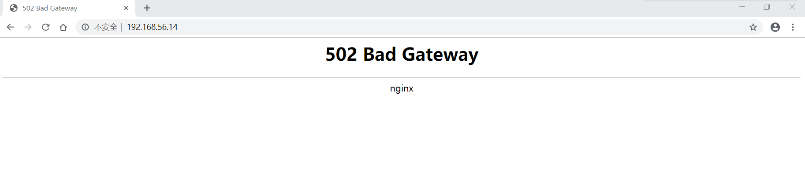
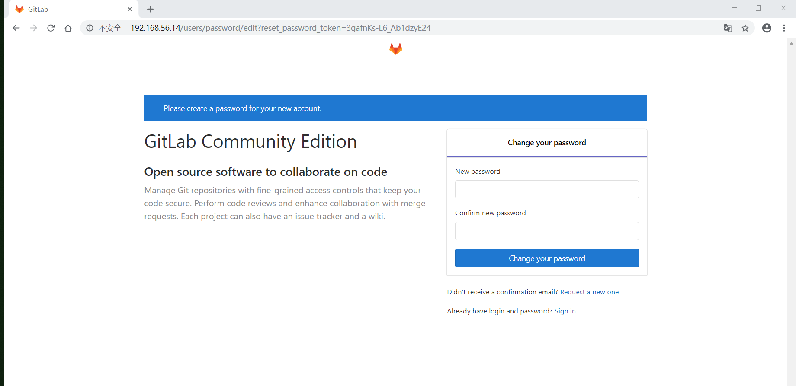
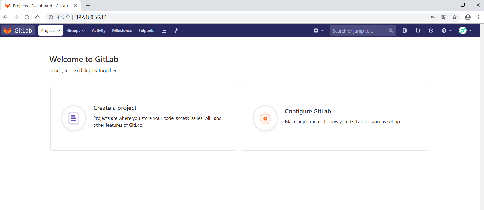
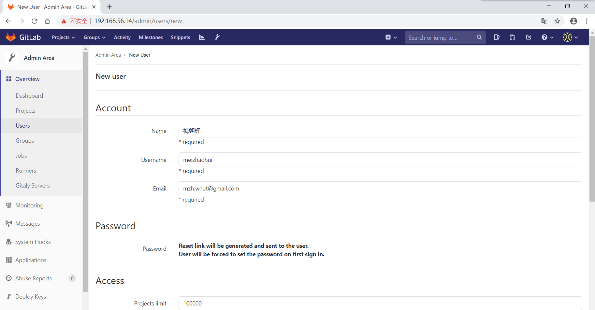
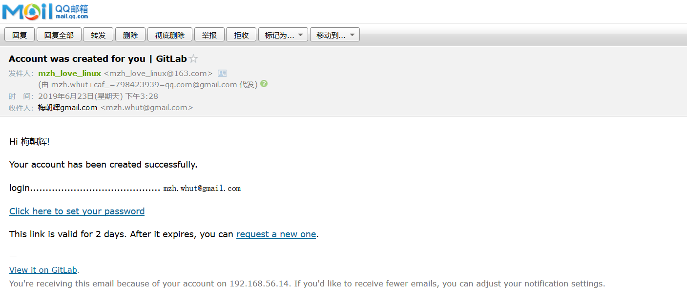
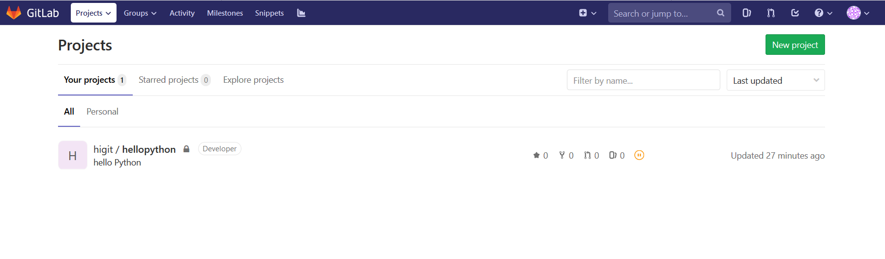
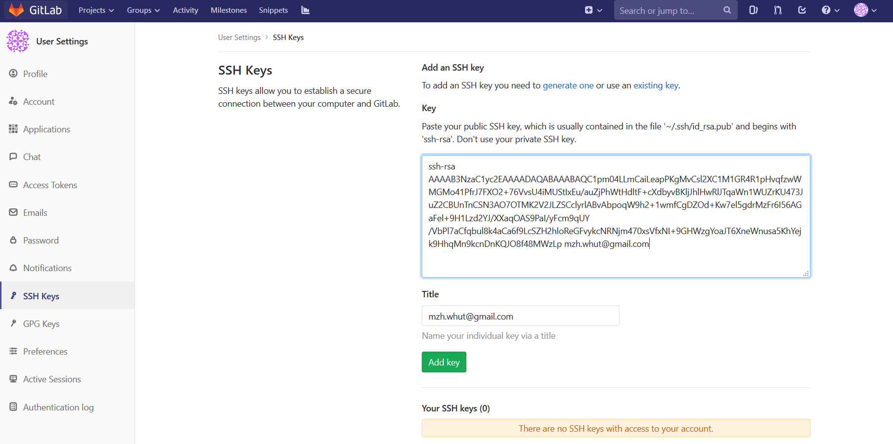
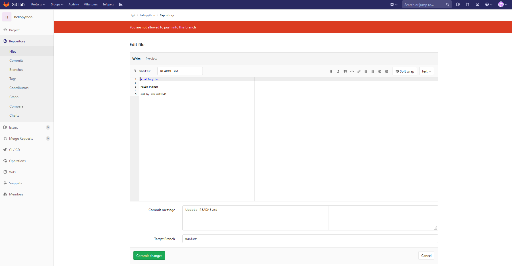
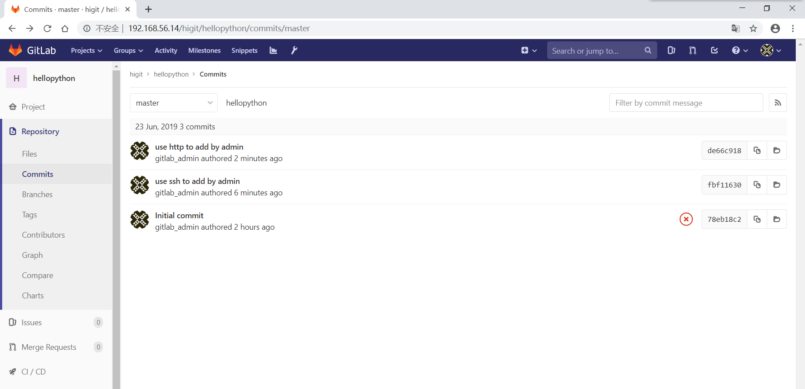

.. _centos7_install_gitlab_with_external_nginx:

CenOS7安装GitLab(使用外部Nginx配置)
=================================================

.. contents:: 目录

本文讲解在CentOS7系统中安装GitLab(使用外部Nginx配置)。

实验环境
-------------------------------------------------

- server服务端: 操作系统为CentOS 7.6，IP:192.168.56.14， git:2.16.5。

查看server服务端信息::

    [root@server ~]# cat /etc/centos-release
    CentOS Linux release 7.6.1810 (Core) 
    [root@server ~]# ip a show|grep 192
    inet 192.168.56.14/24 brd 192.168.56.255 scope global noprefixroute enp0s3
    [root@server ~]# git --version
    git version 2.16.5
    
配置要求
-------------------------------------------------

配置要求参考 https://docs.gitlab.com/ce/install/requirements.html 。

- 系统支持：支持Ubuntu、Debian、CentOS、openSUSE、Red Hat，不支持Arch Linux、Fedora、FreeBSD、Gentoo、macOS、 **Windows** (官方未计划支持)。
- Ruby版本：Ruby (MRI) 2.5。
- 硬件要求：存储，建议使用LVM或者支持NFS协议(network file system protocol)的NAS或SAN网络存储设备。
- 硬件要求：CPU，推荐500用户时使用2 cores，2000用户时使用4 cores。
- 硬件要求：内存，推荐100用户时使用8GB RAM，2000用户时使用16GB RAM；推荐使用SWAP交换分区。
- 数据库：PostgreSQL 9.6，建议至少5-10GB的可用存储空间。
- Unicorn Workers：工人数，推荐工人数 = CPU cores + 1 。
- GitLab Runner：如果有多台服务器的话，不建议将GitLab Runner安装在GitLab服务器上，运行GitLab Runner可能消耗大量内存。
- 浏览器支持：Firefox、Chrome、Safari、Microsoft Edge、Internet Explorer 11。

准备工作
-------------------------------------------------

设置服务器时间为 ``Asia/Shanghai`` ，并同步一下时间 ::

    [root@server ~]# mv /etc/localtime /etc/localtime.bak
    [root@server ~]# ln -s /usr/share/zoneinfo/Asia/Shanghai  /etc/localtime
    [root@server ~]# date
    Sat Jun 22 15:34:05 CST 2019
    [root@server ~]# echo "sync to cn.ntp.org.cn with time5.aliyun.com IP:182.92.12.11"
    sync to cn.ntp.org.cn with time5.aliyun.com IP:182.92.12.11
    [root@server ~]# ntpdate 182.92.12.11
    22 Jun 15:34:28 ntpdate[14920]: step time server 182.92.12.11 offset 0.791964 sec
    [root@server ~]# date
    Sat Jun 22 15:34:31 CST 2019
    
安装GitLab
-------------------------------------------------

参考 https://about.gitlab.com/install/#centos-7 在CentOS7上面安装Omnibus package。

安装依赖
^^^^^^^^^^^^^^^^^^^^^^^^^^^^^^^^^^^^^^^^^^^^^^^^^

安装必要依赖，并开启防火墙放行80端口::

    # 说明：安装依赖
    [root@server ~]# yum install curl policycoreutils-python openssh-server -y
    
    # 说明：开机启动sshd服务并启动
    [root@server ~]# systemctl enable sshd
    [root@server ~]# systemctl start sshd
    [root@server ~]# systemctl status sshd
    ● sshd.service - OpenSSH server daemon
       Loaded: loaded (/usr/lib/systemd/system/sshd.service; enabled; vendor preset: enabled)
       Active: active (running) since Sat 2019-06-22 09:50:43 CST; 4h 51min ago
         Docs: man:sshd(8)
               man:sshd_config(5)
     Main PID: 3193 (sshd)
        Tasks: 1
       Memory: 3.4M
       CGroup: /system.slice/sshd.service
               └─3193 /usr/sbin/sshd -D
    
    Jun 22 09:50:42 server.hopewait systemd[1]: Starting OpenSSH server daemon...
    Jun 22 09:50:43 server.hopewait sshd[3193]: Server listening on 0.0.0.0 port 22.
    Jun 22 09:50:43 server.hopewait sshd[3193]: Server listening on :: port 22.
    Jun 22 09:50:43 server.hopewait systemd[1]: Started OpenSSH server daemon.
    Jun 22 11:59:11 server.hopewait sshd[13692]: Accepted password for root from 192.168.56.1 port 55574 ssh2
    
    # 说明：查看防火墙放行列表
    [root@server ~]# firewall-cmd --list-all
    public (active)
      target: default
      icmp-block-inversion: no
      interfaces: enp0s3 enp0s8
      sources: 
      services: ssh dhcpv6-client
      ports: 8140/tcp 53/tcp 11211/tcp
      protocols: 
      masquerade: no
      forward-ports: 
      source-ports: 
      icmp-blocks: 
      rich rules: 
    
    # 说明：防火墙放行80端口
    [root@server ~]# firewall-cmd -zone=public --add-port=80/tcp --permanent
    success
    
    # 说明：重启防火墙
    [root@server ~]# firewall-cmd --reload
    success
    
    # 说明：查看防火墙放行列表
    [root@server ~]# firewall-cmd --list-all
    public (active)
      target: default
      icmp-block-inversion: no
      interfaces: enp0s3 enp0s8
      sources: 
      services: ssh dhcpv6-client
      ports: 8140/tcp 53/tcp 11211/tcp 80/tcp
      protocols: 
      masquerade: no
      forward-ports: 
      source-ports: 
      icmp-blocks: 
      rich rules: 

新增GitLab的国内清华大学的yum源
^^^^^^^^^^^^^^^^^^^^^^^^^^^^^^^^^^^^^^^^^^^^^^^^^

- 清华大学YUM源地址 https://mirrors.tuna.tsinghua.edu.cn/gitlab-ce/yum/el7/
- 清华大学Gitlab Community Edition 镜像使用帮助 https://mirrors.tuna.tsinghua.edu.cn/help/gitlab-ce/

新建 ``/etc/yum.repos.d/gitlab-ce.repo`` ，内容如下::

    [gitlab-ce]
    name=Gitlab CE Repository
    baseurl=https://mirrors.tuna.tsinghua.edu.cn/gitlab-ce/yum/el\$releasever/
    gpgcheck=0
    enabled=1

使用以下命令添加数据::

    [root@server ~]# cat > /etc/yum.repos.d/gitlab-ce.repo << EOF
    > [gitlab-ce]
    > name=Gitlab CE Repository
    > baseurl=https://mirrors.tuna.tsinghua.edu.cn/gitlab-ce/yum/el\$releasever/
    > gpgcheck=0
    > enabled=1
    > EOF
    [root@server ~]# cat /etc/yum.repos.d/gitlab-ce.repo 
    [gitlab-ce]
    name=Gitlab CE Repository
    baseurl=https://mirrors.tuna.tsinghua.edu.cn/gitlab-ce/yum/el$releasever/
    gpgcheck=0
    enabled=1
    [root@server ~]#

查找yum源中gitlab-ce的版本::

    [root@server ~]# yum list gitlab-ce --showduplicates
    Loaded plugins: fastestmirror
    Loading mirror speeds from cached hostfile
     * base: mirrors.163.com
     * centos-sclo-rh: mirrors.cn99.com
     * epel: mirrors.tuna.tsinghua.edu.cn
     * extras: ap.stykers.moe
     * updates: mirrors.cn99.com
    Available Packages
    gitlab-ce.x86_64                                                     7.10.0~omnibus-1                                                       gitlab-ce
    .... 省略
    gitlab-ce.x86_64                                                     11.9.11-ce.0.el7                                                       gitlab-ce
    gitlab-ce.x86_64                                                     11.9.12-ce.0.el7                                                       gitlab-ce
    gitlab-ce.x86_64                                                     11.10.0-ce.0.el7                                                       gitlab-ce
    gitlab-ce.x86_64                                                     11.10.1-ce.0.el7                                                       gitlab-ce
    gitlab-ce.x86_64                                                     11.10.2-ce.0.el7                                                       gitlab-ce
    gitlab-ce.x86_64                                                     11.10.3-ce.0.el7                                                       gitlab-ce
    gitlab-ce.x86_64                                                     11.10.4-ce.0.el7                                                       gitlab-ce
    gitlab-ce.x86_64                                                     11.10.5-ce.0.el7                                                       gitlab-ce
    gitlab-ce.x86_64                                                     11.10.6-ce.0.el7                                                       gitlab-ce
    gitlab-ce.x86_64                                                     11.11.0-ce.0.el7                                                       gitlab-ce
    gitlab-ce.x86_64                                                     11.11.1-ce.0.el7                                                       gitlab-ce
    gitlab-ce.x86_64                                                     11.11.2-ce.0.el7                                                       gitlab-ce
    gitlab-ce.x86_64                                                     11.11.3-ce.0.el7                                                       gitlab-ce

安装gitlab-ce-11.10.0
^^^^^^^^^^^^^^^^^^^^^^^^^^^^^^^^^^^^^^^^^^^^^^^^^

我们安装11.11.0版本::

    [root@server ~]# yum install gitlab-ce-11.10.0
    Loaded plugins: fastestmirror
    Loading mirror speeds from cached hostfile
     * base: mirrors.163.com
     * centos-sclo-rh: mirrors.cn99.com
     * epel: mirrors.tuna.tsinghua.edu.cn
     * extras: ap.stykers.moe
     * updates: mirrors.cn99.com
    Resolving Dependencies
    --> Running transaction check
    ---> Package gitlab-ce.x86_64 0:11.10.0-ce.0.el7 will be installed
    --> Finished Dependency Resolution
    
    Dependencies Resolved
    
    =====================================================================================================================================================
     Package                           Arch                           Version                                    Repository                         Size
    =====================================================================================================================================================
    Installing:
     gitlab-ce                         x86_64                         11.10.0-ce.0.el7                           gitlab-ce                         594 M
    
    Transaction Summary
    =====================================================================================================================================================
    Install  1 Package
    
    Total download size: 594 M
    Installed size: 594 M
    Is this ok [y/d/N]: y
    Downloading packages:
    gitlab-ce-11.10.0-ce.0.el7.x86_64.rpm                        2% [=                                                 ] 2.2 MB/s |  13 MB  00:04:24 ETA
    gitlab-ce-11.10.0-ce.0.el7.x86_64.rpm                       66% [=================================                 ] 7.7 MB/s | 397 MB  00:00:25 ETA 
    gitlab-ce-11.10.0-ce.0.el7.x86_64.rpm                                                                                         | 594 MB  00:02:37     
    Running transaction check
    Running transaction test
    Transaction test succeeded
    Running transaction
    Warning: RPMDB altered outside of yum.
    ** Found 1 pre-existing rpmdb problem(s), 'yum check' output follows:
    ius-release-2-1.el7.ius.noarch is a duplicate with ius-release-1.0-15.ius.centos7.noarch
      Installing : gitlab-ce-11.10.0-ce.0.el7.x86_64 [#######################################                                                      ] 1/1
      Installing : gitlab-ce-11.10.0-ce.0.el7.x86_64 [###################################################################################          ] 1/1
      Installing : gitlab-ce-11.10.0-ce.0.el7.x86_64                                                                                                 1/1 
    It looks like GitLab has not been configured yet; skipping the upgrade script.
    
           *.                  *.
          ***                 ***
         *****               *****
        .******             *******
        ********            ********
       ,,,,,,,,,***********,,,,,,,,,
      ,,,,,,,,,,,*********,,,,,,,,,,,
      .,,,,,,,,,,,*******,,,,,,,,,,,,
          ,,,,,,,,,*****,,,,,,,,,.
             ,,,,,,,****,,,,,,
                .,,,***,,,,
                    ,*,.
      
    
    
         _______ __  __          __
        / ____(_) /_/ /   ____ _/ /_
       / / __/ / __/ /   / __ `/ __ \
      / /_/ / / /_/ /___/ /_/ / /_/ /
      \____/_/\__/_____/\__,_/_.___/
      
    
    Thank you for installing GitLab!
    GitLab was unable to detect a valid hostname for your instance.
    Please configure a URL for your GitLab instance by setting `external_url`
    configuration in /etc/gitlab/gitlab.rb file.
    Then, you can start your GitLab instance by running the following command:
      sudo gitlab-ctl reconfigure
    
    For a comprehensive list of configuration options please see the Omnibus GitLab readme
    https://gitlab.com/gitlab-org/omnibus-gitlab/blob/master/README.md
    
      Verifying  : gitlab-ce-11.10.0-ce.0.el7.x86_64                                                                                                 1/1 
    
    Installed:
      gitlab-ce.x86_64 0:11.10.0-ce.0.el7                                                                                                                
    
    Complete!
    
``或者`` 通过手动下载安装包安装，这样后面本地目录下面就存在 ``gitlab-ce-11.10.0-ce.0.el7.x86_64.rpm`` 的安装包::

    [root@server ~]# wget https://mirrors.tuna.tsinghua.edu.cn/gitlab-ce/yum/el7/gitlab-ce-11.10.0-ce.0.el7.x86_64.rpm
    --2019-06-22 15:10:23--  https://mirrors.tuna.tsinghua.edu.cn/gitlab-ce/yum/el7/gitlab-ce-11.10.0-ce.0.el7.x86_64.rpm
    Resolving mirrors.tuna.tsinghua.edu.cn (mirrors.tuna.tsinghua.edu.cn)... 101.6.8.193, 2402:f000:1:408:8100::1
    Connecting to mirrors.tuna.tsinghua.edu.cn (mirrors.tuna.tsinghua.edu.cn)|101.6.8.193|:443... connected.
    HTTP request sent, awaiting response... 200 OK
    Length: 622413230 (594M) [application/x-redhat-package-manager]
    Saving to: ‘gitlab-ce-11.10.0-ce.0.el7.x86_64.rpm’
    
    7% [======>                                                                                                     ] 43,851,424  1.60MB/s  eta 3m 1s 
    100%[===========================================================================================================>] 622,413,230 5.89MB/s   in 3m 11s 
    
    2019-06-22 15:13:34 (3.10 MB/s) - ‘gitlab-ce-11.10.0-ce.0.el7.x86_64.rpm’ saved [622413230/622413230]
 
    [root@server ~]# rpm -ivh gitlab-ce-11.10.0-ce.0.el7.x86_64.rpm
    
查看GitLab版本::

    [root@server ~]# cat /opt/gitlab/embedded/service/gitlab-rails/VERSION
    11.10.0

配置GitLab配置文件
^^^^^^^^^^^^^^^^^^^^^^^^^^^^^^^^^^^^^^^^^^^^^^^^^

GitLab配置文件存放路径为 ``/etc/gitlab/gitlab.rb`` ，我们先备份一份原始配置文件::

    [root@server ~]# cp /etc/gitlab/gitlab.rb /etc/gitlab/gitlab.rb.20190622_1540.bak
    [root@server ~]# ls -lah /etc/gitlab/
    total 188K
    drwxr-xr-x.  2 root root   58 Jun 22 15:40 .
    drwxr-xr-x. 88 root root 8.0K Jun 22 15:32 ..
    -rw-------.  1 root root  88K Jun 22 15:09 gitlab.rb
    -rw-------.  1 root root  88K Jun 22 15:40 gitlab.rb.20190622_1540.bak

外部URL(external URL)配置
~~~~~~~~~~~~~~~~~~~~~~~~~~~~~~~~~~~~~~~~~~~~~~~~~~~~~~~~

- 为了给用户展示正确的仓库克隆链接，需要设置external URL。
- 外部URL可以分多种形式：
  1 IP地址形式的URL，开放80端口
  2 域名形式的URL，开放80端口
  3 使用CA认证的URL，开放443端口

我们先使用IP形式的外部URL配置，验证成功后，后面再使用域名形式或CA认证的URL。

- 13 external_url 'http://gitlab.example.com'  --->  external_url 'http://192.168.56.14'

说明："--->" 表示修改为， 前面的13表示第13行。

使用命令修改::

    [root@server ~]# sed -i "13s@external_url 'http://gitlab.example.com'@external_url \"http://192.168.56.14\"@g" /etc/gitlab/gitlab.rb
    [root@server ~]# cat -n /etc/gitlab/gitlab.rb|sed -n '13p'
        13  external_url "http://192.168.56.14"

时区配置
~~~~~~~~~~~~~~~~~~~~~~~~~~~~~~~~~~~~~~~~~~~~~~~~~~~~~~~~

时区设置为"Asia/Shanghai":

- 49 # gitlab_rails['time_zone'] = 'UTC'  --->  gitlab_rails['time_zone'] = 'Asia/Shanghai'

使用命令修改::

    [root@server ~]# sed -i "49s@^# gitlab_rails\['time_zone'\] = 'UTC'@gitlab_rails\['time_zone'\] = 'Asia/Shanghai'@g" /etc/gitlab/gitlab.rb
    [root@server ~]# cat -n /etc/gitlab/gitlab.rb|sed -n '49p'
        49  gitlab_rails['time_zone'] = 'Asia/Shanghai'

Email邮箱设置
~~~~~~~~~~~~~~~~~~~~~~~~~~~~~~~~~~~~~~~~~~~~~~~~~~~~~~~~

参考： https://docs.gitlab.com/omnibus/settings/smtp.html

我们使用网易的163邮箱作为邮件的发送人。

原始配置::

    51 ### Email Settings
    52 # gitlab_rails['gitlab_email_enabled'] = true
    53 # gitlab_rails['gitlab_email_from'] = 'example@example.com'
    54 # gitlab_rails['gitlab_email_display_name'] = 'Example'
    55 # gitlab_rails['gitlab_email_reply_to'] = 'noreply@example.com'
    56 # gitlab_rails['gitlab_email_subject_suffix'] = ''

修改为::

    51 ### Email Settings
    52 gitlab_rails['gitlab_email_enabled'] = true
    53 gitlab_rails['gitlab_email_from'] = 'mzh_love_linux@163.com'
    54 # gitlab_rails['gitlab_email_display_name'] = 'GitLab'
    55 # gitlab_rails['gitlab_email_reply_to'] = 'mzh_love_linux@163.com'
    56 # gitlab_rails['gitlab_email_subject_suffix'] = '[GitLab]'

使用命令修改::

    [root@server ~]# sed -i "52s@^# gitlab_rails\['gitlab_email_enabled'\] = true@gitlab_rails\['gitlab_email_enabled'\] = true@g" /etc/gitlab/gitlab.rb
    [root@server ~]# sed -i "53s@^# gitlab_rails\['gitlab_email_from'\] = 'example\@example.com'@gitlab_rails\['gitlab_email_from'\] = 'mzh_love_linux\@163.com'@g" /etc/gitlab/gitlab.rb
    [root@server ~]# sed -i "54s@^# gitlab_rails\['gitlab_email_display_name'\] = 'Example'@gitlab_rails\['gitlab_email_display_name'\] = 'GitLab'@g" /etc/gitlab/gitlab.rb
    [root@server ~]# sed -i "55s@^# gitlab_rails\['gitlab_email_reply_to'\] = 'noreply\@example.com'@gitlab_rails\['gitlab_email_reply_to'\] = 'mzh_love_linux\@163.com'@g" /etc/gitlab/gitlab.rb
    [root@server ~]# sed -i "56s@^# gitlab_rails\['gitlab_email_subject_suffix'\] = ''@gitlab_rails\['gitlab_email_subject_suffix'\] = '[GitLab]'@g" /etc/gitlab/gitlab.rb
    [root@server ~]# cat -n /etc/gitlab/gitlab.rb|sed -n '51,56p'
        51  ### Email Settings
        52  gitlab_rails['gitlab_email_enabled'] = true
        53  gitlab_rails['gitlab_email_from'] = 'mzh_love_linux@163.com'
        54  gitlab_rails['gitlab_email_display_name'] = 'GitLab'
        55  gitlab_rails['gitlab_email_reply_to'] = 'mzh_love_linux@163.com'
        56  gitlab_rails['gitlab_email_subject_suffix'] = '[GitLab]'

禁止用户创建顶层组
~~~~~~~~~~~~~~~~~~~~~~~~~~~~~~~~~~~~~~~~~~~~~~~~~~~~~~~~

参考： https://docs.gitlab.com/ee/administration/user_settings.html#disallow-users-creating-top-level-groups

禁止用户创建顶层组(Disallow users creating top-level groups):

-  59 # gitlab_rails['gitlab_default_can_create_group'] = true  --->  gitlab_rails['gitlab_default_can_create_group'] = false

使用命令修改::

    [root@server ~]# sed -i "59s@# gitlab_rails\['gitlab_default_can_create_group'\] = true@gitlab_rails\['gitlab_default_can_create_group'\] = false@g"  /etc/gitlab/gitlab.rb
    [root@server ~]# cat -n /etc/gitlab/gitlab.rb|sed -n '59p' 
        59  gitlab_rails['gitlab_default_can_create_group'] = false

禁止用户修改用户名
~~~~~~~~~~~~~~~~~~~~~~~~~~~~~~~~~~~~~~~~~~~~~~~~~~~~~~~~

参考： https://docs.gitlab.com/ee/administration/user_settings.html#disallow-users-changing-usernames

禁止用户修改用户名(Disallow users changing usernames):

- 60 # gitlab_rails['gitlab_username_changing_enabled'] = true  --->  gitlab_rails['gitlab_username_changing_enabled'] = false

使用命令修改::

    [root@server ~]# sed -i "60s@# gitlab_rails\['gitlab_username_changing_enabled'\] = true@gitlab_rails\['gitlab_username_changing_enabled'\] = false@g" /etc/gitlab/gitlab.rb
    [root@server ~]# cat -n /etc/gitlab/gitlab.rb|sed -n '60p'
        60  gitlab_rails['gitlab_username_changing_enabled'] = false

GitLab trusted_proxies可信代理配置
~~~~~~~~~~~~~~~~~~~~~~~~~~~~~~~~~~~~~~~~~~~~~~~~~~~~~~~~

将IP子网段添加到可信代理中:
- 113 # gitlab_rails['trusted_proxies'] = []  --->  gitlab_rails['trusted_proxies'] = ['192.168.56.0/24']

使用命令修改::

    [root@server ~]# sed -i "113s@^# gitlab_rails\['trusted_proxies'\] = \[\]@gitlab_rails['trusted_proxies'] = \['192.168.56.0/24'\]@g" /etc/gitlab/gitlab.rb
    [root@server ~]# cat -n /etc/gitlab/gitlab.rb|sed -n '113p'
       113  gitlab_rails['trusted_proxies'] = ['192.168.56.0/24']

git仓库存储目录配置
~~~~~~~~~~~~~~~~~~~~~~~~~~~~~~~~~~~~~~~~~~~~~~~~~~~~~~~~

参考： https://docs.gitlab.com/omnibus/settings/configuration.html#storing-git-data-in-an-alternative-directory

git仓库存储目录默认为 ``/var/opt/gitlab/git-data`` ，由于git仓库存储数据比较多，最好将存储目录设置LVM或者支持NFS协议(network file system protocol)的NAS或SAN网络存储设备对应的卷的路径，便于后面扩容。

.. Attention:: git仓库存储目录 ``必须是目录，不能是软链接`` ！！

修改git_data_dirs的配置::

    380 # git_data_dirs({                                                                                                                               
    381 #   "default" => {
    382 #     "path" => "/mnt/nfs-01/git-data"
    383 #    }
    384 # })

修改为::

    380 git_data_dirs({                                                                                                                               
    381     "default" => {
    382         "path" => "/home/git/git-data"
    383     }
    384 })

使用命令修改::

    [root@server ~]# sed -i "380s@^# git_data_dirs@git_data_dirs@g" /etc/gitlab/gitlab.rb
    [root@server ~]# sed -i "381s@^#   \"default@    \"default@g" /etc/gitlab/gitlab.rb
    [root@server ~]# sed -i "382s@^#     \"path\" => \"/mnt/nfs-01/git-data\"@        \"path\" => \"/home/git/git-data\"@g" /etc/gitlab/gitlab.rb
    [root@server ~]# sed -i "383s@^#    }@    }@g" /etc/gitlab/gitlab.rb
    [root@server ~]# sed -i "384s@^# })@})@g" /etc/gitlab/gitlab.rb
    [root@server ~]# cat -n /etc/gitlab/gitlab.rb|sed -n '380,384p'
       380  git_data_dirs({
       381      "default" => {
       382          "path" => "/home/git/git-data"
       383      }
       384  })

创建仓库存储目录::

    [root@server ~]# id git
    uid=1001(git) gid=1001(git) groups=1001(git)
    [root@server ~]# cat /etc/passwd|grep git
    git:x:1001:1001::/home/git:/bin/bash
    [root@server ~]# ls -lad /home/git/
    drwx------. 4 git git 111 Jun 22 19:45 /home/git/
    [root@server ~]# ls -lad /home/git/git-data/
    drwxr-xr-x. 2 root root 6 Jun 22 19:45 /home/git/git-data/
    [root@server ~]# chown git:root /home/git/git-data/
    [root@server ~]# ls -lad /home/git/git-data/       
    drwxr-xr-x. 2 git root 6 Jun 22 19:45 /home/git/git-data/

SMTP外部邮箱设置
~~~~~~~~~~~~~~~~~~~~~~~~~~~~~~~~~~~~~~~~~~~~~~~~~~~~~~~~

参考： https://docs.gitlab.com/omnibus/settings/smtp.html

我们使用外部邮箱发送邮件通知。

SMTP的原始信息::

    507 ### GitLab email server settings
    508 ###! Docs: https://docs.gitlab.com/omnibus/settings/smtp.html
    509 ###! **Use smtp instead of sendmail/postfix.**
    510                                                                                                                                                 
    511 # gitlab_rails['smtp_enable'] = true
    512 # gitlab_rails['smtp_address'] = "smtp.server"
    513 # gitlab_rails['smtp_port'] = 465
    514 # gitlab_rails['smtp_user_name'] = "smtp user"
    515 # gitlab_rails['smtp_password'] = "smtp password"
    516 # gitlab_rails['smtp_domain'] = "example.com"
    517 # gitlab_rails['smtp_authentication'] = "login"
    518 # gitlab_rails['smtp_enable_starttls_auto'] = true
    519 # gitlab_rails['smtp_tls'] = false

修改为::

    507 ### GitLab email server settings
    508 ###! Docs: https://docs.gitlab.com/omnibus/settings/smtp.html
    509 ###! **Use smtp instead of sendmail/postfix.**
    510                                                                                                                                                 
    511 gitlab_rails['smtp_enable'] = true
    512 gitlab_rails['smtp_address'] = "smtp.163.com"
    513 gitlab_rails['smtp_port'] = 465
    514 gitlab_rails['smtp_user_name'] = "mzh_love_linux@163.com"
    515 gitlab_rails['smtp_password'] = "authCode"  # <--- 说明：先在邮箱设置中开启客户端授权码，防止密码泄露，此处填写网易邮箱的授权码，不要填写真实密码
    516 gitlab_rails['smtp_domain'] = "163.com"
    517 gitlab_rails['smtp_authentication'] = "login"
    518 gitlab_rails['smtp_enable_starttls_auto'] = true
    519 gitlab_rails['smtp_tls'] = true

使用命令修改::

    [root@server ~]# sed -i "511s@# gitlab_rails\['smtp_enable'\] = true@gitlab_rails\['smtp_enable'\] = true@g" /etc/gitlab/gitlab.rb
    [root@server ~]# sed -i "512s@# gitlab_rails\['smtp_address'\] = \"smtp.server\"@gitlab_rails\['smtp_address'\] = \"smtp.163.com\"@g" /etc/gitlab/gitlab.rb
    [root@server ~]# sed -i "513s@# gitlab_rails\['smtp_port'\] = 465@gitlab_rails\['smtp_port'\] = 465@g"  /etc/gitlab/gitlab.rb
    [root@server ~]# sed -i "514s@# gitlab_rails\['smtp_user_name'\] = \"smtp user\"@gitlab_rails\['smtp_user_name'\] = \"mzh_love_linux\@163.com\"@g"  /etc/gitlab/gitlab.rb
    [root@server ~]# sed -i "515s@# gitlab_rails\['smtp_password'\] = \"smtp password\"@gitlab_rails\['smtp_password'\] = \"authCode\"@g"  /etc/gitlab/gitlab.rb
    [root@server ~]# sed -i "516s@# gitlab_rails\['smtp_domain'\] = \"example.com\"@gitlab_rails\['smtp_domain'\] = \"163.com\"@g"  /etc/gitlab/gitlab.rb
    [root@server ~]# sed -i "517s@# gitlab_rails\['smtp_authentication'\] = \"login\"@gitlab_rails\['smtp_authentication'\] = \"login\"@g"  /etc/gitlab/gitlab.rb
    [root@server ~]# sed -i "518s@# gitlab_rails\['smtp_enable_starttls_auto'\] = true@gitlab_rails\['smtp_enable_starttls_auto'\] = true@g"  /etc/gitlab/gitlab.rb
    [root@server ~]# sed -i "519s@# gitlab_rails\['smtp_tls'\] = false@gitlab_rails\['smtp_tls'\] = true@g"  /etc/gitlab/gitlab.rb
    [root@server ~]# cat -n /etc/gitlab/gitlab.rb|sed -n '511,519p'
       511  gitlab_rails['smtp_enable'] = true
       512  gitlab_rails['smtp_address'] = "smtp.163.com"
       513  gitlab_rails['smtp_port'] = 465
       514  gitlab_rails['smtp_user_name'] = "mzh_love_linux@163.com"
       515  gitlab_rails['smtp_password'] = "authCode"
       516  gitlab_rails['smtp_domain'] = "163.com"
       517  gitlab_rails['smtp_authentication'] = "login"
       518  gitlab_rails['smtp_enable_starttls_auto'] = true
       519  gitlab_rails['smtp_tls'] = true

.. Attention:: 配置生效后，需要测试SMTP发送邮件是否成功！测试SMTP设置参考： https://docs.gitlab.com/omnibus/settings/smtp.html#testing-the-smtp-configuration

改变Git有用户和组信息
~~~~~~~~~~~~~~~~~~~~~~~~~~~~~~~~~~~~~~~~~~~~~~~~~~~~~~~~

参考： https://docs.gitlab.com/omnibus/settings/configuration.html#changing-the-name-of-the-git-user--group

Git配置的原始信息::

    653 # user['username'] = "git"
    654 # user['group'] = "git"                                                                                                                         
    655 # user['uid'] = nil
    656 # user['gid'] = nil
    657 
    658 ##! The shell for the git user
    659 # user['shell'] = "/bin/sh"
    660 
    661 ##! The home directory for the git user
    662 # user['home'] = "/var/opt/gitlab"
    663 
    664 # user['git_user_name'] = "GitLab"
    665 # user['git_user_email'] = "gitlab@#{node['fqdn']}"
    666 

我们修改为::

    653 user['username'] = "git"    # <-- 说明： 此行被修改
    654 user['group'] = "git"     # <-- 说明： 此行被修改
    655 # user['uid'] = nil
    656 # user['gid'] = nil
    657 
    658 ##! The shell for the git user
    659 # user['shell'] = "/bin/sh"
    660 
    661 ##! The home directory for the git user
    662 user['home'] = "/home/git"     # <-- 说明： 此行被修改
    663 
    664 # user['git_user_name'] = "GitLab"
    665 # user['git_user_email'] = "mzh_love_linux@163.com"     # <-- 说明： 此行被修改，邮箱地址是配置SMTP需要使用的邮箱地址
    666 

使用命令修改::

    [root@server ~]# sed -i "653s@^# user\['username'\]@user\['username'\]@g" /etc/gitlab/gitlab.rb
    [root@server ~]# sed -i "654s@^# user\['group'\]@user\['group'\]@g" /etc/gitlab/gitlab.rb
    [root@server ~]# sed -i "662s@^# user\['home'\] = \"/var/opt/gitlab\"@user\['home'\] = \"/home/git\"@g" /etc/gitlab/gitlab.rb
    [root@server ~]# sed -i "665s@^# user\['git_user_email'\] = \"gitlab\@#{node\['fqdn'\]}\"@user\['git_user_email'\] = \"mzh_love_linux\@163.com\"@g" /etc/gitlab/gitlab.rb
    [root@server ~]# cat -n /etc/gitlab/gitlab.rb|sed -n '653,665p'
       653  user['username'] = "git"
       654  user['group'] = "git"
       655  # user['uid'] = nil
       656  # user['gid'] = nil
       657
       658  ##! The shell for the git user
       659  # user['shell'] = "/bin/sh"
       660
       661  ##! The home directory for the git user
       662  user['home'] = "/home/git"
       663
       664  # user['git_user_name'] = "GitLab"
       665  user['git_user_email'] = "mzh_love_linux@163.com"

设置非捆绑WEB服务器的用户名
~~~~~~~~~~~~~~~~~~~~~~~~~~~~~~~~~~~~~~~~~~~~~~~~~~~~~~~~

参考： https://docs.gitlab.com/omnibus/settings/nginx.html#using-a-non-bundled-web-server

WEB SERVER配置的原始信息::

    968 ##! When bundled nginx is disabled we need to add the external webserver user to
    969 ##! the GitLab webserver group.
    970 # web_server['external_users'] = []
    971 # web_server['username'] = 'gitlab-www'
    972 # web_server['group'] = 'gitlab-www'
    973 # web_server['uid'] = nil
    974 # web_server['gid'] = nil
    975 # web_server['shell'] = '/bin/false'
    976 # web_server['home'] = '/var/opt/gitlab/nginx'

修改为::

    970 web_server['external_users'] = ['nginx', 'root']
    971 web_server['username'] = 'nginx'
    972 web_server['group'] = 'nginx'
    973 # web_server['uid'] = nil
    974 # web_server['gid'] = nil
    975 # web_server['shell'] = '/bin/false'
    976 # web_server['home'] = '/var/opt/gitlab/nginx'

使用命令修改::

    [root@server ~]# sed -i "970s@^# web_server\['external_users'\] = \[\]@web_server\['external_users'\] = \['nginx', 'root'\]@g" /etc/gitlab/gitlab.rb
    [root@server ~]# sed -i "971s@^# web_server\['username'\] = 'gitlab-www'@web_server\['username'\] = 'nginx'@g" /etc/gitlab/gitlab.rb
    [root@server ~]# sed -i "972s@^# web_server\['group'\] = 'gitlab-www'@web_server\['group'\] = 'nginx'@g" /etc/gitlab/gitlab.rb
    [root@server ~]# cat -n /etc/gitlab/gitlab.rb|sed -n '970,976p'
       970  web_server['external_users'] = ['nginx', 'root']
       971  web_server['username'] = 'nginx'
       972  web_server['group'] = 'nginx'
       973  # web_server['uid'] = nil
       974  # web_server['gid'] = nil
       975  # web_server['shell'] = '/bin/false'
       976  # web_server['home'] = '/var/opt/gitlab/nginx'

安装外部Nginx服务::

    [root@server ~]# yum install nginx -y
    [root@server ~]# nginx -V
    nginx version: nginx/1.12.2
    built by gcc 4.8.5 20150623 (Red Hat 4.8.5-36) (GCC) 
    built with OpenSSL 1.0.2k-fips  26 Jan 2017
    TLS SNI support enabled
    configure arguments: --prefix=/usr/share/nginx --sbin-path=/usr/sbin/nginx --modules-path=/usr/lib64/nginx/modules --conf-path=/etc/nginx/nginx.conf --error-log-path=/var/log/nginx/error.log --http-log-path=/var/log/nginx/access.log --http-client-body-temp-path=/var/lib/nginx/tmp/client_body --http-proxy-temp-path=/var/lib/nginx/tmp/proxy --http-fastcgi-temp-path=/var/lib/nginx/tmp/fastcgi --http-uwsgi-temp-path=/var/lib/nginx/tmp/uwsgi --http-scgi-temp-path=/var/lib/nginx/tmp/scgi --pid-path=/run/nginx.pid --lock-path=/run/lock/subsys/nginx --user=nginx --group=nginx --with-file-aio --with-ipv6 --with-http_auth_request_module --with-http_ssl_module --with-http_v2_module --with-http_realip_module --with-http_addition_module --with-http_xslt_module=dynamic --with-http_image_filter_module=dynamic --with-http_geoip_module=dynamic --with-http_sub_module --with-http_dav_module --with-http_flv_module --with-http_mp4_module --with-http_gunzip_module --with-http_gzip_static_module --with-http_random_index_module --with-http_secure_link_module --with-http_degradation_module --with-http_slice_module --with-http_stub_status_module --with-http_perl_module=dynamic --with-mail=dynamic --with-mail_ssl_module --with-pcre --with-pcre-jit --with-stream=dynamic --with-stream_ssl_module --with-google_perftools_module --with-debug --with-cc-opt='-O2 -g -pipe -Wall -Wp,-D_FORTIFY_SOURCE=2 -fexceptions -fstack-protector-strong --param=ssp-buffer-size=4 -grecord-gcc-switches -specs=/usr/lib/rpm/redhat/redhat-hardened-cc1 -m64 -mtune=generic' --with-ld-opt='-Wl,-z,relro -specs=/usr/lib/rpm/redhat/redhat-hardened-ld -Wl,-E'
    [root@server ~]# nginx -v
    nginx version: nginx/1.12.2

    [root@server ~]# cat /etc/passwd|grep nginx
    nginx:x:992:989:Nginx web server:/var/lib/nginx:/sbin/nologin
    [root@server ~]# usermod -d /var/opt/gitlab/nginx nginx
    [root@server ~]# cat /etc/passwd|grep nginx
    nginx:x:992:989:Nginx web server:/var/opt/gitlab/nginx:/bin/false

设置非捆绑WEB服务器为Nginx
~~~~~~~~~~~~~~~~~~~~~~~~~~~~~~~~~~~~~~~~~~~~~~~~~~~~~~~~

关闭捆绑WEB服务器：

- 983 # nginx['enable'] = true   --> nginx['enable'] = false

使用命令修改::

    [root@server ~]# sed -i "983s@^# nginx\['enable'\] = true@nginx\['enable'\] = false@g" /etc/gitlab/gitlab.rb
    [root@server ~]# cat -n /etc/gitlab/gitlab.rb|sed -n '983p'    
       983  nginx['enable'] = false

配置GitLab的Nginx配置文件
^^^^^^^^^^^^^^^^^^^^^^^^^^^^^^^^^^^^^^^^^^^^^^^^^

参考： https://gitlab.com/gitlab-org/gitlab-recipes/tree/master/web-server/nginx

下载nginx的gitlab配置模板文件，注下载单个文件时，应查看文件的raw文件::

    [root@server ~]# wget https://gitlab.com/gitlab-org/gitlab-recipes/raw/master/web-server/nginx/gitlab-omnibus-nginx.conf

将 ``gitlab-omnibus-nginx.conf`` 移动到 ``/etc/nginx/conf.d`` 目录::

    [root@server ~]# mv gitlab-omnibus-nginx.conf /etc/nginx/conf.d/
    [root@server ~]# ls -lah /etc/nginx/conf.d/
    total 40K
    drwxr-xr-x. 2 root root   39 Jun 22 22:44 .
    drwxr-xr-x. 4 root root 4.0K Jun 22 21:45 ..
    -rw-r--r--. 1 root root  2.1K Jun 22 22:42 gitlab-omnibus-nginx.conf
    

并修改YOUR_SERVER_FQDN为IP地址:

- 31   server_name YOUR_SERVER_FQDN;  --->  server_name 192.168.56.14;

使用命令修改::

    [root@server ~]# sed -i "31s@server_name YOUR_SERVER_FQDN;@server_name 192.168.56.14;@g" /etc/nginx/conf.d/gitlab-omnibus-nginx.conf
    [root@server ~]# cat -n /etc/nginx/conf.d/gitlab-omnibus-nginx.conf|sed -n '31p'
        31    server_name 192.168.56.14; ## Replace this with something like gitlab.example.com

禁用 ``/etc/nginx/nginx.conf`` 中的默认的80端口的server配置:

80端口的server的原始信息::

    38     server {
    39         listen       80 default_server;
    40         listen       [::]:80 default_server;
    41         server_name  _;
    42         root         /usr/share/nginx/html;
    43 
    44         # Load configuration files for the default server block.
    45         include /etc/nginx/default.d/*.conf;
    46 
    47         location / {
    48         }
    49 
    50         error_page 404 /404.html;
    51             location = /40x.html {
    52         }
    53 
    54         error_page 500 502 503 504 /50x.html;
    55             location = /50x.html {
    56         }                                                                                                                                        
    57     }

修改为::

        38  #     server {
        39  #         listen       80 default_server;
        40  #         listen       [::]:80 default_server;
        41  #         server_name  _;
        42  #         root         /usr/share/nginx/html;
        43  # 
        44  #         # Load configuration files for the default server block.
        45  #         include /etc/nginx/default.d/*.conf;
        46  # 
        47  #         location / {
        48  #         }
        49  # 
        50  #         error_page 404 /404.html;
        51  #             location = /40x.html {
        52  #         }
        53  # 
        54  #         error_page 500 502 503 504 /50x.html;
        55  #             location = /50x.html {
        56  #         }
        57  #     }

使用命令修改::

    [root@server ~]# sed -i "38,57s@^@# @g" /etc/nginx/nginx.conf
    [root@server ~]# cat -n /etc/nginx/nginx.conf|sed -n '38,57p'
        38  #     server {
        39  #         listen       80 default_server;
        40  #         listen       [::]:80 default_server;
        41  #         server_name  _;
        42  #         root         /usr/share/nginx/html;
        43  # 
        44  #         # Load configuration files for the default server block.
        45  #         include /etc/nginx/default.d/*.conf;
        46  # 
        47  #         location / {
        48  #         }
        49  # 
        50  #         error_page 404 /404.html;
        51  #             location = /40x.html {
        52  #         }
        53  # 
        54  #         error_page 500 502 503 504 /50x.html;
        55  #             location = /50x.html {
        56  #         }
        57  #     }

检查nginx配置是否正确::

    [root@server ~]# nginx -t
    nginx: the configuration file /etc/nginx/nginx.conf syntax is ok
    nginx: configuration file /etc/nginx/nginx.conf test is successful

加载配置
-------------------------------------------------

使用 ``gitlab-ctl reconfigure`` ::

    [root@server ~]# gitlab-ctl reconfigure
    Starting Chef Client, version 13.6.4
    resolving cookbooks for run list: ["gitlab"]
    Synchronizing Cookbooks:
      - postgresql (0.1.0)
      - redis (0.1.0)
      - package (0.1.0)
      - gitlab (0.0.1)
      - letsencrypt (0.1.0)
      - nginx (0.1.0)
      - runit (4.3.0)
      - registry (0.1.0)
      - gitaly (0.1.0)
      - consul (0.1.0)
      - mattermost (0.1.0)
      - crond (0.1.0)
      - acme (3.1.0)
      - compat_resource (12.19.1)
    Installing Cookbook Gems:
    Compiling Cookbooks...
    ..... 执行剧本，省略
    ..... 执行剧本，省略
    Recipe: <Dynamically Defined Resource>
      * service[gitaly] action restart
        - restart service service[gitaly]
    Recipe: gitaly::enable
      * runit_service[gitaly] action hup
        - send hup to runit_service[gitaly]
    Recipe: <Dynamically Defined Resource>
      * service[gitlab-workhorse] action restart
        - restart service service[gitlab-workhorse]
      * service[node-exporter] action restart
        - restart service service[node-exporter]
      * service[gitlab-monitor] action restart
        - restart service service[gitlab-monitor]
      * service[redis-exporter] action restart
        - restart service service[redis-exporter]
      * service[prometheus] action restart
        - restart service service[prometheus]
    Recipe: gitlab::prometheus
      * execute[reload prometheus] action run
        - execute /opt/gitlab/bin/gitlab-ctl hup prometheus
    Recipe: <Dynamically Defined Resource>
      * service[alertmanager] action restart
        - restart service service[alertmanager]
      * service[postgres-exporter] action restart
        - restart service service[postgres-exporter]

    Running handlers:
    Running handlers complete
    Chef Client finished, 457/1201 resources updated in 03 minutes 40 seconds
    gitlab Reconfigured!

没有报错，看到"gitlab Reconfigured!"，说明加载配置成功！！

测试SMTP配置
-------------------------------------------------

运行 ``gitlab-rails console`` 进入到 ``gitlab-rails`` 控制台::

    [root@server ~]# gitlab-rails console
    -------------------------------------------------------------------------------------
     GitLab:       11.10.0 (8a802d1c6b7)
     GitLab Shell: 9.0.0
     PostgreSQL:   9.6.11
    -------------------------------------------------------------------------------------
    Loading production environment (Rails 5.0.7.2)
    irb(main):001:0>

发送测试邮件::

    irb(main):001:0> Notify.test_email('798423939@qq.com', 'Message Subject by gitlab-rails', '
Message Body
').deliver_now
    Notify#test_email: processed outbound mail in 333.1ms
    Sent mail to 798423939@qq.com (424.3ms)
    Date: Sat, 22 Jun 2019 23:15:59 +0800
    From: GitLab <mzh_love_linux@163.com>
    Reply-To: GitLab <mzh_love_linux@163.com>
    To: 798423939@qq.com
    Message-ID: <5d0e462f535b3_4fc03ffd1a8d65ec8634f@server.hopewait.mail>
    Subject: Message Subject by gitlab-rails
    Mime-Version: 1.0
    Content-Type: text/html;
     charset=UTF-8
    Content-Transfer-Encoding: 7bit
    Auto-Submitted: auto-generated
    X-Auto-Response-Suppress: All
    
    <!DOCTYPE html PUBLIC "-//W3C//DTD HTML 4.0 Transitional//EN" "http://www.w3.org/TR/REC-html40/loose.dtd">
    <html><body>
Message Body
</body></html>
    
    => #<Mail::Message:70355958155220, Multipart: false, Headers: <Date: Sat, 22 Jun 2019 23:15:59 +0800>, <From: GitLab <mzh_love_linux@163.com>>, <Reply-To: GitLab <mzh_love_linux@163.com>>, <To: 798423939@qq.com>, <Message-ID: <5d0e462f535b3_4fc03ffd1a8d65ec8634f@server.hopewait.mail>>, <Subject: Message Subject by gitlab-rails>, <Mime-Version: 1.0>, <Content-Type: text/html; charset=UTF-8>, <Content-Transfer-Encoding: 7bit>, <Auto-Submitted: auto-generated>, <X-Auto-Response-Suppress: All>>
    irb(main):002:0> quit

没有报异常，说明邮件发送成功！登陆QQ邮箱检查邮件信息，发现已经收到邮件！

启动GitLab和Nginx服务
-------------------------------------------------

启动GitLab和Nginx服务::

    [root@server ~]# systemctl start gitlab-runsvdir
    [root@server ~]# gitlab-ctl start
    ok: run: alertmanager: (pid 19703) 954s
    ok: run: gitaly: (pid 19616) 957s
    ok: run: gitlab-monitor: (pid 19637) 957s
    ok: run: gitlab-workhorse: (pid 19601) 958s
    ok: run: logrotate: (pid 19021) 1030s
    ok: run: node-exporter: (pid 19612) 958s
    ok: run: postgres-exporter: (pid 19719) 954s
    ok: run: postgresql: (pid 18472) 1092s
    ok: run: prometheus: (pid 19661) 956s
    ok: run: redis: (pid 18129) 1109s
    ok: run: redis-exporter: (pid 19650) 956s
    ok: run: sidekiq: (pid 18895) 1039s
    ok: run: unicorn: (pid 18807) 1045s
    [root@server ~]# systemctl start nginx
    [root@server ~]# netstat -tunlp|grep nginx
    tcp        0      0 0.0.0.0:80              0.0.0.0:*               LISTEN      21570/nginx: master 
    tcp6       0      0 :::80                   :::*                    LISTEN      21570/nginx: master

.. Attention:: 启动GitLab和Nginx服务前，先要使用 ``systemctl start gitlab-runsvdir`` 启动 ``runsv`` 。

访问GitLab
-------------------------------------------------

在Google浏览器中访问URL: http://192.168.56.14/ ，提示"502 Bad Gateway"，说明GitLab异常。

查看GitLab的错误日志文件 ``/var/log/nginx/gitlab_error.log`` ::

    [root@server ~]# tail -f /var/log/nginx/gitlab_error.log 
    2019/06/22 23:30:13 [crit] 21571#0: *1 connect() to unix:/var/opt/gitlab/gitlab-workhorse/socket failed (13: Permission denied) while connecting to upstream, client: 192.168.56.1, server: 192.168.56.14, request: "GET /favicon.ico HTTP/1.1", upstream: "http://unix:/var/opt/gitlab/gitlab-workhorse/socket:/favicon.ico", host: "192.168.56.14", referrer: "http://192.168.56.14/"
    2019/06/22 23:30:15 [crit] 21571#0: *1 connect() to unix:/var/opt/gitlab/gitlab-workhorse/socket failed (13: Permission denied) while connecting to upstream, client: 192.168.56.1, server: 192.168.56.14, request: "GET / HTTP/1.1", upstream: "http://unix:/var/opt/gitlab/gitlab-workhorse/socket:/", host: "192.168.56.14"
    2019/06/22 23:30:15 [crit] 21571#0: *1 connect() to unix:/var/opt/gitlab/gitlab-workhorse/socket failed (13: Permission denied) while connecting to upstream, client: 192.168.56.1, server: 192.168.56.14, request: "GET /favicon.ico HTTP/1.1", upstream: "http://unix:/var/opt/gitlab/gitlab-workhorse/socket:/favicon.ico", host: "192.168.56.14", referrer: "http://192.168.56.14/"
    2019/06/22 23:30:16 [crit] 21571#0: *1 connect() to unix:/var/opt/gitlab/gitlab-workhorse/socket failed (13: Permission denied) while connecting to upstream, client: 192.168.56.1, server: 192.168.56.14, request: "GET / HTTP/1.1", upstream: "http://unix:/var/opt/gitlab/gitlab-workhorse/socket:/", host: "192.168.56.14"
    2019/06/22 23:30:16 [crit] 21571#0: *1 connect() to unix:/var/opt/gitlab/gitlab-workhorse/socket failed (13: Permission denied) while connecting to upstream, client: 192.168.56.1, server: 192.168.56.14, request: "GET /favicon.ico HTTP/1.1", upstream: "http://unix:/var/opt/gitlab/gitlab-workhorse/socket:/favicon.ico", host: "192.168.56.14", referrer: "http://192.168.56.14/"
    2019/06/22 23:30:17 [crit] 21571#0: *1 connect() to unix:/var/opt/gitlab/gitlab-workhorse/socket failed (13: Permission denied) while connecting to upstream, client: 192.168.56.1, server: 192.168.56.14, request: "GET / HTTP/1.1", upstream: "http://unix:/var/opt/gitlab/gitlab-workhorse/socket:/", host: "192.168.56.14"
    2019/06/22 23:30:17 [crit] 21571#0: *1 connect() to unix:/var/opt/gitlab/gitlab-workhorse/socket failed (13: Permission denied) while connecting to upstream, client: 192.168.56.1, server: 192.168.56.14, request: "GET /favicon.ico HTTP/1.1", upstream: "http://unix:/var/opt/gitlab/gitlab-workhorse/socket:/favicon.ico", host: "192.168.56.14", referrer: "http://192.168.56.14/"
    2019/06/22 23:30:24 [crit] 21571#0: *16 connect() to unix:/var/opt/gitlab/gitlab-workhorse/socket failed (13: Permission denied) while connecting to upstream, client: 192.168.56.1, server: 192.168.56.14, request: "GET / HTTP/1.1", upstream: "http://unix:/var/opt/gitlab/gitlab-workhorse/socket:/", host: "192.168.56.14"
    2019/06/22 23:30:24 [crit] 21571#0: *16 connect() to unix:/var/opt/gitlab/gitlab-workhorse/socket failed (13: Permission denied) while connecting to upstream, client: 192.168.56.1, server: 192.168.56.14, request: "GET /favicon.ico HTTP/1.1", upstream: "http://unix:/var/opt/gitlab/gitlab-workhorse/socket:/favicon.ico", host: "192.168.56.14"
    2019/06/22 23:30:27 [crit] 21571#0: *16 connect() to unix:/var/opt/gitlab/gitlab-workhorse/socket failed (13: Permission denied) while connecting to upstream, client: 192.168.56.1, server: 192.168.56.14, request: "GET / HTTP/1.1", upstream: "http://unix:/var/opt/gitlab/gitlab-workhorse/socket:/", host: "192.168.56.14"

可以发现上游权限配置异常。

GitLab异常调试
-------------------------------------------------

GitLab异常调试是一个痛苦的过程，为了让GitLab跑起来，需要不断的尝试。

我们给 ``/var/opt/gitlab/gitlab-workhorse/`` 增加可执行权限::

    [root@server ~]# ls -lad /var/opt/gitlab/gitlab-workhorse/
    drwxr-x---.  2 git               nginx   54 Jun 23 08:56 /var/opt/gitlab/gitlab-workhorse/
    [root@server ~]# chmod -R o+x /var/opt/gitlab/gitlab-workhorse/
    [root@server ~]# ls -lad /var/opt/gitlab/gitlab-workhorse/
    drwxr-x--x.  2 git               nginx   54 Jun 23 08:56 /var/opt/gitlab/gitlab-workhorse/

重启GitLab，再次访问 http://192.168.56.14/ ，仍然提示权限异常::

    [root@server ~]# gitlab-ctl restart
    ok: run: alertmanager: (pid 24936) 1s
    ok: run: gitaly: (pid 24949) 0s
    ok: run: gitlab-monitor: (pid 24967) 1s
    ok: run: gitlab-workhorse: (pid 24971) 0s
    ok: run: logrotate: (pid 24981) 1s
    ok: run: node-exporter: (pid 24998) 0s
    ok: run: postgres-exporter: (pid 25004) 1s
    ok: run: postgresql: (pid 25014) 0s
    ok: run: prometheus: (pid 25022) 1s
    ok: run: redis: (pid 25029) 0s
    ok: run: redis-exporter: (pid 25034) 1s
    ok: run: sidekiq: (pid 25041) 1s
    ok: run: unicorn: (pid 25129) 0s
    [root@server ~]# systemctl restart nginx
    [root@server ~]# echo "" > /var/log/nginx/gitlab_error.log 
    [root@server ~]# tail -f /var/log/nginx/gitlab_error.log 

    2019/06/23 10:33:09 [crit] 25171#0: *1 connect() to unix:/var/opt/gitlab/gitlab-workhorse/socket failed (13: Permission denied) while connecting to upstream, client: 192.168.56.1, server: 192.168.56.14, request: "GET / HTTP/1.1", upstream: "http://unix:/var/opt/gitlab/gitlab-workhorse/socket:/", host: "192.168.56.14"
    2019/06/23 10:33:09 [crit] 25171#0: *1 connect() to unix:/var/opt/gitlab/gitlab-workhorse/socket failed (13: Permission denied) while connecting to upstream, client: 192.168.56.1, server: 192.168.56.14, request: "GET /favicon.ico HTTP/1.1", upstream: "http://unix:/var/opt/gitlab/gitlab-workhorse/socket:/favicon.ico", host: "192.168.56.14", referrer: "http://192.168.56.14/"

我们重新配置GitLab::

    [root@server ~]# gitlab-ctl stop
    ok: down: alertmanager: 0s, normally up
    ok: down: gitaly: 0s, normally up
    ok: down: gitlab-monitor: 0s, normally up
    ok: down: gitlab-workhorse: 1s, normally up
    ok: down: logrotate: 0s, normally up
    ok: down: node-exporter: 1s, normally up
    ok: down: postgres-exporter: 0s, normally up
    ok: down: postgresql: 0s, normally up
    ok: down: prometheus: 0s, normally up
    ok: down: redis: 0s, normally up
    ok: down: redis-exporter: 1s, normally up
    ok: down: sidekiq: 0s, normally up
    ok: down: unicorn: 0s, normally up
    [root@server ~]# gitlab-ctl cleanse
        *******************************************************************
        * * * * * * * * * * *       STOP AND READ       * * * * * * * * * *
        *******************************************************************
        This command will delete *all* local configuration, log, and
        variable data associated with gitlab.

        You have 60 seconds to hit CTRL-C before configuration,
        logs, and local data for this application are permanently
        deleted.
        *******************************************************************
    ok: down: alertmanager: 90s, normally up
    ok: down: gitaly: 89s, normally up
    ok: down: gitlab-monitor: 89s, normally up
    ok: down: gitlab-workhorse: 89s, normally up
    ok: down: logrotate: 88s, normally up
    ok: down: node-exporter: 88s, normally up
    ok: down: postgres-exporter: 87s, normally up
    ok: down: postgresql: 87s, normally up
    ok: down: prometheus: 86s, normally up
    ok: down: redis: 86s, normally up
    ok: down: redis-exporter: 86s, normally up
    ok: down: sidekiq: 84s, normally up
    ok: down: unicorn: 83s, normally up
    alertmanager disabled, not stopping
    gitaly disabled, not stopping
    gitlab-monitor disabled, not stopping
    gitlab-workhorse disabled, not stopping
    logrotate disabled, not stopping
    node-exporter disabled, not stopping
    postgres-exporter disabled, not stopping
    postgresql disabled, not stopping
    prometheus disabled, not stopping
    redis disabled, not stopping
    redis-exporter disabled, not stopping
    sidekiq disabled, not stopping
    unicorn disabled, not stopping
    Terminating processes running under application users. This will take a few seconds.
    Your config files have been backed up to /root/gitlab-cleanse-2019-06-23T10:39.
    
卸载掉GitLab并删除相关文件::

    [root@server ~]# yum remove gitlab-ce
    Loaded plugins: fastestmirror
    Resolving Dependencies
    --> Running transaction check
    ---> Package gitlab-ce.x86_64 0:11.10.0-ce.0.el7 will be erased
    --> Finished Dependency Resolution
    
    Dependencies Resolved
    
    =====================================================================================================================================================
     Package                           Arch                           Version                                   Repository                          Size
    =====================================================================================================================================================
    Removing:
     gitlab-ce                         x86_64                         11.10.0-ce.0.el7                          @gitlab-ce                         1.4 G
    
    Transaction Summary
    =====================================================================================================================================================
    Remove  1 Package
    
    Installed size: 1.4 G
    Is this ok [y/N]: y
    Downloading packages:
    Running transaction check
    Running transaction test
    Transaction test succeeded
    Running transaction
      Erasing    : gitlab-ce-11.10.0-ce.0.el7.x86_64                                                                                                 1/1 
      Verifying  : gitlab-ce-11.10.0-ce.0.el7.x86_64                                                                                                 1/1 
    
    Removed:
      gitlab-ce.x86_64 0:11.10.0-ce.0.el7                                                                                                                
    
    Complete!
    [root@server ~]# trash-put /opt/gitlab
    [root@server ~]# trash-put /var/log/nginx/gitlab_*
    [root@server ~]# trash-empty
    
再检查一下相关目录::

    [root@server ~]# ls -lah /etc/gitlab/
    ls: cannot access /etc/gitlab/: No such file or directory
    [root@server ~]# ls -lah /var/opt/gitlab/
    ls: cannot access /var/opt/gitlab/: No such file or directory
    [root@server ~]# ls -lah /opt/gitlab
    ls: cannot access /opt/gitlab: No such file or directory

说明GitLab相关文件已经删除。

我们重新安装::

    [root@server ~]# rpm -ivh gitlab-ce-11.10.0-ce.0.el7.x86_64.rpm 
    warning: gitlab-ce-11.10.0-ce.0.el7.x86_64.rpm: Header V4 RSA/SHA1 Signature, key ID f27eab47: NOKEY
    Preparing...                          ################################# [100%]
    Updating / installing...
       1:gitlab-ce-11.10.0-ce.0.el7       ################################# [100%]
    It looks like GitLab has not been configured yet; skipping the upgrade script.

           *.                  *.
          ***                 ***
         *****               *****
        .******             *******
        ********            ********
       ,,,,,,,,,***********,,,,,,,,,
      ,,,,,,,,,,,*********,,,,,,,,,,,
      .,,,,,,,,,,,*******,,,,,,,,,,,,
          ,,,,,,,,,*****,,,,,,,,,.
             ,,,,,,,****,,,,,,
                .,,,***,,,,
                    ,*,.
      

         _______ __  __          __
        / ____(_) /_/ /   ____ _/ /_
       / / __/ / __/ /   / __ `/ __ \
      / /_/ / / /_/ /___/ /_/ / /_/ /
      \____/_/\__/_____/\__,_/_.___/
      

    Thank you for installing GitLab!
    GitLab was unable to detect a valid hostname for your instance.
    Please configure a URL for your GitLab instance by setting `external_url`
    configuration in /etc/gitlab/gitlab.rb file.
    Then, you can start your GitLab instance by running the following command:
      sudo gitlab-ctl reconfigure

    For a comprehensive list of configuration options please see the Omnibus GitLab readme
    https://gitlab.com/gitlab-org/omnibus-gitlab/blob/master/README.md

    [root@server ~]# ls -lah /etc/gitlab/
    total 100K
    drwxr-xr-x.  2 root root   23 Jun 23 10:53 .
    drwxr-xr-x. 90 root root 8.0K Jun 23 10:53 ..
    -rw-------.  1 root root  88K Jun 23 10:53 gitlab.rb
    [root@server ~]# ls -lah /var/opt/gitlab
    ls: cannot access /var/opt/gitlab: No such file or directory
    [root@server ~]# ls -lah /opt/gitlab/
    total 2.9M
    drwxr-xr-x.  9 root root  201 Jun 23 10:53 .
    drwxr-xr-x.  7 root root   84 Jun 23 10:52 ..
    drwxr-xr-x.  2 root root  108 Jun 23 10:52 bin
    -rw-r--r--.  1 root root 162K Apr 19 19:59 dependency_licenses.json
    drwxr-xr-x. 16 root root  191 Jun 23 10:53 embedded
    drwxr-xr-x.  2 root root   32 Jun 23 10:53 etc
    drwxr-xr-x.  2 root root    6 Apr 19 19:59 init
    -rw-r--r--.  1 root root 2.7M Apr 19 19:59 LICENSE
    drwxr-xr-x.  2 root root  24K Jun 23 10:52 LICENSES
    drwxr-xr-x.  2 root root    6 Apr 19 19:59 service
    drwxr-xr-x.  2 root root    6 Apr 19 19:59 sv
    -rw-r--r--.  1 root root  26K Apr 19 19:59 version-manifest.json
    -rw-r--r--.  1 root root  12K Apr 19 19:59 version-manifest.txt
    [root@server ~]# 

重新对 ``/etc/gitlab/gitlab.rb`` 进行配置，我将设置过程编写了脚本gitlab_conf_init.sh，直接执行即可修改配置文件 ``/etc/gitlab/gitlab.rb`` ::

    [root@server ~]# sh gitlab_conf_init.sh
    目录/home/git/git-data存在
    Step 1: set external url
    Step 2: set Time Zone
    Step 3: Email Setting
    Step 4: Disallow users creating top-level groups
    Step 5: Disallow users changing usernames
    Step 6: Configuring GitLab trusted_proxies
    Step 7: Git data dirs Settings
    Step 8: SMTP settings
    Step 9: GitLab User Settings
    Step 10: Set the username of the non-bundled web-server user
    Step 11: Disable bundled Nginx
    OK. Done!!!

加载配置::

    [root@server ~]# systemctl start gitlab-runsvdir
    [root@server ~]# gitlab-ctl reconfigure
    Starting Chef Client, version 13.6.4
    resolving cookbooks for run list: ["gitlab"]
    Synchronizing Cookbooks:
    ...... 执行剧本，省略
    ...... 执行剧本，省略
    Recipe: gitlab::gitlab-rails
      * execute[clear the gitlab-rails cache] action run
        - execute /opt/gitlab/bin/gitlab-rake cache:clear
    Recipe: <Dynamically Defined Resource>
      * service[gitaly] action restart
        - restart service service[gitaly]
    Recipe: gitaly::enable
      * runit_service[gitaly] action hup
        - send hup to runit_service[gitaly]
    Recipe: <Dynamically Defined Resource>
      * service[gitlab-workhorse] action restart
        - restart service service[gitlab-workhorse]
      * service[node-exporter] action restart
        - restart service service[node-exporter]
      * service[gitlab-monitor] action restart
        - restart service service[gitlab-monitor]
      * service[redis-exporter] action restart
        - restart service service[redis-exporter]
      * service[prometheus] action restart
        - restart service service[prometheus]
    Recipe: gitlab::prometheus
      * execute[reload prometheus] action run
        - execute /opt/gitlab/bin/gitlab-ctl hup prometheus
    Recipe: <Dynamically Defined Resource>
      * service[alertmanager] action restart
        - restart service service[alertmanager]
      * service[postgres-exporter] action restart
        - restart service service[postgres-exporter]
    
    Running handlers:
    Running handlers complete
    Chef Client finished, 424/1194 resources updated in 03 minutes 06 seconds
    gitlab Reconfigured!

    [root@server ~]# ls -lah /var/opt/gitlab/
    total 12K
    drwxr-xr-x. 16 root              root  4.0K Jun 23 11:06 .
    drwxr-xr-x.  5 root              root    48 Jun 23 11:03 ..
    drwxr-x---.  3 gitlab-prometheus root    42 Jun 23 11:06 alertmanager
    drwx------.  2 git               root     6 Jun 23 11:04 backups
    -rw-------.  1 root              root    38 Jun 23 11:05 bootstrapped
    drwx------.  2 git               root    79 Jun 23 11:06 gitaly
    drwxr-xr-x.  3 git               root    20 Jun 23 11:04 gitlab-ci
    drwxr-xr-x.  2 git               root    32 Jun 23 11:05 gitlab-monitor
    drwxr-xr-x.  9 git               root   160 Jun 23 11:05 gitlab-rails
    drwx------.  2 git               root    24 Jun 23 11:03 gitlab-shell
    drwxr-x---.  2 git               nginx   54 Jun 23 11:06 gitlab-workhorse
    drwx------.  3 root              root    47 Jun 23 11:05 logrotate
    drwxr-xr-x.  3 root              root    32 Jun 23 11:05 node-exporter
    drwx------.  2 gitlab-psql       root    26 Jun 23 11:06 postgres-exporter
    drwxr-xr-x.  3 gitlab-psql       root    81 Jun 23 11:04 postgresql
    drwxr-x---.  4 gitlab-prometheus root    53 Jun 23 11:05 prometheus
    -rw-r--r--.  1 root              root   226 Jun 23 11:06 public_attributes.json
    drwxr-x---.  2 gitlab-redis      git     44 Jun 23 11:04 redis

启动GitLab和Nginx服务::

    [root@server ~]# gitlab-ctl start
    ok: run: alertmanager: (pid 29988) 354s
    ok: run: gitaly: (pid 29868) 359s
    ok: run: gitlab-monitor: (pid 29929) 357s
    ok: run: gitlab-workhorse: (pid 29898) 358s
    ok: run: logrotate: (pid 29237) 429s
    ok: run: node-exporter: (pid 29912) 358s
    ok: run: postgres-exporter: (pid 30004) 354s
    ok: run: postgresql: (pid 28639) 489s
    ok: run: prometheus: (pid 29953) 356s
    ok: run: redis: (pid 28313) 506s
    ok: run: redis-exporter: (pid 29942) 357s
    ok: run: sidekiq: (pid 29088) 441s
    ok: run: unicorn: (pid 29002) 447s
    [root@server ~]# systemctl start nginx
    [root@server ~]# ls -lah /var/opt/gitlab/
    total 12K
    drwxr-xr-x. 16 root              root  4.0K Jun 23 11:06 .
    drwxr-xr-x.  5 root              root    48 Jun 23 11:03 ..
    drwxr-x---.  3 gitlab-prometheus root    42 Jun 23 11:12 alertmanager
    drwx------.  2 git               root     6 Jun 23 11:04 backups
    -rw-------.  1 root              root    38 Jun 23 11:05 bootstrapped
    drwx------.  2 git               root    79 Jun 23 11:12 gitaly
    drwxr-xr-x.  3 git               root    20 Jun 23 11:04 gitlab-ci
    drwxr-xr-x.  2 git               root    32 Jun 23 11:12 gitlab-monitor
    drwxr-xr-x.  9 git               root   160 Jun 23 11:11 gitlab-rails
    drwx------.  2 git               root    24 Jun 23 11:11 gitlab-shell
    drwxr-x---.  2 git               nginx   54 Jun 23 11:12 gitlab-workhorse
    drwx------.  3 root              root    47 Jun 23 11:12 logrotate
    drwxr-xr-x.  3 root              root    32 Jun 23 11:05 node-exporter
    drwx------.  2 gitlab-psql       root    26 Jun 23 11:12 postgres-exporter
    drwxr-xr-x.  3 gitlab-psql       root    81 Jun 23 11:12 postgresql
    drwxr-x---.  4 gitlab-prometheus root    53 Jun 23 11:12 prometheus
    -rw-r--r--.  1 root              root   226 Jun 23 11:12 public_attributes.json
    drwxr-x---.  2 gitlab-redis      git     60 Jun 23 11:12 redis

访问GitLab，仍然显示"502 Bad Gateway"！我们把nginx加入到git组中::

    参考： 【Nginx】 *26054 open() "/var/lib/nginx/tmp/client_body/0000000005" failed (13: Permission denied) https://www.boboidea.com/blog/3
    [root@server ~]# gpasswd -a nginx git
    Adding user nginx to group git
    [root@server ~]# id nginx
    uid=992(nginx) gid=989(nginx) groups=989(nginx),1001(git)
    [root@server ~]# id git
    uid=1001(git) gid=1001(git) groups=1001(git)

再重启GitLab和Nginx服务，并访问GitLab，仍然显示"502 Bad Gateway" ::

    [root@server ~]# gitlab-ctl restart
    ok: run: alertmanager: (pid 2951) 1s
    ok: run: gitaly: (pid 2964) 0s
    ok: run: gitlab-monitor: (pid 2982) 1s
    ok: run: gitlab-workhorse: (pid 2987) 0s
    ok: run: logrotate: (pid 2997) 0s
    ok: run: node-exporter: (pid 3016) 1s
    ok: run: postgres-exporter: (pid 3023) 0s
    ok: run: postgresql: (pid 3033) 1s
    ok: run: prometheus: (pid 3036) 0s
    ok: run: redis: (pid 3051) 1s
    ok: run: redis-exporter: (pid 3055) 0s
    ok: run: sidekiq: (pid 3063) 0s
    ok: run: unicorn: (pid 3152) 0s
    [root@server ~]# systemctl restart nginx
    [root@server ~]# echo "" > /var/log/nginx/gitlab_error.log 
    [root@server ~]# tail -f /var/log/nginx/gitlab_error.log 
    
    2019/06/23 11:37:19 [crit] 3199#0: *1 connect() to unix:/var/opt/gitlab/gitlab-workhorse/socket failed (13: Permission denied) while connecting to upstream, client: 192.168.56.1, server: 192.168.56.14, request: "GET / HTTP/1.1", upstream: "http://unix:/var/opt/gitlab/gitlab-workhorse/socket:/", host: "192.168.56.14"
    2019/06/23 11:37:19 [crit] 3199#0: *1 connect() to unix:/var/opt/gitlab/gitlab-workhorse/socket failed (13: Permission denied) while connecting to upstream, client: 192.168.56.1, server: 192.168.56.14, request: "GET /favicon.ico HTTP/1.1", upstream: "http://unix:/var/opt/gitlab/gitlab-workhorse/socket:/favicon.ico", host: "192.168.56.14", referrer: "http://192.168.56.14/"

.. Attention:: https://docs.gitlab.com/omnibus/settings/nginx.html#using-a-non-bundled-web-server 中指出：

    - Note: if you are using SELinux and your web server runs under a restricted SELinux profile you may have to loosen the restrictions on your web server
    
    - \*Note: make sure that the webserver user has the correct permissions on all directories used by external web-server, otherwise you will receive failed (XX: Permission denied) while reading upstream errors.

检查SELinux配置::

    [root@server ~]# getenforce 
    Enforcing

    [root@server ~]# sestatus 
    SELinux status:                 enabled
    SELinuxfs mount:                /sys/fs/selinux
    SELinux root directory:         /etc/selinux
    Loaded policy name:             targeted
    Current mode:                   enforcing
    Mode from config file:          enforcing
    Policy MLS status:              enabled
    Policy deny_unknown status:     allowed
    Max kernel policy version:      31

    [root@server ~]# cat /etc/selinux/config 

    # This file controls the state of SELinux on the system.
    # SELINUX= can take one of these three values:
    #     enforcing - SELinux security policy is enforced.
    #     permissive - SELinux prints warnings instead of enforcing.
    #     disabled - No SELinux policy is loaded.
    SELINUX=enforcing
    # SELINUXTYPE= can take one of three values:
    #     targeted - Targeted processes are protected,
    #     minimum - Modification of targeted policy. Only selected processes are protected. 
    #     mls - Multi Level Security protection.
    SELINUXTYPE=targeted 

可以发现SELinux已经开启。

- SELinux主要作用就是最大限度地减小系统中服务进程可访问的资源（最小权限原则）。
- targeted：对大部分网络服务进程进行管制。这是系统默认使用的政策。
- SELinux工作模式： enforcing：强制模式。违反SELinux规则的行为将被阻止并记录到日志中。
- SELinux工作模式： permissive：宽容模式。违反SELinux 规则的行为只会记录到日志中。一般为调试用。
- SELinux工作模式： disabled：关闭模式。不启用SElinux。
- ``sestatus`` 命令，查看SELinux的具体的工作状态。
- ``getenforce`` 命令，查看SELinux当前的工作模式。
- ``getsebool -a`` 命令，查看SELinux下不同的规则，SELinux根据不同的工作类型对这些规则打开或关闭（on|off<布尔值1|0>），然后通过规则的开启与关闭具体地限制不同进程对文件的读取。

查看SELinux下不同的规则::

    [root@server ~]# getsebool -a|wc -l
    331
    [root@server ~]# getsebool -a|grep httpd
    httpd_anon_write --> off
    httpd_builtin_scripting --> on
    httpd_can_check_spam --> off
    httpd_can_connect_ftp --> off
    httpd_can_connect_ldap --> off
    httpd_can_connect_mythtv --> off
    httpd_can_connect_zabbix --> off
    httpd_can_network_connect --> off
    httpd_can_network_connect_cobbler --> off
    httpd_can_network_connect_db --> off
    httpd_can_network_memcache --> off
    httpd_can_network_relay --> off
    httpd_can_sendmail --> off
    httpd_dbus_avahi --> off
    httpd_dbus_sssd --> off
    httpd_dontaudit_search_dirs --> off
    httpd_enable_cgi --> on
    httpd_enable_ftp_server --> off
    httpd_enable_homedirs --> off
    httpd_execmem --> off
    httpd_graceful_shutdown --> on
    httpd_manage_ipa --> off
    httpd_mod_auth_ntlm_winbind --> off
    httpd_mod_auth_pam --> off
    httpd_read_user_content --> off
    httpd_run_foreman --> on
    httpd_run_ipa --> off
    httpd_run_preupgrade --> off
    httpd_run_stickshift --> off
    httpd_serve_cobbler_files --> off
    httpd_setrlimit --> on
    httpd_ssi_exec --> off
    httpd_sys_script_anon_write --> off
    httpd_tmp_exec --> off
    httpd_tty_comm --> off
    httpd_unified --> off
    httpd_use_cifs --> off
    httpd_use_fusefs --> off
    httpd_use_gpg --> off
    httpd_use_nfs --> off
    httpd_use_openstack --> off
    httpd_use_sasl --> off
    httpd_verify_dns --> off

开启下面三个设置， ``setsebool -P`` 表示重启后保留设置，永久设置::

    [root@server ~]# setsebool -P httpd_can_network_connect on
    [root@server ~]# setsebool -P httpd_can_network_relay on
    [root@server ~]# setsebool -P httpd_read_user_content on
    
    [root@server ~]# getsebool -a|grep 'httpd_can'           
    httpd_can_check_spam --> off
    httpd_can_connect_ftp --> off
    httpd_can_connect_ldap --> off
    httpd_can_connect_mythtv --> off
    httpd_can_connect_zabbix --> off
    httpd_can_network_connect --> on
    httpd_can_network_connect_cobbler --> off
    httpd_can_network_connect_db --> off
    httpd_can_network_memcache --> off
    httpd_can_network_relay --> on
    httpd_can_sendmail --> off
    [root@server ~]# getsebool -a|grep 'httpd_read'
    httpd_read_user_content --> on
    
    semanage -i - <<EOF
    fcontext -a -t user_home_dir_t '/home/git(/.*)?'
    fcontext -a -t ssh_home_t '/home/git/.ssh(/.*)?'
    fcontext -a -t httpd_sys_content_t '/var/opt/gitlab/public(/.*)?'
    fcontext -a -t httpd_sys_content_t '/home/git/repositories(/.*)?'
    EOF

重启服务器::

    [root@server ~]# shutdown -r now

访问GitLab，仍然显示"502 Bad Gateway"！！！

尝试临时关闭SELinux::

    [root@server ~]# setenforce 0

访问GitLab，可以访问！！！

尝试临时开启SELinux::
    
    [root@server ~]# setenforce 1
    
访问GitLab，又显示"502 Bad Gateway"！！！我决定彻底关闭SELinux。

修改SELinux配置，关闭SELinux::

    [root@server ~]# sed -i '7s@^SELINUX=enforcing@SELINUX=disabled@g' /etc/selinux/config
    [root@server ~]# cat -n /etc/selinux/config 
         1
         2  # This file controls the state of SELinux on the system.
         3  # SELINUX= can take one of these three values:
         4  #     enforcing - SELinux security policy is enforced.
         5  #     permissive - SELinux prints warnings instead of enforcing.
         6  #     disabled - No SELinux policy is loaded.
         7  SELINUX=disabled
         8  # SELINUXTYPE= can take one of three values:
         9  #     targeted - Targeted processes are protected,
        10  #     minimum - Modification of targeted policy. Only selected processes are protected. 
        11  #     mls - Multi Level Security protection.
        12  SELINUXTYPE=targeted 
        13
        14

为了还原GitLab相关文件原有权限，我们卸载GitLab并删除相关目录，进行清理工作::

    [root@server ~]# gitlab-ctl stop
    ok: down: alertmanager: 0s, normally up
    ok: down: gitaly: 0s, normally up
    ok: down: gitlab-monitor: 1s, normally up
    ok: down: gitlab-workhorse: 0s, normally up
    ok: down: logrotate: 1s, normally up
    ok: down: node-exporter: 0s, normally up
    ok: down: postgres-exporter: 0s, normally up
    ok: down: postgresql: 1s, normally up
    ok: down: prometheus: 0s, normally up
    ok: down: redis: 1s, normally up
    ok: down: redis-exporter: 0s, normally up
    ok: down: sidekiq: 0s, normally up
    ok: down: unicorn: 0s, normally up
    [root@server ~]# systemctl stop gitlab-runsvdir
    [root@server ~]# systemctl stop nginx
    [root@server ~]# ps -ef|grep nginx
    root     19967 13485  0 14:09 pts/0    00:00:00 grep --color=auto nginx
    [root@server ~]# ps -ef|grep gitlab
    root     19972 13485  0 14:09 pts/0    00:00:00 grep --color=auto gitlab
    [root@server ~]# yum remove gitlab-ce
    Loaded plugins: fastestmirror
    Resolving Dependencies
    --> Running transaction check
    ---> Package gitlab-ce.x86_64 0:11.10.0-ce.0.el7 will be erased
    --> Finished Dependency Resolution
    
    Dependencies Resolved
    
    =====================================================================================================================================================
     Package                           Arch                           Version                                    Repository                         Size
    =====================================================================================================================================================
    Removing:
     gitlab-ce                         x86_64                         11.10.0-ce.0.el7                           installed                         1.4 G
    
    Transaction Summary
    =====================================================================================================================================================
    Remove  1 Package
    
    Installed size: 1.4 G
    Is this ok [y/N]: y
    Downloading packages:
    Running transaction check
    Running transaction test
    Transaction test succeeded
    Running transaction
    Warning: RPMDB altered outside of yum.
    ** Found 1 pre-existing rpmdb problem(s), 'yum check' output follows:
    ius-release-2-1.el7.ius.noarch is a duplicate with ius-release-1.0-15.ius.centos7.noarch
      Erasing    : gitlab-ce-11.10.0-ce.0.el7.x86_64                                                                                                 1/1 
      Verifying  : gitlab-ce-11.10.0-ce.0.el7.x86_64                                                                                                 1/1 
    
    Removed:
      gitlab-ce.x86_64 0:11.10.0-ce.0.el7                                                                                                                
    
    Complete!
    
    [root@server ~]# trash-put /var/opt/gitlab /opt/gitlab /var/log/gitlab/ /var/log/nginx/gitlab_* /etc/gitlab
    
    [root@server ~]# find / -name 'gitlab*'
    

清理工作完成后，重启服务器::

    [root@server ~]# shutdown -r now

关闭SELinux后，重新配置GitLab服务
-------------------------------------------------

查看SELinux的具体的工作状态::

    [root@server ~]# getenforce 
    Disabled
    [root@server ~]# getsebool 
    getsebool:  SELinux is disabled
    [root@server ~]# getsebool -a
    getsebool:  SELinux is disabled

``说明SELinux已经关闭！``

重新安装Nginx服务::

    [root@server ~]# yum remove nginx -y
    [root@server ~]# userdel nginx
    
    [root@server ~]# yum install nginx -y
    [root@server ~]# useradd nginx
    
    [root@server ~]# nginx -V
    nginx version: nginx/1.12.2
    built by gcc 4.8.5 20150623 (Red Hat 4.8.5-36) (GCC) 
    built with OpenSSL 1.0.2k-fips  26 Jan 2017
    TLS SNI support enabled
    configure arguments: --prefix=/usr/share/nginx --sbin-path=/usr/sbin/nginx --modules-path=/usr/lib64/nginx/modules --conf-path=/etc/nginx/nginx.conf --error-log-path=/var/log/nginx/error.log --http-log-path=/var/log/nginx/access.log --http-client-body-temp-path=/var/lib/nginx/tmp/client_body --http-proxy-temp-path=/var/lib/nginx/tmp/proxy --http-fastcgi-temp-path=/var/lib/nginx/tmp/fastcgi --http-uwsgi-temp-path=/var/lib/nginx/tmp/uwsgi --http-scgi-temp-path=/var/lib/nginx/tmp/scgi --pid-path=/run/nginx.pid --lock-path=/run/lock/subsys/nginx --user=nginx --group=nginx --with-file-aio --with-ipv6 --with-http_auth_request_module --with-http_ssl_module --with-http_v2_module --with-http_realip_module --with-http_addition_module --with-http_xslt_module=dynamic --with-http_image_filter_module=dynamic --with-http_geoip_module=dynamic --with-http_sub_module --with-http_dav_module --with-http_flv_module --with-http_mp4_module --with-http_gunzip_module --with-http_gzip_static_module --with-http_random_index_module --with-http_secure_link_module --with-http_degradation_module --with-http_slice_module --with-http_stub_status_module --with-http_perl_module=dynamic --with-mail=dynamic --with-mail_ssl_module --with-pcre --with-pcre-jit --with-stream=dynamic --with-stream_ssl_module --with-google_perftools_module --with-debug --with-cc-opt='-O2 -g -pipe -Wall -Wp,-D_FORTIFY_SOURCE=2 -fexceptions -fstack-protector-strong --param=ssp-buffer-size=4 -grecord-gcc-switches -specs=/usr/lib/rpm/redhat/redhat-hardened-cc1 -m64 -mtune=generic' --with-ld-opt='-Wl,-z,relro -specs=/usr/lib/rpm/redhat/redhat-hardened-ld -Wl,-E'
    [root@server ~]# nginx -v
    nginx version: nginx/1.12.2

为了让Nginx能够访问git中的数据，将Nginx账号加入到git组中，参考 `Give nginx access to git group <https://gitlab.com/gitlab-org/gitlab-recipes/tree/master/web-server/nginx#give-nginx-access-to-git-group>`_ ::

    [root@server ~]# id git
    uid=1001(git) gid=1001(git) groups=1001(git)
    [root@server ~]# id nginx
    uid=1002(nginx) gid=1002(nginx) groups=1002(nginx)
    [root@server ~]# gpasswd -a nginx git
    Adding user nginx to group git
    [root@server ~]# id git
    uid=1001(git) gid=1001(git) groups=1001(git)
    [root@server ~]# id nginx
    uid=1002(nginx) gid=1002(nginx) groups=1002(nginx),1001(git)

重新安装GitLab::

    [root@server ~]# rpm -ivh gitlab-ce-11.10.0-ce.0.el7.x86_64.rpm 

修改配置文件::

    [root@server ~]# sh gitlab_conf_init.sh 
    目录/home/git/git-data存在
    Step 1: set external url
    Step 2: set Time Zone
    Step 3: Email Setting
    Step 4: Disallow users creating top-level groups
    Step 5: Disallow users changing usernames
    Step 6: Configuring GitLab trusted_proxies
    Step 7: Git data dirs Settings
    Step 8: SMTP settings
    Step 9: GitLab User Settings
    Step 10: Set the username of the non-bundled web-server user
    Step 11: Disable bundled Nginx
    OK. Done!!!
    
    [root@server ~]# ls /etc/gitlab/
    gitlab.rb  gitlab.rb.20190623-145044.bak
    [root@server ~]# diff /etc/gitlab/gitlab.rb.20190623-145044.bak /etc/gitlab/gitlab.rb
    13c13
    < external_url 'http://gitlab.example.com'
    ---
    > external_url "http://192.168.56.14"
    49c49
    < # gitlab_rails['time_zone'] = 'UTC'
    ---
    > gitlab_rails['time_zone'] = 'Asia/Shanghai'
    52,56c52,56
    < # gitlab_rails['gitlab_email_enabled'] = true
    < # gitlab_rails['gitlab_email_from'] = 'example@example.com'
    < # gitlab_rails['gitlab_email_display_name'] = 'Example'
    < # gitlab_rails['gitlab_email_reply_to'] = 'noreply@example.com'
    < # gitlab_rails['gitlab_email_subject_suffix'] = ''
    ---
    > gitlab_rails['gitlab_email_enabled'] = true
    > gitlab_rails['gitlab_email_from'] = 'mzh_love_linux@163.com'
    > gitlab_rails['gitlab_email_display_name'] = 'GitLab'
    > gitlab_rails['gitlab_email_reply_to'] = 'mzh_love_linux@163.com'
    > gitlab_rails['gitlab_email_subject_suffix'] = '[GitLab]'
    59,60c59,60
    < # gitlab_rails['gitlab_default_can_create_group'] = true
    < # gitlab_rails['gitlab_username_changing_enabled'] = true
    ---
    > gitlab_rails['gitlab_default_can_create_group'] = false
    > gitlab_rails['gitlab_username_changing_enabled'] = false
    113c113
    < # gitlab_rails['trusted_proxies'] = []
    ---
    > gitlab_rails['trusted_proxies'] = ['192.168.56.0/24']
    380,384c380,384
    < # git_data_dirs({
    < #   "default" => {
    < #     "path" => "/mnt/nfs-01/git-data"
    < #    }
    < # })
    ---
    > git_data_dirs({
    >     "default" => {
    >         "path" => "/home/git/git-data"
    >     }
    > })
    511,519c511,519
    < # gitlab_rails['smtp_enable'] = true
    < # gitlab_rails['smtp_address'] = "smtp.server"
    < # gitlab_rails['smtp_port'] = 465
    < # gitlab_rails['smtp_user_name'] = "smtp user"
    < # gitlab_rails['smtp_password'] = "smtp password"
    < # gitlab_rails['smtp_domain'] = "example.com"
    < # gitlab_rails['smtp_authentication'] = "login"
    < # gitlab_rails['smtp_enable_starttls_auto'] = true
    < # gitlab_rails['smtp_tls'] = false
    ---
    > gitlab_rails['smtp_enable'] = true
    > gitlab_rails['smtp_address'] = "smtp.163.com"
    > gitlab_rails['smtp_port'] = 465
    > gitlab_rails['smtp_user_name'] = "mzh_love_linux@163.com"
    > gitlab_rails['smtp_password'] = "authCode"
    > gitlab_rails['smtp_domain'] = "163.com"
    > gitlab_rails['smtp_authentication'] = "login"
    > gitlab_rails['smtp_enable_starttls_auto'] = true
    > gitlab_rails['smtp_tls'] = true
    653,654c653,654
    < # user['username'] = "git"
    < # user['group'] = "git"
    ---
    > user['username'] = "git"
    > user['group'] = "git"
    662c662
    < # user['home'] = "/var/opt/gitlab"
    ---
    > user['home'] = "/home/git"
    665c665
    < # user['git_user_email'] = "gitlab@#{node['fqdn']}"
    ---
    > user['git_user_email'] = "mzh_love_linux@163.com"
    970,972c970,972
    < # web_server['external_users'] = []
    < # web_server['username'] = 'gitlab-www'
    < # web_server['group'] = 'gitlab-www'
    ---
    > web_server['external_users'] = ['nginx', 'root']
    > web_server['username'] = 'nginx'
    > web_server['group'] = 'nginx'
    983c983
    < # nginx['enable'] = true
    ---
    > nginx['enable'] = false

先停止nginx服务，再让配置生效::

    [root@server ~]# ps -ef|grep nginx
    root     13989     1  0 14:40 ?        00:00:00 nginx: master process /usr/sbin/nginx
    nginx    13990 13989  0 14:40 ?        00:00:00 nginx: worker process
    root     15068 13209  0 14:54 pts/0    00:00:00 grep --color=auto nginx
    [root@server ~]# systemctl stop nginx
    [root@server ~]# ps -ef|grep nginx   
    root     15086 13209  0 14:54 pts/0    00:00:00 grep --color=auto nginx
    
    [root@server ~]# systemctl start gitlab-runsvdir
    [root@server ~]# gitlab-ctl reconfigure
    Starting Chef Client, version 13.6.4
    ...... 执行剧本，省略
    ...... 执行剧本，省略
    Running handlers:
    Running handlers complete
    Chef Client finished, 431/1194 resources updated in 02 minutes 44 seconds
    gitlab Reconfigured!

    [root@server ~]# ls -lah /var/opt/gitlab/
    total 8.0K
    drwxr-xr-x  16 root              root  320 Jun 23 14:58 .
    drwxr-xr-x.  5 root              root   48 Jun 23 14:54 ..
    drwxr-x---   3 gitlab-prometheus root   42 Jun 23 14:58 alertmanager
    drwx------   2 git               root    6 Jun 23 14:56 backups
    -rw-------   1 root              root   38 Jun 23 14:57 bootstrapped
    drwx------   2 git               root   79 Jun 23 14:58 gitaly
    drwxr-xr-x   3 git               root   20 Jun 23 14:56 gitlab-ci
    drwxr-xr-x   2 git               root   32 Jun 23 14:57 gitlab-monitor
    drwxr-xr-x   9 git               root  160 Jun 23 14:57 gitlab-rails
    drwx------   2 git               root   24 Jun 23 14:56 gitlab-shell
    drwxr-x---   2 git               nginx  54 Jun 23 14:58 gitlab-workhorse
    drwx------   3 root              root   47 Jun 23 14:57 logrotate
    drwxr-xr-x   3 root              root   32 Jun 23 14:57 node-exporter
    drwx------   2 gitlab-psql       root   26 Jun 23 14:58 postgres-exporter
    drwxr-xr-x   3 gitlab-psql       root   81 Jun 23 14:56 postgresql
    drwxr-x---   4 gitlab-prometheus root   53 Jun 23 14:58 prometheus
    -rw-r--r--   1 root              root  226 Jun 23 14:58 public_attributes.json
    drwxr-x---   2 gitlab-redis      git    44 Jun 23 14:56 redis
    [root@server ~]# ls -lah /home/nginx
    total 12K
    drwx------  2 nginx nginx  62 Jun 23 14:39 .
    drwxr-xr-x. 5 root  root   45 Jun 23 14:39 ..
    -rw-r--r--  1 nginx nginx  18 Oct 31  2018 .bash_logout
    -rw-r--r--  1 nginx nginx 193 Oct 31  2018 .bash_profile
    -rw-r--r--  1 nginx nginx 231 Oct 31  2018 .bashrc

配置GitLab的Nginx配置文件::

    [root@server ~]# sed -i "31s@server_name YOUR_SERVER_FQDN;@server_name 192.168.56.14;@g" /etc/nginx/conf.d/gitlab-omnibus-nginx.conf
    [root@server ~]# cat -n /etc/nginx/conf.d/gitlab-omnibus-nginx.conf|sed -n '31p'
        31    server_name 192.168.56.14; ## Replace this with something like gitlab.example.com
    [root@server ~]# sed -i "38,57s@^@# @g" /etc/nginx/nginx.conf
    [root@server ~]# cat -n /etc/nginx/nginx.conf|sed -n '38,57p'
        38  #     server {
        39  #         listen       80 default_server;
        40  #         listen       [::]:80 default_server;
        41  #         server_name  _;
        42  #         root         /usr/share/nginx/html;
        43  # 
        44  #         # Load configuration files for the default server block.
        45  #         include /etc/nginx/default.d/*.conf;
        46  # 
        47  #         location / {
        48  #         }
        49  # 
        50  #         error_page 404 /404.html;
        51  #             location = /40x.html {
        52  #         }
        53  # 
        54  #         error_page 500 502 503 504 /50x.html;
        55  #             location = /50x.html {
        56  #         }
        57  #     }

    [root@server ~]# nginx -t
    nginx: the configuration file /etc/nginx/nginx.conf syntax is ok
    nginx: configuration file /etc/nginx/nginx.conf test is successful

启动GitLab和Nginx服务::

    [root@server ~]# gitlab-ctl start gitlab-runsvdir
    [root@server ~]# gitlab-ctl start
    ok: run: alertmanager: (pid 17129) 354s
    ok: run: gitaly: (pid 17013) 358s
    ok: run: gitlab-monitor: (pid 17074) 356s
    ok: run: gitlab-workhorse: (pid 17045) 357s
    ok: run: logrotate: (pid 16593) 425s
    ok: run: node-exporter: (pid 17063) 357s
    ok: run: postgres-exporter: (pid 17145) 353s
    ok: run: postgresql: (pid 16195) 484s
    ok: run: prometheus: (pid 17096) 355s
    ok: run: redis: (pid 15983) 501s
    ok: run: redis-exporter: (pid 17084) 356s
    ok: run: sidekiq: (pid 16518) 437s
    ok: run: unicorn: (pid 16466) 443s
    [root@server ~]# systemctl start nginx
    [root@server ~]# 
    
访问GitLab，终于见到了GitLab页面了！

GitLab WEB界面配置
-------------------------------------------------

设置GitLab管理员root的密码为"1234567890"，并重新登陆，进入主页：

新建一个用户:

登陆邮箱查看邮件，验证账号：

重置密码:

普通账号登陆：

.. image:: ./_static/images/gitlab_login_page.png

管理员账号新建组(Group)和项目(Project)，并添加组成员，并给予开发者权限：

管理员账号将普通账号加入到项目中后，普通用户就可以看到相应的项目：

在服务器上面创建一个普通用户，并切换到普通用户下，然后创建SSH KEY::

    [root@server ~]# useradd meizhaohui
    [root@server ~]# su meizhaohui
    [meizhaohui@server root]$ cd
    [meizhaohui@server ~]$ pwd
    /home/meizhaohui
    [meizhaohui@server ~]$ ssh-keygen -C mzh.whut@gmail.com
    Generating public/private rsa key pair.
    Enter file in which to save the key (/home/meizhaohui/.ssh/id_rsa): 
    Enter passphrase (empty for no passphrase): 
    Enter same passphrase again: 
    Your identification has been saved in /home/meizhaohui/.ssh/id_rsa.
    Your public key has been saved in /home/meizhaohui/.ssh/id_rsa.pub.
    The key fingerprint is:
    SHA256:SVQoFdXPLdjWpnZ4QomX5l23p3vfWLSEAIetcM3bV4U mzh.whut@gmail.com
    The key's randomart image is:
    +---[RSA 2048]----+
    |       .+*Bo   .o|
    |      .o.oo+. E .|
    |       .+ ..o* =.|
    |       . o .+.&.*|
    |        S    B.B=|
    |              Bo*|
    |             . *o|
    |              .oo|
    |              oo+|
    +----[SHA256]-----+
    [meizhaohui@server ~]$ cat ~/.ssh/id_rsa.pub 
    ssh-rsa AAAAB3NzaC1yc2EAAAADAQABAAABAQC1pm04LLmCaiLeapPKgMvCsl2XC1M1GR4R1pHvqfzwWMGMo41PfrJ7FXO2+76VvsU4iMUStIxEu/auZjPhWtHdltF+cXdbyvBKljJhlHwRlJTqaWn1WUZrKU473JuZ2CBUnTnCSN3AO7OTMK2V2JLZSCclyrlABvAbpoqW9h2+1wmfCgDZOd+Kw7el5gdrMzFr6I56AGaFel+9H1Lzd2YJ/XXaqOAS9PaI/yFcm9qUY/VbPl7aCfqbul8k4aCa6f9LcSZH2hloReGFvykcNRNjm470xsVfxNI+9GHWzgYoaJT6XneWnusa5KhYejk9HhqMn9kcnDnKQJO8f48MWzLp mzh.whut@gmail.com

普通用户在WEB界面添加SSH KEY：

配置git环境::

    [meizhaohui@server ~]$ git config --global --list
    fatal: unable to read config file '/home/meizhaohui/.gitconfig': No such file or directory
    [meizhaohui@server ~]$ git config --global user.name "Zhaohui Mei"
    [meizhaohui@server ~]$ git config --global user.email "mzh.whut@gmail.com"
    [meizhaohui@server ~]$ git config --global --list
    user.name=Zhaohui Mei
    user.email=mzh.whut@gmail.com

克隆下载项目文件::

    [meizhaohui@server ~]$ git clone git@192.168.56.14:higit/hellopython.git
    Cloning into 'hellopython'...
    The authenticity of host '192.168.56.14 (192.168.56.14)' can't be established.
    ECDSA key fingerprint is SHA256:7rw7b1vOEC5UmjDAbdIJ6SCK4aoGk5e+48vi3ubjdjE.
    ECDSA key fingerprint is MD5:96:39:70:28:72:73:f5:34:61:6f:b6:37:da:90:58:48.
    Are you sure you want to continue connecting (yes/no)? yes
    Warning: Permanently added '192.168.56.14' (ECDSA) to the list of known hosts.
    remote: Enumerating objects: 3, done.
    remote: Counting objects: 100% (3/3), done.
    remote: Total 3 (delta 0), reused 0 (delta 0)
    Receiving objects: 100% (3/3), done.
    [meizhaohui@server ~]$ ls
    hellopython
    [meizhaohui@server ~]$ cd hellopython/
    [meizhaohui@server hellopython]$ git remote -v
    origin  git@192.168.56.14:higit/hellopython.git (fetch)
    origin  git@192.168.56.14:higit/hellopython.git (push)
    [meizhaohui@server hellopython]$ git branch
    * master
    [meizhaohui@server hellopython]$ git log 
    commit 78eb18c2c78eaed906dddfcdbddafa1f575a73ab (HEAD -> master, origin/master, origin/HEAD)
    Author: Administrator <mzh_love_linux@163.com>
    Date:   Sun Jun 23 15:23:00 2019 +0800
    
        Initial commit
    [meizhaohui@server hellopython]$

提交修改::

    [meizhaohui@server hellopython]$ git diff
    diff --git a/README.md b/README.md
    index e859add..ef146f3 100644
    --- a/README.md
    +++ b/README.md
    @@ -1,3 +1,6 @@
     # hellopython
     
    -hello Python
    \ No newline at end of file
    +hello Python
    +
    +add by ssh method!
    +
    [meizhaohui@server hellopython]$ git add -A
    [meizhaohui@server hellopython]$ git commit -m"add by ssh method"
    [master b871965] add by ssh method
     1 file changed, 4 insertions(+), 1 deletion(-)
    [meizhaohui@server hellopython]$ git push origin master:master
    Counting objects: 3, done.
    Writing objects: 100% (3/3), 288 bytes | 288.00 KiB/s, done.
    Total 3 (delta 0), reused 0 (delta 0)
    remote: GitLab: You are not allowed to push code to protected branches on this project.
    To 192.168.56.14:higit/hellopython.git
     ! [remote rejected] master -> master (pre-receive hook declined)
    error: failed to push some refs to 'git@192.168.56.14:higit/hellopython.git'

可以发现私有项目，开发人员不能直接合入！

在WEB界面上操作也可以发现无法合入:

通过http方式下载项目文件::

    [meizhaohui@server ~]$ git clone http://192.168.56.14/higit/hellopython.git http
    Cloning into 'http'...
    Username for 'http://192.168.56.14': meizhaohui
    Password for 'http://meizhaohui@192.168.56.14': 
    remote: Enumerating objects: 3, done.
    remote: Counting objects: 100% (3/3), done.
    remote: Total 3 (delta 0), reused 0 (delta 0)
    Unpacking objects: 100% (3/3), done.
    [meizhaohui@server ~]$ cd http/
    [meizhaohui@server http]$ ls
    README.md
    [meizhaohui@server http]$ git remote -v
    origin  http://192.168.56.14/higit/hellopython.git (fetch)
    origin  http://192.168.56.14/higit/hellopython.git (push)
    [meizhaohui@server http]$ git branch
    * master
    [meizhaohui@server http]$ echo -e "\n\nadd by http method" >> README.md 
    [meizhaohui@server http]$ git diff
    diff --git a/README.md b/README.md
    index e859add..219db24 100644
    --- a/README.md
    +++ b/README.md
    @@ -1,3 +1,5 @@
     # hellopython
     
    -hello Python
    \ No newline at end of file
    +hello Python
    +
    +add by http method
    [meizhaohui@server http]$ git add -A
    [meizhaohui@server http]$ git commit -m"add by http method"
    [master ae5cfef] add by http method
     1 file changed, 3 insertions(+), 1 deletion(-)
    [meizhaohui@server http]$ git push origin master:master
    Username for 'http://192.168.56.14': meizhaohui
    Password for 'http://meizhaohui@192.168.56.14': 
    Counting objects: 3, done.
    Writing objects: 100% (3/3), 289 bytes | 289.00 KiB/s, done.
    Total 3 (delta 0), reused 0 (delta 0)
    remote: GitLab: You are not allowed to push code to protected branches on this project.
    To http://192.168.56.14/higit/hellopython.git
     ! [remote rejected] master -> master (pre-receive hook declined)
    error: failed to push some refs to 'http://192.168.56.14/higit/hellopython.git'
    [meizhaohui@server http]$ 

可以发现通过http方式下载的私有项目，开发人员不能直接合入！

为管理员创建SSH KEY::

    [root@server ~]# useradd gitlab_admin
    [root@server ~]# su gitlab_admin
    [gitlab_admin@server root]$ cd
    [gitlab_admin@server ~]$ pwd
    /home/gitlab_admin
    [gitlab_admin@server ~]$ ssh-keygen -C mzh_love_linux@163.com
    Generating public/private rsa key pair.
    Enter file in which to save the key (/home/gitlab_admin/.ssh/id_rsa): 
    Created directory '/home/gitlab_admin/.ssh'.
    Enter passphrase (empty for no passphrase): 
    Enter same passphrase again: 
    Your identification has been saved in /home/gitlab_admin/.ssh/id_rsa.
    Your public key has been saved in /home/gitlab_admin/.ssh/id_rsa.pub.
    The key fingerprint is:
    SHA256:5VmhRdvJx9UG0g13rbExZmDCk/bjcYL3ZlSx0NX6J5M mzh_love_linux@163.com
    The key's randomart image is:
    +---[RSA 2048]----+
    |         ..oB++=@|
    |          == *O=@|
    |         .o+oo+@o|
    |         o.o* *. |
    |        S oo B o |
    |            . E o|
    |             o o.|
    |                 |
    |                 |
    +----[SHA256]-----+
    [gitlab_admin@server ~]$ cat ~/.ssh/id_rsa.pub 
    ssh-rsa AAAAB3NzaC1yc2EAAAADAQABAAABAQCyfsgcQo7mH3a2Hp48m7re9988v/Jw+Qk7h7g8KP7kRlAe2Z843TNSnLGLkIHIcyEmnfK1pVGgUmJHaA0TZFJ/hiEaeKwDLdkXo9lWW7bhFHN5/IXA+Q44qChnH7KQUvrpf+l0u/V0iuNC0gUiUuiQWkP5F3L3lp5oZLL2JLAsAQt4IyK1N9fzuN5SK8DpXWDNfsqtWNqqFlrxrmKQn0qqmfpdanvjdA0TUQhHNl02lGGbilJto+5Ib7ZoTKDyZ8xto3zhPymXe+/TNkcyo3w2i0RYWH3o2Oe08yT8Lk/zetlAH69l0ET0gQ25FEjSGnBX9fvBfKoiw6N2piaxPVmF mzh_love_linux@163.com

并将公钥加入到SSH KEY配置界面中，忽略。

配置git环境::

    [gitlab_admin@server ~]$ git config --global user.name "GitLab Admin"
    [gitlab_admin@server ~]$ git config --global user.email "mzh_love_linux@163.com"
    [gitlab_admin@server ~]$ git config --global --list
    user.name=GitLab Admin
    user.email=mzh_love_linux@163.com

通过SSH克隆下载项目文件，并提交修改::

    [gitlab_admin@server ~]$ git clone git@192.168.56.14:higit/hellopython.git
    Cloning into 'hellopython'...
    The authenticity of host '192.168.56.14 (192.168.56.14)' can't be established.
    ECDSA key fingerprint is SHA256:7rw7b1vOEC5UmjDAbdIJ6SCK4aoGk5e+48vi3ubjdjE.
    ECDSA key fingerprint is MD5:96:39:70:28:72:73:f5:34:61:6f:b6:37:da:90:58:48.
    Are you sure you want to continue connecting (yes/no)? yes
    Warning: Permanently added '192.168.56.14' (ECDSA) to the list of known hosts.
    remote: Enumerating objects: 3, done.
    remote: Counting objects: 100% (3/3), done.
    remote: Total 3 (delta 0), reused 0 (delta 0)
    Receiving objects: 100% (3/3), done.
    [gitlab_admin@server ~]$ cd hellopython/
    [gitlab_admin@server ~]$ echo "\n\nadd by ssh method" >> README.md 
    [gitlab_admin@server hellopython]$ git diff
    diff --git a/README.md b/README.md
    index e859add..49e0ece 100644
    --- a/README.md
    +++ b/README.md
    @@ -1,3 +1,3 @@
     # hellopython
     
    -hello Python
    \ No newline at end of file
    +hello Python\n\nadd by ssh method
    [gitlab_admin@server hellopython]$ git add -A
    [gitlab_admin@server hellopython]$ git commit -m"use ssh to add by admin"
    [master fbf1163] use ssh to add by admin
     1 file changed, 1 insertion(+), 1 deletion(-)
    [gitlab_admin@server hellopython]$ git push origin master:master
    Counting objects: 3, done.
    Writing objects: 100% (3/3), 299 bytes | 299.00 KiB/s, done.
    Total 3 (delta 0), reused 0 (delta 0)
    To 192.168.56.14:higit/hellopython.git
       78eb18c..fbf1163  master -> master
    [gitlab_admin@server hellopython]$ 

通过HTTP方式克隆下载项目文件，并提交修改::

    [gitlab_admin@server ~]$ git clone http://192.168.56.14/higit/hellopython.git http
    Cloning into 'http'...
    Username for 'http://192.168.56.14': root
    Password for 'http://root@192.168.56.14': 
    remote: Enumerating objects: 6, done.
    remote: Counting objects: 100% (6/6), done.
    remote: Compressing objects: 100% (2/2), done.
    remote: Total 6 (delta 0), reused 0 (delta 0)
    Unpacking objects: 100% (6/6), done.
    [gitlab_admin@server ~]$ cd http/
    [gitlab_admin@server http]$ ls
    README.md
    [gitlab_admin@server http]$ cat README.md 
    # hellopython

    hello Python\n\nadd by ssh method
    [gitlab_admin@server http]$ echo -e "\nadd by http method" > README.md 
    [gitlab_admin@server http]$ git diff
    diff --git a/README.md b/README.md
    index 49e0ece..2706707 100644
    --- a/README.md
    +++ b/README.md
    @@ -1,3 +1,2 @@
    -# hellopython
     
    -hello Python\n\nadd by ssh method
    +add by http method
    [gitlab_admin@server http]$ git add -A
    [gitlab_admin@server http]$ git commit -m"use http to add by admin"
    [master de66c91] use http to add by admin
     1 file changed, 1 insertion(+), 2 deletions(-)
    [gitlab_admin@server http]$ git push origin master:master
    Username for 'http://192.168.56.14': root
    Password for 'http://root@192.168.56.14': 
    Counting objects: 3, done.
    Writing objects: 100% (3/3), 279 bytes | 279.00 KiB/s, done.
    Total 3 (delta 0), reused 0 (delta 0)
    To http://192.168.56.14/higit/hellopython.git
       fbf1163..de66c91  master -> master
    [gitlab_admin@server http]$ 

可以发现项目的owner拥有者可以通过SSH或HTTP方式克隆和PUSH数据到项目中，但通过HTTP方式下载和提交修改时都需要输入用户名和密码。

在WEB界面上可以看到刚才的两次提交:

项目成员权限请参考:

- `Project members permissions <https://docs.gitlab.com/ce/user/permissions.html#project-members-permissions>`_
- `GitLab各类型账号的权限 <https://blog.csdn.net/qq_37674858/article/details/80825077>`_

项目流水线Pipeline是失败的，需要配置gitlab-runner才能生效，后续补充！

GitLab常用命令
-------------------------------------------------

- 启动服务： ``gitlab-ctl start``
- 查看状态： ``gitlab-ctl status``
- 停掉服务： ``gitlab-ctl stop``
- 重启服务： ``gitlab-ctl restart``
- 让配置生效： ``gitlab-ctl reconfigure``
- 查看GitLab版本： ``cat /opt/gitlab/embedded/service/gitlab-rails/VERSION``

初始化GitLab配置文件的脚本文件
-------------------------------------------------

- `初始化GitLab配置文件的脚本文件 <https://github.com/meizhaohui/hellogit/blob/master/source/scripts/init_gitlab_conf.sh>`_

init_gitlab_conf.sh脚本内容如下::

    #!/bin/bash
    # Filename: init_gitlab_conf.sh
    # Author: Zhaohui Mei
    # Email: mzh_love_linux@163.com
    # Function: init the configuration /etc/gitlab/gitlab.rb.

    ### Note: You need install at first!
    ### [root@localhost ~]# rpm -ivh gitlab-ce-11.10.0-ce.0.el7.x86_64.rpm 
    ### [root@localhost ~]# rpm -ivh gitlab-ce-11.10.0-ce.0.el7.x86_64.rpm 
    ### warning: gitlab-ce-11.10.0-ce.0.el7.x86_64.rpm: Header V4 RSA/SHA1 Signature, key ID f27eab47: NOKEY
    ### Preparing...                          ################################# [100%]
    ### Updating / installing...
    ###    1:gitlab-ce-11.10.0-ce.0.el7       ##################                ( 54%)
    ### ################################# [100%]
    ### 
    ### It looks like GitLab has not been configured yet; skipping the upgrade script.
    ### 
    ###        *.                  *.
    ###       ***                 ***
    ###      *****               *****
    ###     .******             *******
    ###     ********            ********
    ###    ,,,,,,,,,***********,,,,,,,,,
    ###   ,,,,,,,,,,,*********,,,,,,,,,,,
    ###   .,,,,,,,,,,,*******,,,,,,,,,,,,
    ###       ,,,,,,,,,*****,,,,,,,,,.
    ###          ,,,,,,,****,,,,,,
    ###             .,,,***,,,,
    ###                 ,*,.
    ###   
    ### 
    ### 
    ###      _______ __  __          __
    ###     / ____(_) /_/ /   ____ _/ /_
    ###    / / __/ / __/ /   / __ `/ __ \
    ###   / /_/ / / /_/ /___/ /_/ / /_/ /
    ###   \____/_/\__/_____/\__,_/_.___/
    ###   
    ### 
    ### Thank you for installing GitLab!
    ### GitLab was unable to detect a valid hostname for your instance.
    ### Please configure a URL for your GitLab instance by setting `external_url`
    ### configuration in /etc/gitlab/gitlab.rb file.
    ### Then, you can start your GitLab instance by running the following command:
    ###   sudo gitlab-ctl reconfigure
    ### 
    ### For a comprehensive list of configuration options please see the Omnibus GitLab readme
    ### https://gitlab.com/gitlab-org/omnibus-gitlab/blob/master/README.md

    ### Check the GitLab version
    ### [root@localhost ~]# cat /opt/gitlab/embedded/service/gitlab-rails/VERSION
    ### 11.10.0

    ### gitlab configuration init
    export LANG="zh_CN.UTF-8"
    TIMEZONE="Asia/Shanghai"
    gitlab_conf="/etc/gitlab/gitlab.rb"
    NOW_TIME=$(date +"%Y%m%d-%H%M%S")
    cp "${gitlab_conf}" "${gitlab_conf}".${NOW_TIME}.bak
    IP=$(ip a show|grep 192|awk -F'[ /]+' '{print $3}')
    TRUSTED_PROXY=$(echo ${IP}|awk -F'.' '{print $1"."$2"."$3}')
    GIT_DATA_DIR="/home/git/git-data"
    if test -d "${GIT_DATA_DIR}" ; then
        echo "The Folder ${GIT_DATA_DIR} exist"
    else
        mkdir -p "${GIT_DATA_DIR}"
    fi
    chown -R git:root "${GIT_DATA_DIR}"

    echo -e "Step 1: set external url"
    sed -i "13s@external_url 'http://gitlab.example.com'@external_url \"http://${IP}\"@g" "${gitlab_conf}"

    echo -e "Step 2: set Time Zone ans Sync Time to time5.aliyun.com IP:182.92.12.11"
    sed -i "49s@^# gitlab_rails\['time_zone'\] = 'UTC'@gitlab_rails\['time_zone'\] = '${TIMEZONE}'@g" "${gitlab_conf}"
    yum install ntp && ntpdate 182.92.12.11 && echo "Time Sync Done!"

    echo "Step 3: Email Setting"
    sed -i "52s@^# gitlab_rails\['gitlab_email_enabled'\] = true@gitlab_rails\['gitlab_email_enabled'\] = true@g" "${gitlab_conf}"
    sed -i "53s@^# gitlab_rails\['gitlab_email_from'\] = 'example\@example.com'@gitlab_rails\['gitlab_email_from'\] = 'mzh_love_linux\@163.com'@g" "${gitlab_conf}"
    sed -i "54s@^# gitlab_rails\['gitlab_email_display_name'\] = 'Example'@gitlab_rails\['gitlab_email_display_name'\] = 'GitLab'@g" "${gitlab_conf}"
    sed -i "55s@^# gitlab_rails\['gitlab_email_reply_to'\] = 'noreply\@example.com'@gitlab_rails\['gitlab_email_reply_to'\] = 'mzh_love_linux\@163.com'@g" "${gitlab_conf}"
    sed -i "56s@^# gitlab_rails\['gitlab_email_subject_suffix'\] = ''@gitlab_rails\['gitlab_email_subject_suffix'\] = '[GitLab]'@g" "${gitlab_conf}"

    echo -e "Step 4: Disallow users creating top-level groups"
    sed -i "59s@# gitlab_rails\['gitlab_default_can_create_group'\] = true@gitlab_rails\['gitlab_default_can_create_group'\] = false@g" "${gitlab_conf}"

    echo -e "Step 5: Disallow users changing usernames"
    sed -i "60s@# gitlab_rails\['gitlab_username_changing_enabled'\] = true@gitlab_rails\['gitlab_username_changing_enabled'\] = false@g" "${gitlab_conf}"

    echo -e "Step 6: Configuring GitLab trusted_proxies"
    sed -i "113s@^# gitlab_rails\['trusted_proxies'\] = \[\]@gitlab_rails['trusted_proxies'] = \['${TRUSTED_PROXY}.0/24'\]@g" "${gitlab_conf}"

    echo -e "Step 7: Git data dirs Settings"
    sed -i "380s@^# git_data_dirs@git_data_dirs@g" "${gitlab_conf}"
    sed -i "381s@^#   \"default@    \"default@g" "${gitlab_conf}"
    sed -i "382s@^#     \"path\" => \"/mnt/nfs-01/git-data\"@        \"path\" => \"/home/git/git-data\"@g" "${gitlab_conf}"
    sed -i "383s@^#    }@    }@g" "${gitlab_conf}"
    sed -i "384s@^# })@})@g" "${gitlab_conf}"

    echo -e "Step 8: SMTP settings"
    sed -i "511s@# gitlab_rails\['smtp_enable'\] = true@gitlab_rails\['smtp_enable'\] = true@g" "${gitlab_conf}"
    sed -i "512s@# gitlab_rails\['smtp_address'\] = \"smtp.server\"@gitlab_rails\['smtp_address'\] = \"smtp.163.com\"@g" "${gitlab_conf}"
    sed -i "513s@# gitlab_rails\['smtp_port'\] = 465@gitlab_rails\['smtp_port'\] = 465@g"  "${gitlab_conf}"
    sed -i "514s@# gitlab_rails\['smtp_user_name'\] = \"smtp user\"@gitlab_rails\['smtp_user_name'\] = \"mzh_love_linux\@163.com\"@g"  "${gitlab_conf}"
    sed -i "515s@# gitlab_rails\['smtp_password'\] = \"smtp password\"@gitlab_rails\['smtp_password'\] = \"authCode\"@g"  "${gitlab_conf}"
    sed -i "516s@# gitlab_rails\['smtp_domain'\] = \"example.com\"@gitlab_rails\['smtp_domain'\] = \"163.com\"@g"  "${gitlab_conf}"
    sed -i "517s@# gitlab_rails\['smtp_authentication'\] = \"login\"@gitlab_rails\['smtp_authentication'\] = \"login\"@g"  "${gitlab_conf}"
    sed -i "518s@# gitlab_rails\['smtp_enable_starttls_auto'\] = true@gitlab_rails\['smtp_enable_starttls_auto'\] = true@g"  "${gitlab_conf}"
    sed -i "519s@# gitlab_rails\['smtp_tls'\] = false@gitlab_rails\['smtp_tls'\] = true@g"  "${gitlab_conf}"

    echo -e "Step 9: GitLab User Settings"
    sed -i "653s@^# user\['username'\]@user\['username'\]@g" "${gitlab_conf}"
    sed -i "654s@^# user\['group'\]@user\['group'\]@g" "${gitlab_conf}"
    sed -i "662s@^# user\['home'\] = \"/var/opt/gitlab\"@user\['home'\] = \"/home/git\"@g" "${gitlab_conf}"
    sed -i "665s@^# user\['git_user_email'\] = \"gitlab\@#{node\['fqdn'\]}\"@user\['git_user_email'\] = \"mzh_love_linux\@163.com\"@g" "${gitlab_conf}"

    echo -e "Step 10: Set the username of the non-bundled web-server user"
    sed -i "970s@^# web_server\['external_users'\] = \[\]@web_server\['external_users'\] = \['nginx', 'root'\]@g" "${gitlab_conf}"
    sed -i "971s@^# web_server\['username'\] = 'gitlab-www'@web_server\['username'\] = 'nginx'@g" "${gitlab_conf}"
    sed -i "972s@^# web_server\['group'\] = 'gitlab-www'@web_server\['group'\] = 'nginx'@g" "${gitlab_conf}"

    echo -e "Step 11: Disable bundled Nginx"
    sed -i "983s@^# nginx\['enable'\] = true@nginx\['enable'\] = false@g" "${gitlab_conf}"
    echo -e "OK. Great Done!!!"

    echo -e "=============================================================="
    echo -e "You can run the command to test the configuration"
    echo -e "Start the gitlab-runsvdir: systemctl start gitlab-runsvdir"
    echo -e "Start the gitlab: gitlab-ctl reconfigure"
    echo -e "Start the gitlab: gitlab-ctl start"
    echo -e "modiry the Nginx configuration"
    echo -e "Start the nginx: systemctl start nginx"

    
    
参考:

- `httpd访问网络配置httpd_can_network_connect <https://www.cnblogs.com/mousean/p/6025220.html>`_
- `gitlab介绍及使用 <https://blog.csdn.net/lzxlfly/article/details/84071806>`_
- `GitLab发布全球开发者报告,开源仍是主流! <http://tech.it168.com/a2018/0320/3194/000003194908.shtml>`_
- `Nginx解决open()failed (13: Permission denied) while reading upstream的问题 <https://wkm.iteye.com/blog/2431814>`_
- `CentOS related Nginx notes <https://gitlab.com/gitlab-org/gitlab-recipes/tree/master/web-server/nginx#centos-related-nginx-notes>`_
- `Project members permissions <https://docs.gitlab.com/ce/user/permissions.html#project-members-permissions>`_
- `GitLab各类型账号的权限 <https://blog.csdn.net/qq_37674858/article/details/80825077>`_
- `Omnibus GitLab documentation <https://docs.gitlab.com/omnibus/README.html>`_
- `Gitlab 8 在 CentOS 安装(注：此文档指出SELinux问题的解决办法思路) <https://blog.csdn.net/weixin_42463677/article/details/81364520>`_
- `SELinux policy for nginx and GitLab unix socket in Fedora 19  <https://axilleas.me/en/blog/2013/selinux-policy-for-nginx-and-gitlab-unix-socket-in-fedora-19/>`_
- `using-a-non-bundled-web-server <https://docs.gitlab.com/omnibus/settings/nginx.html#using-a-non-bundled-web-server>`_
- `testing-the-smtp-configuration <https://docs.gitlab.com/omnibus/settings/smtp.html#testing-the-smtp-configuration>`_