.. _centos7_install_gitlab_with_external_nginx_and_https:

CenOS7安装GitLab(使用外部Nginx配置)并配置HTTPS协议
=========================================================

.. contents:: 目录

本文讲解在CentOS7系统中安装GitLab(使用外部Nginx配置)并配置HTTPS协议进行加密传输数据。

实验环境
-------------------------------------------------

- server服务端: 操作系统为CentOS 7.6，IP:192.168.56.14， git:2.16.5。
- 宿主机：Windows 10，IP:192.168.1.8， git:git version 2.21.0.windows.1。

查看server服务端信息::

    [root@hellogitlab ~]# cat /etc/centos-release
    CentOS Linux release 7.6.1810 (Core) 
    [root@hellogitlab ~]# ip addr show|grep 192  
        inet 192.168.1.11/24 brd 192.168.1.255 scope global noprefixroute dynamic enp0s3

安装GitLab
-------------------------------------------------

参考 https://about.gitlab.com/install/#centos-7 在CentOS7上面安装Omnibus package。

安装依赖
^^^^^^^^^^^^^^^^^^^^^^^^^^^^^^^^^^^^^^^^^^^^^^^^^

安装必要依赖，并开启防火墙放行80和443端口::

    # 说明：安装依赖
    [root@hellogitlab ~]# yum install curl policycoreutils-python openssh-server deltarpm -y
    
    # 说明：查看防火墙放行列表
    [root@hellogitlab ~]# firewall-cmd --list-all
    public (active)
      target: default
      icmp-block-inversion: no
      interfaces: enp0s3 enp0s8
      sources: 
      services: ssh dhcpv6-client
      ports: 8140/tcp 53/tcp 11211/tcp
      protocols: 
      masquerade: no
      forward-ports: 
      source-ports: 
      icmp-blocks: 
      rich rules: 
    
    # 说明：防火墙放行80端口
    [root@hellogitlab ~]# firewall-cmd --zone=public --add-port=80/tcp --permanent
    success
    [root@hellogitlab ~]# firewall-cmd --zone=public --add-port=443/tcp --permanent
    success
    
    # 说明：重启防火墙
    [root@hellogitlab ~]# firewall-cmd --reload
    success
    
    # 说明：查看防火墙放行列表
    [root@hellogitlab ~]# firewall-cmd --list-all
    public (active)
      target: default
      icmp-block-inversion: no
      interfaces: enp0s3
      sources: 
      services: ssh dhcpv6-client
      ports: 80/tcp 443/tcp
      protocols: 
      masquerade: no
      forward-ports: 
      source-ports: 
      icmp-blocks: 
      rich rules: 

新增GitLab的国内清华大学的yum源
^^^^^^^^^^^^^^^^^^^^^^^^^^^^^^^^^^^^^^^^^^^^^^^^^

- 清华大学YUM源地址 https://mirrors.tuna.tsinghua.edu.cn/gitlab-ce/yum/el7/
- 清华大学Gitlab Community Edition 镜像使用帮助 https://mirrors.tuna.tsinghua.edu.cn/help/gitlab-ce/

新建 ``/etc/yum.repos.d/gitlab-ce.repo`` ，内容如下::

    [gitlab-ce]
    name=Gitlab CE Repository
    baseurl=https://mirrors.tuna.tsinghua.edu.cn/gitlab-ce/yum/el$releasever/
    gpgcheck=0
    enabled=1

使用以下命令添加数据::

    [root@hellogitlab ~]# cat > /etc/yum.repos.d/gitlab-ce.repo << EOF
    > [gitlab-ce]
    > name=Gitlab CE Repository
    > baseurl=https://mirrors.tuna.tsinghua.edu.cn/gitlab-ce/yum/el\$releasever/
    > gpgcheck=0
    > enabled=1
    > EOF
    [root@hellogitlab ~]# cat /etc/yum.repos.d/gitlab-ce.repo 
    [gitlab-ce]
    name=Gitlab CE Repository
    baseurl=https://mirrors.tuna.tsinghua.edu.cn/gitlab-ce/yum/el$releasever/
    gpgcheck=0
    enabled=1

查找yum源中gitlab-ce的版本::

    [root@hellogitlab ~]# yum list gitlab-ce --showduplicates|tail -n 30|head 
    gitlab-ce.x86_64                  11.9.12-ce.0.el7                     gitlab-ce
    gitlab-ce.x86_64                  11.10.0-ce.0.el7                     gitlab-ce
    gitlab-ce.x86_64                  11.10.1-ce.0.el7                     gitlab-ce
    gitlab-ce.x86_64                  11.10.2-ce.0.el7                     gitlab-ce
    gitlab-ce.x86_64                  11.10.3-ce.0.el7                     gitlab-ce
    gitlab-ce.x86_64                  11.10.4-ce.0.el7                     gitlab-ce
    gitlab-ce.x86_64                  11.10.5-ce.0.el7                     gitlab-ce
    gitlab-ce.x86_64                  11.10.6-ce.0.el7                     gitlab-ce
    gitlab-ce.x86_64                  11.10.7-ce.0.el7                     gitlab-ce
    gitlab-ce.x86_64                  11.10.8-ce.0.el7                     gitlab-ce

安装gitlab-ce-11.10.0
^^^^^^^^^^^^^^^^^^^^^^^^^^^^^^^^^^^^^^^^^^^^^^^^^

我们安装11.10.0版本::

    [root@hellogitlab ~]# yum install gitlab-ce-11.10.0 -y
    Loaded plugins: fastestmirror
    Loading mirror speeds from cached hostfile
     * base: mirrors.tuna.tsinghua.edu.cn
     * extras: mirrors.tuna.tsinghua.edu.cn
     * updates: mirrors.tuna.tsinghua.edu.cn
    Resolving Dependencies
    --> Running transaction check
    ---> Package gitlab-ce.x86_64 0:11.10.0-ce.0.el7 will be installed
    --> Finished Dependency Resolution
    
    Dependencies Resolved
    
    ==============================================================================================================================================
     Package                         Arch                         Version                                   Repository                       Size
    ==============================================================================================================================================
    Installing:
     gitlab-ce                       x86_64                       11.10.0-ce.0.el7                          gitlab-ce                       594 M
    
    Transaction Summary
    ==============================================================================================================================================
    Install  1 Package
    
    Total download size: 594 M
    Installed size: 594 M
    Downloading packages:
    gitlab-ce-11.10.0-ce.0.el7.x86_64.rpm                    14% [======-                                       ] 5.9 MB/s |  88 MB  00:01:24 ETA 
    gitlab-ce-11.10.0-ce.0.el7.x86_64.rpm                                                                                  | 594 MB  00:01:56     
    Running transaction check
    Running transaction test
    Transaction test succeeded
    Running transaction
      Installing : gitlab-ce-11.10.0-ce.0.el7.x86_64 [###################################                                                   ] 1/1
      Installing : gitlab-ce-11.10.0-ce.0.el7.x86_64 [############################################################                          ] 1/1
      Installing : gitlab-ce-11.10.0-ce.0.el7.x86_64                                                                                          1/1 
    It looks like GitLab has not been configured yet; skipping the upgrade script.
    
           *.                  *.
          ***                 ***
         *****               *****
        .******             *******
        ********            ********
       ,,,,,,,,,***********,,,,,,,,,
      ,,,,,,,,,,,*********,,,,,,,,,,,
      .,,,,,,,,,,,*******,,,,,,,,,,,,
          ,,,,,,,,,*****,,,,,,,,,.
             ,,,,,,,****,,,,,,
                .,,,***,,,,
                    ,*,.
      
    
    
         _______ __  __          __
        / ____(_) /_/ /   ____ _/ /_
       / / __/ / __/ /   / __ `/ __ \
      / /_/ / / /_/ /___/ /_/ / /_/ /
      \____/_/\__/_____/\__,_/_.___/
      
    
    Thank you for installing GitLab!
    GitLab was unable to detect a valid hostname for your instance.
    Please configure a URL for your GitLab instance by setting `external_url`
    configuration in /etc/gitlab/gitlab.rb file.
    Then, you can start your GitLab instance by running the following command:
      sudo gitlab-ctl reconfigure
    
    For a comprehensive list of configuration options please see the Omnibus GitLab readme
    https://gitlab.com/gitlab-org/omnibus-gitlab/blob/master/README.md
    
      Verifying  : gitlab-ce-11.10.0-ce.0.el7.x86_64                                                                                          1/1 
    
    Installed:
      gitlab-ce.x86_64 0:11.10.0-ce.0.el7                                                                                                         
    
    Complete!

查看GitLab版本::

    [root@hellogitlab ~]# cat /opt/gitlab/embedded/service/gitlab-rails/VERSION
    11.10.0

配置GitLab配置文件
^^^^^^^^^^^^^^^^^^^^^^^^^^^^^^^^^^^^^^^^^^^^^^^^^

GitLab配置文件存放路径为 ``/etc/gitlab/gitlab.rb`` ，我们先备份一份原始配置文件::

    [root@hellogitlab ~]# cp /etc/gitlab/gitlab.rb /etc/gitlab/gitlab.rb.20190818_1106.bak
    [root@hellogitlab ~]# ls -lah /etc/gitlab/
    total 188K
    drwxr-xr-x   2 root root   58 Aug 18 11:06 .
    drwxr-xr-x. 77 root root 8.0K Aug 18 11:03 ..
    -rw-------   1 root root  88K Aug 18 11:03 gitlab.rb
    -rw-------   1 root root  88K Aug 18 11:06 gitlab.rb.20190818_1106.bak

外部URL(external URL)配置
~~~~~~~~~~~~~~~~~~~~~~~~~~~~~~~~~~~~~~~~~~~~~~~~~~~~~~~~

- 为了给用户展示正确的仓库克隆链接，需要设置external URL。
- 外部URL可以分多种形式：
  1 IP地址形式的URL，开放80端口
  2 域名形式的URL，开放80端口
  3 使用CA认证的URL，开放443端口

第一种方式通过IP地址形式的URL开放80端口，可以参考 :ref:`CenOS7安装GitLab(使用外部Nginx配置) <centos7_install_gitlab_with_external_nginx>` 。

我们今天使用域名形式和CA认证的URL。先尝试使用域名形式的URL。

- 13 external_url 'http://gitlab.example.com'  --->  external_url 'http://hellogitlab.com'

说明："--->" 表示修改为， 前面的13表示第13行。

使用命令修改::

    # 查看本地的hostname，并绑定hostname与ip地址
    [root@hellogitlab ~]# hostname
    hellogitlab.com
    [root@hellogitlab ~]# cat /etc/hosts
    127.0.0.1   localhost localhost.localdomain localhost4 localhost4.localdomain4
    ::1         localhost localhost.localdomain localhost6 localhost6.localdomain6
    [root@hellogitlab ~]# ip addr show|grep 192
        inet 192.168.1.11/24 brd 192.168.1.255 scope global noprefixroute dynamic enp0s3
    [root@hellogitlab ~]# echo "192.168.1.11    hellogitlab.com" >> /etc/hosts
    [root@hellogitlab ~]# cat /etc/hosts
    127.0.0.1   localhost localhost.localdomain localhost4 localhost4.localdomain4
    ::1         localhost localhost.localdomain localhost6 localhost6.localdomain6
    192.168.1.11    hellogitlab.com
    [root@hellogitlab ~]# ping hellogitlab.com -c 3
    PING hellogitlab.com (192.168.1.11) 56(84) bytes of data.
    64 bytes from hellogitlab.com (192.168.1.11): icmp_seq=1 ttl=64 time=0.032 ms
    64 bytes from hellogitlab.com (192.168.1.11): icmp_seq=2 ttl=64 time=0.040 ms
    64 bytes from hellogitlab.com (192.168.1.11): icmp_seq=3 ttl=64 time=0.040 ms
    
    --- hellogitlab.com ping statistics ---
    3 packets transmitted, 3 received, 0% packet loss, time 2000ms
    rtt min/avg/max/mdev = 0.032/0.037/0.040/0.006 ms
    
    # 设置gitlab的URL地址
    [root@hellogitlab ~]# sed -i "13s@external_url 'http://gitlab.example.com'@external_url \"http://hellogitlab.com\"@g" /etc/gitlab/gitlab.rb
    [root@hellogitlab ~]# cat -n /etc/gitlab/gitlab.rb|sed -n '13p'
        13  external_url "http://hellogitlab.com"

时区配置
~~~~~~~~~~~~~~~~~~~~~~~~~~~~~~~~~~~~~~~~~~~~~~~~~~~~~~~~

时区设置为"Asia/Shanghai":

- 49 # gitlab_rails['time_zone'] = 'UTC'  --->  gitlab_rails['time_zone'] = 'Asia/Shanghai'

使用命令修改::

    [root@hellogitlab ~]# sed -i "49s@^# gitlab_rails\['time_zone'\] = 'UTC'@gitlab_rails\['time_zone'\] = 'Asia/Shanghai'@g" /etc/gitlab/gitlab.rb
    [root@hellogitlab ~]# cat -n /etc/gitlab/gitlab.rb|sed -n '49p'
        49  gitlab_rails['time_zone'] = 'Asia/Shanghai'

Email邮箱设置
~~~~~~~~~~~~~~~~~~~~~~~~~~~~~~~~~~~~~~~~~~~~~~~~~~~~~~~~

参考： https://docs.gitlab.com/omnibus/settings/smtp.html

我们使用网易的163邮箱作为邮件的发送人。

原始配置::

    51 ### Email Settings
    52 # gitlab_rails['gitlab_email_enabled'] = true
    53 # gitlab_rails['gitlab_email_from'] = 'example@example.com'
    54 # gitlab_rails['gitlab_email_display_name'] = 'Example'
    55 # gitlab_rails['gitlab_email_reply_to'] = 'noreply@example.com'
    56 # gitlab_rails['gitlab_email_subject_suffix'] = ''

修改为::

    51 ### Email Settings
    52 gitlab_rails['gitlab_email_enabled'] = true
    53 gitlab_rails['gitlab_email_from'] = 'mzh_love_linux@163.com'
    54 # gitlab_rails['gitlab_email_display_name'] = 'GitLab'
    55 # gitlab_rails['gitlab_email_reply_to'] = 'mzh_love_linux@163.com'
    56 # gitlab_rails['gitlab_email_subject_suffix'] = '[GitLab]'

使用命令修改::

    [root@hellogitlab ~]# sed -i "52s@^# gitlab_rails\['gitlab_email_enabled'\] = true@gitlab_rails\['gitlab_email_enabled'\] = true@g" /etc/gitlab/gitlab.rb
    [root@hellogitlab ~]# sed -i "53s@^# gitlab_rails\['gitlab_email_from'\] = 'example\@example.com'@gitlab_rails\['gitlab_email_from'\] = 'mzh_love_linux\@163.com'@g" /etc/gitlab/gitlab.rb
    [root@hellogitlab ~]# sed -i "54s@^# gitlab_rails\['gitlab_email_display_name'\] = 'Example'@gitlab_rails\['gitlab_email_display_name'\] = 'GitLab'@g" /etc/gitlab/gitlab.rb
    [root@hellogitlab ~]# sed -i "55s@^# gitlab_rails\['gitlab_email_reply_to'\] = 'noreply\@example.com'@gitlab_rails\['gitlab_email_reply_to'\] = 'mzh_love_linux\@163.com'@g" /etc/gitlab/gitlab.rb
    [root@hellogitlab ~]# sed -i "56s@^# gitlab_rails\['gitlab_email_subject_suffix'\] = ''@gitlab_rails\['gitlab_email_subject_suffix'\] = '[GitLab]'@g" /etc/gitlab/gitlab.rb
    [root@hellogitlab ~]# cat -n /etc/gitlab/gitlab.rb|sed -n '51,56p'
        51  ### Email Settings
        52  gitlab_rails['gitlab_email_enabled'] = true
        53  gitlab_rails['gitlab_email_from'] = 'mzh_love_linux@163.com'
        54  gitlab_rails['gitlab_email_display_name'] = 'GitLab'
        55  gitlab_rails['gitlab_email_reply_to'] = 'mzh_love_linux@163.com'
        56  gitlab_rails['gitlab_email_subject_suffix'] = '[GitLab]'

禁止用户创建顶层组
~~~~~~~~~~~~~~~~~~~~~~~~~~~~~~~~~~~~~~~~~~~~~~~~~~~~~~~~

参考： https://docs.gitlab.com/ee/administration/user_settings.html#disallow-users-creating-top-level-groups

禁止用户创建顶层组(Disallow users creating top-level groups):

-  59 # gitlab_rails['gitlab_default_can_create_group'] = true  --->  gitlab_rails['gitlab_default_can_create_group'] = false

使用命令修改::

    [root@hellogitlab ~]# sed -i "59s@# gitlab_rails\['gitlab_default_can_create_group'\] = true@gitlab_rails\['gitlab_default_can_create_group'\] = false@g"  /etc/gitlab/gitlab.rb
    [root@hellogitlab ~]# cat -n /etc/gitlab/gitlab.rb|sed -n '59p' 
        59  gitlab_rails['gitlab_default_can_create_group'] = false

禁止用户修改用户名
~~~~~~~~~~~~~~~~~~~~~~~~~~~~~~~~~~~~~~~~~~~~~~~~~~~~~~~~

参考： https://docs.gitlab.com/ee/administration/user_settings.html#disallow-users-changing-usernames

禁止用户修改用户名(Disallow users changing usernames):

- 60 # gitlab_rails['gitlab_username_changing_enabled'] = true  --->  gitlab_rails['gitlab_username_changing_enabled'] = false

使用命令修改::

    [root@hellogitlab ~]# sed -i "60s@# gitlab_rails\['gitlab_username_changing_enabled'\] = true@gitlab_rails\['gitlab_username_changing_enabled'\] = false@g" /etc/gitlab/gitlab.rb
    [root@hellogitlab ~]# cat -n /etc/gitlab/gitlab.rb|sed -n '60p'
        60  gitlab_rails['gitlab_username_changing_enabled'] = false

GitLab trusted_proxies可信代理配置
~~~~~~~~~~~~~~~~~~~~~~~~~~~~~~~~~~~~~~~~~~~~~~~~~~~~~~~~

将IP子网段添加到可信代理中:
- 113 # gitlab_rails['trusted_proxies'] = []  --->  gitlab_rails['trusted_proxies'] = ['192.168.1.0/24']

使用命令修改::

    [root@hellogitlab ~]# sed -i "113s@^# gitlab_rails\['trusted_proxies'\] = \[\]@gitlab_rails['trusted_proxies'] = \['192.168.1.0/24'\]@g" /etc/gitlab/gitlab.rb
    [root@hellogitlab ~]# cat -n /etc/gitlab/gitlab.rb|sed -n '113p'
       113  gitlab_rails['trusted_proxies'] = ['192.168.56.0/24']

git仓库存储目录配置
~~~~~~~~~~~~~~~~~~~~~~~~~~~~~~~~~~~~~~~~~~~~~~~~~~~~~~~~

参考： https://docs.gitlab.com/omnibus/settings/configuration.html#storing-git-data-in-an-alternative-directory

git仓库存储目录默认为 ``/var/opt/gitlab/git-data`` ，由于git仓库存储数据比较多，最好将存储目录设置LVM或者支持NFS协议(network file system protocol)的NAS或SAN网络存储设备对应的卷的路径，便于后面扩容。

.. Attention:: git仓库存储目录 ``必须是目录，不能是软链接`` ！！

修改git_data_dirs的配置::

    380 # git_data_dirs({                                                                                                                               
    381 #   "default" => {
    382 #     "path" => "/mnt/nfs-01/git-data"
    383 #    }
    384 # })

修改为::

    380 git_data_dirs({                                                                                                                               
    381     "default" => {
    382         "path" => "/home/git/git-data"
    383     }
    384 })

使用命令修改::

    [root@hellogitlab ~]# sed -i "380s@^# git_data_dirs@git_data_dirs@g" /etc/gitlab/gitlab.rb
    [root@hellogitlab ~]# sed -i "381s@^#   \"default@    \"default@g" /etc/gitlab/gitlab.rb
    [root@hellogitlab ~]# sed -i "382s@^#     \"path\" => \"/mnt/nfs-01/git-data\"@        \"path\" => \"/home/git/git-data\"@g" /etc/gitlab/gitlab.rb
    [root@hellogitlab ~]# sed -i "383s@^#    }@    }@g" /etc/gitlab/gitlab.rb
    [root@hellogitlab ~]# sed -i "384s@^# })@})@g" /etc/gitlab/gitlab.rb
    [root@hellogitlab ~]# cat -n /etc/gitlab/gitlab.rb|sed -n '380,384p'
       380  git_data_dirs({
       381      "default" => {
       382          "path" => "/home/git/git-data"
       383      }
       384  })

创建仓库存储目录::

    [root@hellogitlab ~]# useradd -d /home/git -s /sbin/nologin git
    [root@hellogitlab ~]# ls -lah /home/git/
    total 12K
    drwx------  2 git  git   62 Aug 18 11:25 .
    drwxr-xr-x. 4 root root  35 Aug 18 11:25 ..
    -rw-r--r--  1 git  git   18 Oct 31  2018 .bash_logout
    -rw-r--r--  1 git  git  193 Oct 31  2018 .bash_profile
    -rw-r--r--  1 git  git  231 Oct 31  2018 .bashrc
    [root@hellogitlab ~]# cat /etc/passwd|grep git
    git:x:1001:1001::/home/git:/sbin/nologin
    [root@hellogitlab ~]# id git
    uid=1001(git) gid=1001(git) groups=1001(git)
    [root@hellogitlab ~]# ls -lad /home/git/
    drwx------. 4 git git 111 Jun 22 19:45 /home/git/
    [root@hellogitlab ~]# ls -lad /home/git/git-data/
    drwxr-xr-x. 2 root root 6 Jun 22 19:45 /home/git/git-data/
    [root@hellogitlab ~]# chown git:root /home/git/git-data/
    [root@hellogitlab ~]# ls -lad /home/git/git-data/       
    drwxr-xr-x. 2 git root 6 Jun 22 19:45 /home/git/git-data/

SMTP外部邮箱设置
~~~~~~~~~~~~~~~~~~~~~~~~~~~~~~~~~~~~~~~~~~~~~~~~~~~~~~~~

参考： https://docs.gitlab.com/omnibus/settings/smtp.html

我们使用外部邮箱发送邮件通知。

SMTP的原始信息::

    507 ### GitLab email server settings
    508 ###! Docs: https://docs.gitlab.com/omnibus/settings/smtp.html
    509 ###! **Use smtp instead of sendmail/postfix.**
    510                                                                                                                                                 
    511 # gitlab_rails['smtp_enable'] = true
    512 # gitlab_rails['smtp_address'] = "smtp.server"
    513 # gitlab_rails['smtp_port'] = 465
    514 # gitlab_rails['smtp_user_name'] = "smtp user"
    515 # gitlab_rails['smtp_password'] = "smtp password"
    516 # gitlab_rails['smtp_domain'] = "example.com"
    517 # gitlab_rails['smtp_authentication'] = "login"
    518 # gitlab_rails['smtp_enable_starttls_auto'] = true
    519 # gitlab_rails['smtp_tls'] = false

修改为::

    507 ### GitLab email server settings
    508 ###! Docs: https://docs.gitlab.com/omnibus/settings/smtp.html
    509 ###! **Use smtp instead of sendmail/postfix.**
    510                                                                                                                                                 
    511 gitlab_rails['smtp_enable'] = true
    512 gitlab_rails['smtp_address'] = "smtp.163.com"
    513 gitlab_rails['smtp_port'] = 465
    514 gitlab_rails['smtp_user_name'] = "mzh_love_linux@163.com"
    515 gitlab_rails['smtp_password'] = "authCode"  # <--- 说明：先在邮箱设置中开启客户端授权码，防止密码泄露，此处填写网易邮箱的授权码，不要填写真实密码
    516 gitlab_rails['smtp_domain'] = "163.com"
    517 gitlab_rails['smtp_authentication'] = "login"
    518 gitlab_rails['smtp_enable_starttls_auto'] = true
    519 gitlab_rails['smtp_tls'] = true

使用命令修改::

    [root@hellogitlab ~]# sed -i "511s@# gitlab_rails\['smtp_enable'\] = true@gitlab_rails\['smtp_enable'\] = true@g" /etc/gitlab/gitlab.rb
    [root@hellogitlab ~]# sed -i "512s@# gitlab_rails\['smtp_address'\] = \"smtp.server\"@gitlab_rails\['smtp_address'\] = \"smtp.163.com\"@g" /etc/gitlab/gitlab.rb
    [root@hellogitlab ~]# sed -i "513s@# gitlab_rails\['smtp_port'\] = 465@gitlab_rails\['smtp_port'\] = 465@g"  /etc/gitlab/gitlab.rb
    [root@hellogitlab ~]# sed -i "514s@# gitlab_rails\['smtp_user_name'\] = \"smtp user\"@gitlab_rails\['smtp_user_name'\] = \"mzh_love_linux\@163.com\"@g"  /etc/gitlab/gitlab.rb
    [root@hellogitlab ~]# sed -i "515s@# gitlab_rails\['smtp_password'\] = \"smtp password\"@gitlab_rails\['smtp_password'\] = \"authCode\"@g"  /etc/gitlab/gitlab.rb
    [root@hellogitlab ~]# sed -i "516s@# gitlab_rails\['smtp_domain'\] = \"example.com\"@gitlab_rails\['smtp_domain'\] = \"163.com\"@g"  /etc/gitlab/gitlab.rb
    [root@hellogitlab ~]# sed -i "517s@# gitlab_rails\['smtp_authentication'\] = \"login\"@gitlab_rails\['smtp_authentication'\] = \"login\"@g"  /etc/gitlab/gitlab.rb
    [root@hellogitlab ~]# sed -i "518s@# gitlab_rails\['smtp_enable_starttls_auto'\] = true@gitlab_rails\['smtp_enable_starttls_auto'\] = true@g"  /etc/gitlab/gitlab.rb
    [root@hellogitlab ~]# sed -i "519s@# gitlab_rails\['smtp_tls'\] = false@gitlab_rails\['smtp_tls'\] = true@g"  /etc/gitlab/gitlab.rb
    [root@hellogitlab ~]# cat -n /etc/gitlab/gitlab.rb|sed -n '511,519p'
       511  gitlab_rails['smtp_enable'] = true
       512  gitlab_rails['smtp_address'] = "smtp.163.com"
       513  gitlab_rails['smtp_port'] = 465
       514  gitlab_rails['smtp_user_name'] = "mzh_love_linux@163.com"
       515  gitlab_rails['smtp_password'] = "authCode"
       516  gitlab_rails['smtp_domain'] = "163.com"
       517  gitlab_rails['smtp_authentication'] = "login"
       518  gitlab_rails['smtp_enable_starttls_auto'] = true
       519  gitlab_rails['smtp_tls'] = true

.. Attention:: 配置生效后，需要测试SMTP发送邮件是否成功！测试SMTP设置参考： https://docs.gitlab.com/omnibus/settings/smtp.html#testing-the-smtp-configuration

改变Git有用户和组信息
~~~~~~~~~~~~~~~~~~~~~~~~~~~~~~~~~~~~~~~~~~~~~~~~~~~~~~~~

参考： https://docs.gitlab.com/omnibus/settings/configuration.html#changing-the-name-of-the-git-user--group

Git配置的原始信息::

    653 # user['username'] = "git"
    654 # user['group'] = "git"                                                                                                                         
    655 # user['uid'] = nil
    656 # user['gid'] = nil
    657 
    658 ##! The shell for the git user
    659 # user['shell'] = "/bin/sh"
    660 
    661 ##! The home directory for the git user
    662 # user['home'] = "/var/opt/gitlab"
    663 
    664 # user['git_user_name'] = "GitLab"
    665 # user['git_user_email'] = "gitlab@#{node['fqdn']}"
    666 

我们修改为::

    653 user['username'] = "git"    # <-- 说明： 此行被修改
    654 user['group'] = "git"     # <-- 说明： 此行被修改
    655 # user['uid'] = nil
    656 # user['gid'] = nil
    657 
    658 ##! The shell for the git user
    659 # user['shell'] = "/bin/sh"
    660 
    661 ##! The home directory for the git user
    662 user['home'] = "/home/git"     # <-- 说明： 此行被修改
    663 
    664 # user['git_user_name'] = "GitLab"
    665 # user['git_user_email'] = "mzh_love_linux@163.com"     # <-- 说明： 此行被修改，邮箱地址是配置SMTP需要使用的邮箱地址
    666 

使用命令修改::

    [root@hellogitlab ~]# sed -i "653s@^# user\['username'\]@user\['username'\]@g" /etc/gitlab/gitlab.rb
    [root@hellogitlab ~]# sed -i "654s@^# user\['group'\]@user\['group'\]@g" /etc/gitlab/gitlab.rb
    [root@hellogitlab ~]# sed -i "662s@^# user\['home'\] = \"/var/opt/gitlab\"@user\['home'\] = \"/home/git\"@g" /etc/gitlab/gitlab.rb
    [root@hellogitlab ~]# sed -i "665s@^# user\['git_user_email'\] = \"gitlab\@#{node\['fqdn'\]}\"@user\['git_user_email'\] = \"mzh_love_linux\@163.com\"@g" /etc/gitlab/gitlab.rb
    [root@hellogitlab ~]# cat -n /etc/gitlab/gitlab.rb|sed -n '653,665p'
       653  user['username'] = "git"
       654  user['group'] = "git"
       655  # user['uid'] = nil
       656  # user['gid'] = nil
       657
       658  ##! The shell for the git user
       659  # user['shell'] = "/bin/sh"
       660
       661  ##! The home directory for the git user
       662  user['home'] = "/home/git"
       663
       664  # user['git_user_name'] = "GitLab"
       665  user['git_user_email'] = "mzh_love_linux@163.com"

设置非捆绑WEB服务器的用户名
~~~~~~~~~~~~~~~~~~~~~~~~~~~~~~~~~~~~~~~~~~~~~~~~~~~~~~~~

参考： https://docs.gitlab.com/omnibus/settings/nginx.html#using-a-non-bundled-web-server

WEB SERVER配置的原始信息::

    968 ##! When bundled nginx is disabled we need to add the external webserver user to
    969 ##! the GitLab webserver group.
    970 # web_server['external_users'] = []
    971 # web_server['username'] = 'gitlab-www'
    972 # web_server['group'] = 'gitlab-www'
    973 # web_server['uid'] = nil
    974 # web_server['gid'] = nil
    975 # web_server['shell'] = '/bin/false'
    976 # web_server['home'] = '/var/opt/gitlab/nginx'

修改为::

    970 web_server['external_users'] = ['nginx', 'root']
    971 web_server['username'] = 'nginx'
    972 web_server['group'] = 'nginx'
    973 # web_server['uid'] = nil
    974 # web_server['gid'] = nil
    975 # web_server['shell'] = '/bin/false'
    976 # web_server['home'] = '/var/opt/gitlab/nginx'

使用命令修改::

    [root@hellogitlab ~]# sed -i "970s@^# web_server\['external_users'\] = \[\]@web_server\['external_users'\] = \['nginx', 'root'\]@g" /etc/gitlab/gitlab.rb
    [root@hellogitlab ~]# sed -i "971s@^# web_server\['username'\] = 'gitlab-www'@web_server\['username'\] = 'nginx'@g" /etc/gitlab/gitlab.rb
    [root@hellogitlab ~]# sed -i "972s@^# web_server\['group'\] = 'gitlab-www'@web_server\['group'\] = 'nginx'@g" /etc/gitlab/gitlab.rb
    [root@hellogitlab ~]# cat -n /etc/gitlab/gitlab.rb|sed -n '970,972p'
       970  web_server['external_users'] = ['nginx', 'root']
       971  web_server['username'] = 'nginx'
       972  web_server['group'] = 'nginx'

安装外部Nginx服务::

    [root@hellogitlab ~]# yum install nginx -y
    [root@hellogitlab ~]# nginx -V
    nginx version: nginx/1.12.2
    built by gcc 4.8.5 20150623 (Red Hat 4.8.5-36) (GCC) 
    built with OpenSSL 1.0.2k-fips  26 Jan 2017
    TLS SNI support enabled
    configure arguments: --prefix=/usr/share/nginx --sbin-path=/usr/sbin/nginx --modules-path=/usr/lib64/nginx/modules --conf-path=/etc/nginx/nginx.conf --error-log-path=/var/log/nginx/error.log --http-log-path=/var/log/nginx/access.log --http-client-body-temp-path=/var/lib/nginx/tmp/client_body --http-proxy-temp-path=/var/lib/nginx/tmp/proxy --http-fastcgi-temp-path=/var/lib/nginx/tmp/fastcgi --http-uwsgi-temp-path=/var/lib/nginx/tmp/uwsgi --http-scgi-temp-path=/var/lib/nginx/tmp/scgi --pid-path=/run/nginx.pid --lock-path=/run/lock/subsys/nginx --user=nginx --group=nginx --with-file-aio --with-ipv6 --with-http_auth_request_module --with-http_ssl_module --with-http_v2_module --with-http_realip_module --with-http_addition_module --with-http_xslt_module=dynamic --with-http_image_filter_module=dynamic --with-http_geoip_module=dynamic --with-http_sub_module --with-http_dav_module --with-http_flv_module --with-http_mp4_module --with-http_gunzip_module --with-http_gzip_static_module --with-http_random_index_module --with-http_secure_link_module --with-http_degradation_module --with-http_slice_module --with-http_stub_status_module --with-http_perl_module=dynamic --with-mail=dynamic --with-mail_ssl_module --with-pcre --with-pcre-jit --with-stream=dynamic --with-stream_ssl_module --with-google_perftools_module --with-debug --with-cc-opt='-O2 -g -pipe -Wall -Wp,-D_FORTIFY_SOURCE=2 -fexceptions -fstack-protector-strong --param=ssp-buffer-size=4 -grecord-gcc-switches -specs=/usr/lib/rpm/redhat/redhat-hardened-cc1 -m64 -mtune=generic' --with-ld-opt='-Wl,-z,relro -specs=/usr/lib/rpm/redhat/redhat-hardened-ld -Wl,-E'
    [root@hellogitlab ~]# nginx -v
    nginx version: nginx/1.12.2
    
    [root@hellogitlab ~]# cat /etc/passwd|grep nginx
    nginx:x:997:994:Nginx web server:/var/lib/nginx:/sbin/nologin
    [root@hellogitlab ~]# usermod -d /var/opt/gitlab/nginx nginx
    [root@hellogitlab ~]# cat /etc/passwd|grep nginx            
    nginx:x:997:994:Nginx web server:/var/opt/gitlab/nginx:/sbin/nologin

设置非捆绑WEB服务器为Nginx
~~~~~~~~~~~~~~~~~~~~~~~~~~~~~~~~~~~~~~~~~~~~~~~~~~~~~~~~

关闭捆绑WEB服务器：

- 983 # nginx['enable'] = true   --> nginx['enable'] = false

使用命令修改::

    [root@hellogitlab ~]# sed -i "983s@^# nginx\['enable'\] = true@nginx\['enable'\] = false@g" /etc/gitlab/gitlab.rb
    [root@hellogitlab ~]# cat -n /etc/gitlab/gitlab.rb|sed -n '983p'    
       983  nginx['enable'] = false

配置GitLab的Nginx配置文件
^^^^^^^^^^^^^^^^^^^^^^^^^^^^^^^^^^^^^^^^^^^^^^^^^

参考： https://gitlab.com/gitlab-org/gitlab-recipes/tree/master/web-server/nginx

下载nginx的gitlab配置模板文件，注：下载单个文件时，应查看文件的raw文件::

    [root@hellogitlab ~]# wget https://gitlab.com/gitlab-org/gitlab-recipes/raw/master/web-server/nginx/gitlab-omnibus-nginx.conf

你也可以通过点击下面的按钮进行下载。

:download:`gitlab-omnibus-nginx.conf <./data/gitlab-omnibus-nginx.conf>`

将 ``gitlab-omnibus-nginx.conf`` 移动到 ``/etc/nginx/conf.d`` 目录::

    [root@hellogitlab ~]# mv gitlab-omnibus-nginx.conf /etc/nginx/conf.d/
    [root@hellogitlab ~]# ls -lah /etc/nginx/conf.d/
    total 8.0K
    drwxr-xr-x 2 root root   39 Aug 18 11:40 .
    drwxr-xr-x 4 root root 4.0K Aug 18 11:36 ..
    -rw-r--r-- 1 root root 2.1K Aug 18 11:40 gitlab-omnibus-nginx.conf
    

并修改YOUR_SERVER_FQDN为域名:

- 31   server_name YOUR_SERVER_FQDN;  --->  server_name hellogitlab.com;

使用命令修改::

    [root@hellogitlab ~]# sed -i "31s@server_name YOUR_SERVER_FQDN;@server_name hellogitlab.com;@g" /etc/nginx/conf.d/gitlab-omnibus-nginx.conf
    [root@hellogitlab ~]# cat -n /etc/nginx/conf.d/gitlab-omnibus-nginx.conf|sed -n '31p'
        31    server_name hellogitlab.com; ## Replace this with something like gitlab.example.com

禁用 ``/etc/nginx/nginx.conf`` 中的默认的80端口的server配置:

80端口的server的原始信息::

    38     server {
    39         listen       80 default_server;
    40         listen       [::]:80 default_server;
    41         server_name  _;
    42         root         /usr/share/nginx/html;
    43 
    44         # Load configuration files for the default server block.
    45         include /etc/nginx/default.d/*.conf;
    46 
    47         location / {
    48         }
    49 
    50         error_page 404 /404.html;
    51             location = /40x.html {
    52         }
    53 
    54         error_page 500 502 503 504 /50x.html;
    55             location = /50x.html {
    56         }                                                                                                                                        
    57     }

修改为::

        38  #     server {
        39  #         listen       80 default_server;
        40  #         listen       [::]:80 default_server;
        41  #         server_name  _;
        42  #         root         /usr/share/nginx/html;
        43  # 
        44  #         # Load configuration files for the default server block.
        45  #         include /etc/nginx/default.d/*.conf;
        46  # 
        47  #         location / {
        48  #         }
        49  # 
        50  #         error_page 404 /404.html;
        51  #             location = /40x.html {
        52  #         }
        53  # 
        54  #         error_page 500 502 503 504 /50x.html;
        55  #             location = /50x.html {
        56  #         }
        57  #     }

使用命令修改::

    [root@hellogitlab ~]# sed -i "38,57s@^@# @g" /etc/nginx/nginx.conf
    [root@hellogitlab ~]# cat -n /etc/nginx/nginx.conf|sed -n '38,57p'
        38  #     server {
        39  #         listen       80 default_server;
        40  #         listen       [::]:80 default_server;
        41  #         server_name  _;
        42  #         root         /usr/share/nginx/html;
        43  # 
        44  #         # Load configuration files for the default server block.
        45  #         include /etc/nginx/default.d/*.conf;
        46  # 
        47  #         location / {
        48  #         }
        49  # 
        50  #         error_page 404 /404.html;
        51  #             location = /40x.html {
        52  #         }
        53  # 
        54  #         error_page 500 502 503 504 /50x.html;
        55  #             location = /50x.html {
        56  #         }
        57  #     }

检查nginx配置是否正确::

    [root@hellogitlab ~]# nginx -t
    nginx: the configuration file /etc/nginx/nginx.conf syntax is ok
    nginx: configuration file /etc/nginx/nginx.conf test is successful

加载配置
-------------------------------------------------

使用 ``gitlab-ctl reconfigure`` ::

    [root@hellogitlab ~]# gitlab-ctl reconfigure
    Starting Chef Client, version 13.6.4
    resolving cookbooks for run list: ["gitlab"]
    Synchronizing Cookbooks:
      - postgresql (0.1.0)
      - redis (0.1.0)
      - package (0.1.0)
      - gitlab (0.0.1)
      - letsencrypt (0.1.0)
      - nginx (0.1.0)
      - runit (4.3.0)
      - registry (0.1.0)
      - gitaly (0.1.0)
      - consul (0.1.0)
      - mattermost (0.1.0)
      - crond (0.1.0)
      - acme (3.1.0)
      - compat_resource (12.19.1)
    Installing Cookbook Gems:
    Compiling Cookbooks...
    ..... 执行剧本，省略
    ..... 执行剧本，省略
    Recipe: <Dynamically Defined Resource>
      * service[gitaly] action restart
        - restart service service[gitaly]
    Recipe: gitaly::enable
      * runit_service[gitaly] action hup
        - send hup to runit_service[gitaly]
    Recipe: <Dynamically Defined Resource>
      * service[gitlab-workhorse] action restart
        - restart service service[gitlab-workhorse]
      * service[node-exporter] action restart
        - restart service service[node-exporter]
      * service[gitlab-monitor] action restart
        - restart service service[gitlab-monitor]
      * service[redis-exporter] action restart
        - restart service service[redis-exporter]
      * service[prometheus] action restart
        - restart service service[prometheus]
    Recipe: gitlab::prometheus
      * execute[reload prometheus] action run
        - execute /opt/gitlab/bin/gitlab-ctl hup prometheus
    Recipe: <Dynamically Defined Resource>
      * service[alertmanager] action restart
        - restart service service[alertmanager]
      * service[postgres-exporter] action restart
        - restart service service[postgres-exporter]

    Running handlers:
    Running handlers complete
    Chef Client finished, 457/1201 resources updated in 03 minutes 40 seconds
    gitlab Reconfigured!

没有报错，看到"gitlab Reconfigured!"，说明加载配置成功！！

测试SMTP配置
-------------------------------------------------

运行 ``gitlab-rails console`` 进入到 ``gitlab-rails`` 控制台::

    [root@hellogitlab ~]# gitlab-rails console
    -------------------------------------------------------------------------------------
     GitLab:       11.10.0 (8a802d1c6b7)
     GitLab Shell: 9.0.0
     PostgreSQL:   9.6.11
    -------------------------------------------------------------------------------------
    Loading production environment (Rails 5.0.7.2)
    irb(main):001:0>

发送测试邮件::

    irb(main):002:0> Notify.test_email('798423939@qq.com', 'Message Subject by gitlab-rails', '
Message Body
').deliver_now
    Notify#test_email: processed outbound mail in 497.2ms
    Sent mail to 798423939@qq.com (2781.6ms)
    Date: Sun, 18 Aug 2019 11:55:54 +0800
    From: GitLab <mzh_love_linux@163.com>
    Reply-To: GitLab <mzh_love_linux@163.com>
    To: 798423939@qq.com
    Message-ID: <5d58cc4aedc53_59db3fa38ffd65fc74929@hellogitlab.com.mail>
    Subject: Message Subject by gitlab-rails
    Mime-Version: 1.0
    Content-Type: text/html;
     charset=UTF-8
    Content-Transfer-Encoding: 7bit
    Auto-Submitted: auto-generated
    X-Auto-Response-Suppress: All
    
    <!DOCTYPE html PUBLIC "-//W3C//DTD HTML 4.0 Transitional//EN" "http://www.w3.org/TR/REC-html40/loose.dtd">
    <html><body>
Message Body
</body></html>
    
    => #<Mail::Message:69971471528860, Multipart: false, Headers: <Date: Sun, 18 Aug 2019 11:55:54 +0800>, <From: GitLab <mzh_love_linux@163.com>>, <Reply-To: GitLab <mzh_love_linux@163.com>>, <To: 798423939@qq.com>, <Message-ID: <5d58cc4aedc53_59db3fa38ffd65fc74929@hellogitlab.com.mail>>, <Subject: Message Subject by gitlab-rails>, <Mime-Version: 1.0>, <Content-Type: text/html; charset=UTF-8>, <Content-Transfer-Encoding: 7bit>, <Auto-Submitted: auto-generated>, <X-Auto-Response-Suppress: All>>
    
    # 退出命令行
    irb(main):003:0> quit

没有报异常，说明邮件发送成功！登陆QQ邮箱检查邮件信息，发现已经收到邮件！

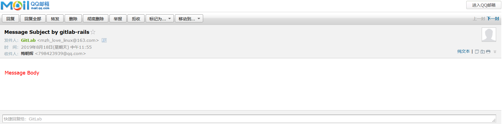

启动GitLab和Nginx服务
-------------------------------------------------

启动GitLab和Nginx服务::

    [root@hellogitlab ~]# systemctl start gitlab-runsvdir
    [root@hellogitlab ~]# gitlab-ctl start
    ok: run: alertmanager: (pid 22117) 1042s
    ok: run: gitaly: (pid 21983) 1050s
    ok: run: gitlab-monitor: (pid 22047) 1048s
    ok: run: gitlab-workhorse: (pid 22011) 1050s
    ok: run: logrotate: (pid 21486) 1191s
    ok: run: node-exporter: (pid 22026) 1049s
    ok: run: postgres-exporter: (pid 22131) 1042s
    ok: run: postgresql: (pid 21050) 1286s
    ok: run: prometheus: (pid 22075) 1047s
    ok: run: redis: (pid 20820) 1308s
    ok: run: redis-exporter: (pid 22056) 1048s
    ok: run: sidekiq: (pid 21407) 1203s
    ok: run: unicorn: (pid 21351) 1209s
    [root@hellogitlab ~]# systemctl start nginx
    [root@hellogitlab ~]# netstat -tunlp|grep nginx
    tcp        0      0 0.0.0.0:80              0.0.0.0:*               LISTEN      24963/nginx: master 
    tcp6       0      0 :::80                   :::*                    LISTEN      24963/nginx: master 

.. Attention:: 启动GitLab和Nginx服务前，先要使用 ``systemctl start gitlab-runsvdir`` 启动 ``runsv`` 。

配置宿主机IP、域名绑定关系
-------------------------------------------------

配置 ``C:\Windows\System32\drivers\etc\hosts`` 文件，增加以下内容：

192.168.1.11 hellogitlab.com

测试是否能够ping通hellogitlab.com::

    $ ping hellogitlab.com
    
    正在 Ping hellogitlab.com [192.168.1.11] 具有 32 字节的数据:
    来自 192.168.1.11 的回复: 字节=32 时间<1ms TTL=64
    来自 192.168.1.11 的回复: 字节=32 时间<1ms TTL=64
    来自 192.168.1.11 的回复: 字节=32 时间<1ms TTL=64
    来自 192.168.1.11 的回复: 字节=32 时间<1ms TTL=64
    
    192.168.1.11 的 Ping 统计信息:
        数据包: 已发送 = 4，已接收 = 4，丢失 = 0 (0% 丢失)，
    往返行程的估计时间(以毫秒为单位):
        最短 = 0ms，最长 = 0ms，平均 = 0ms

发现可以ping通过服务器，说明网络是通的。

关闭SELinux 
-------------------------------------------------

查看SELinux的具体的工作状态::

    [root@hellogitlab ~]# getenforce 
    Disabled
    
``说明SELinux已经关闭！``

访问GitLab
-------------------------------------------------

在Google浏览器中访问URL: http://hellogitlab.com/ ，可以看到GitLab页面了。

.. image:: ./_static/images/gitlab_first_domain_page.png

如果发现异常，可查看GitLab的错误日志文件 ``/var/log/nginx/gitlab_error.log`` ，另外检查SELinux是否关闭。

GitLab WEB界面配置
-------------------------------------------------

设置GitLab管理员root的密码为"1234567890"，并重新登陆，进入主页：

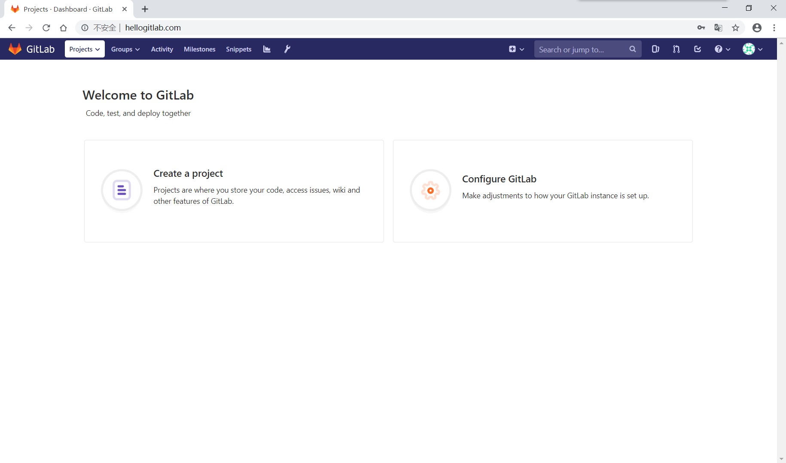

新建一个用户，并设置为管理员:

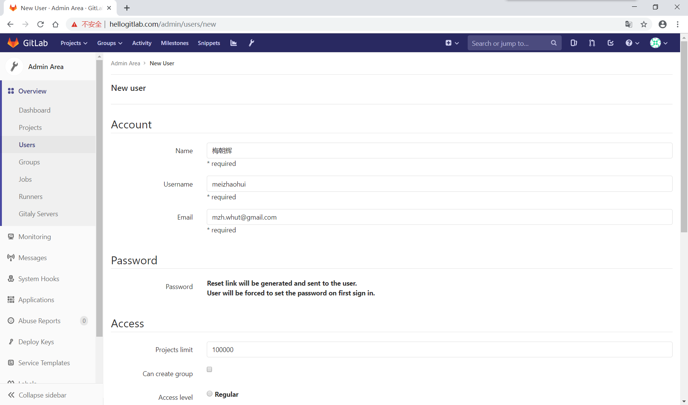

登陆邮箱查看邮件，验证账号：

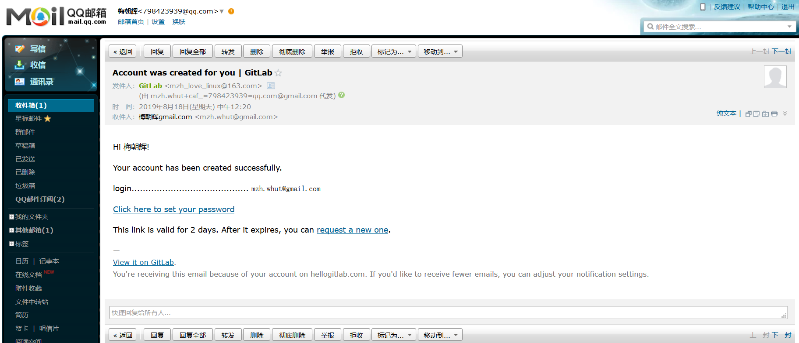

点击链接"Click here to set your password"重置密码:

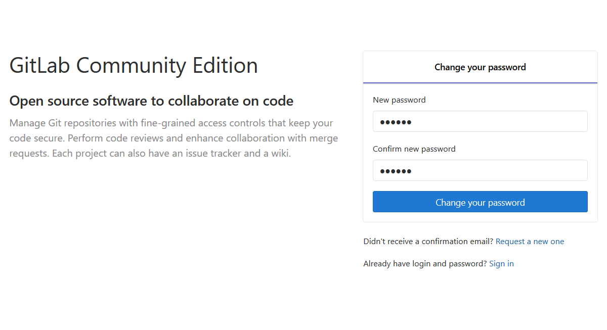

使用刚新建的管理员账号登陆：

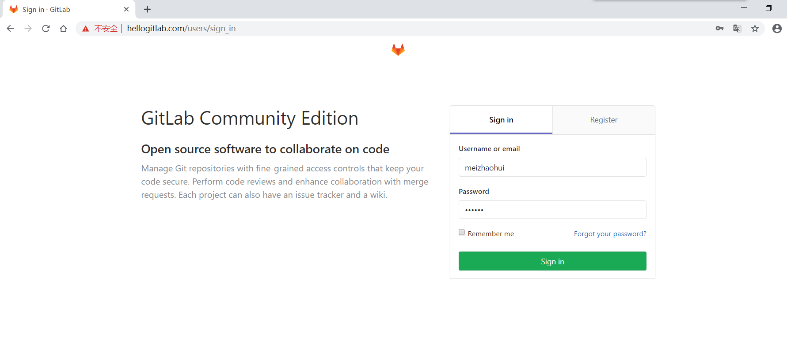

创建一个新的个人项目：

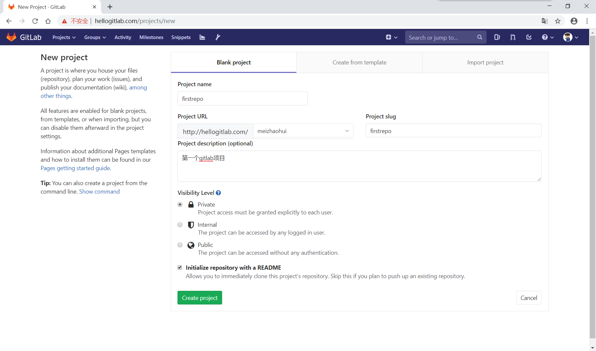

点击"Create project"创建项目。

创建完成后，可以看到跳转到项目详情界面：

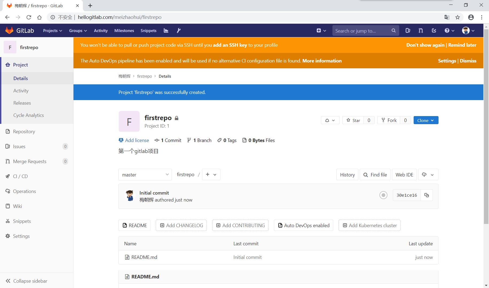

我们将宿主机上的个人公钥加到Gitlab上去，如果没有公钥，可以使用 ``ssh-keygen -C your_email@example.com`` 添加。

在WEB界面添加SSH KEY：

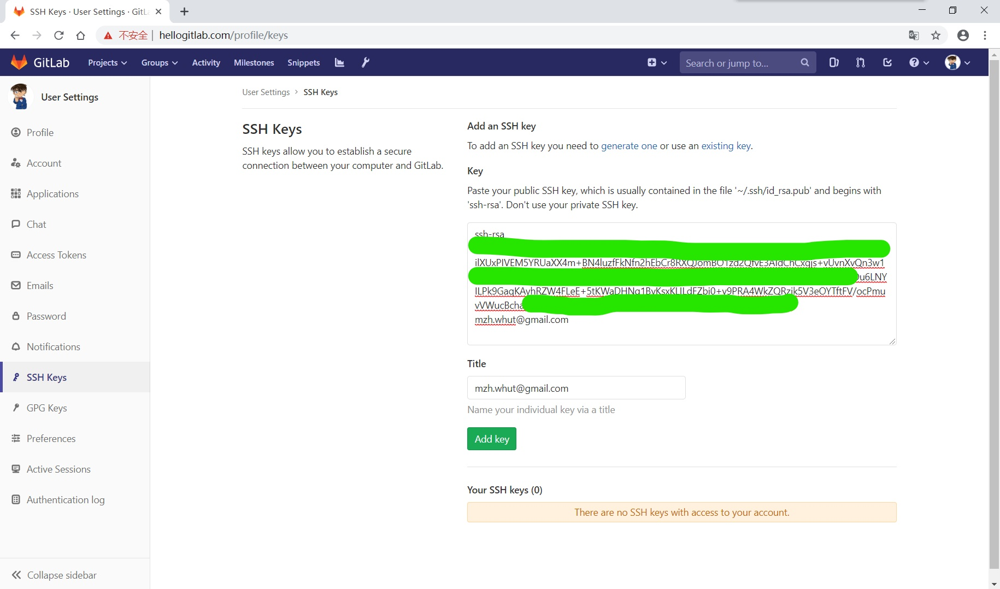

配置git环境::

    $ git config --global user.name "Zhaohui Mei"
    $ git config --global user.email "mzh.whut@gmail.com"
    $ git config --global --list
    user.name=Zhaohui Mei
    user.email=mzh.whut@gmail.com

克隆下载项目文件::

    D:\Desktop                                                                                          
    $ git clone git@hellogitlab.com:meizhaohui/firstrepo.git                                            
    Cloning into 'firstrepo'...                                                                         
    The authenticity of host 'hellogitlab.com (192.168.1.11)' can't be established.                     
    ECDSA key fingerprint is SHA256:c3MxIn6mHOUu3SY/+PvOVFwQQrWTrzzuaNgoR5R4iHc.                        
    Are you sure you want to continue connecting (yes/no)? yes                                          
    Warning: Permanently added 'hellogitlab.com,192.168.1.11' (ECDSA) to the list of known hosts.       
    remote: Enumerating objects: 3, done.                                                               
    remote: Counting objects: 100% (3/3), done.                                                         
    remote: Total 3 (delta 0), reused 0 (delta 0)                                                       
    Receiving objects: 100% (3/3), done.                                                                

提交修改::

    D:\Desktop                                                            
    $ cd firstrepo\                                                       
                                                                          
    D:\Desktop\firstrepo (master -> origin)                               
    $ git diff                                                            
    diff --git a/README.md b/README.md                                    
    index f3156d7..a8737ce 100644                                         
    --- a/README.md                                                       
    +++ b/README.md                                                       
    @@ -1,3 +1,4 @@                                                       
     # firstrepo                                                          
                                                                          
    -第一个gitlab项目                                                     
    \ No newline at end of file                                           
    +第一个gitlab项目                                                     
    +add by ssh method.                                                   
                                                                          
    D:\Desktop\firstrepo (master -> origin)                               
    $ git add -A                                                          
                                                                          
    D:\Desktop\firstrepo (master -> origin)                               
    $ git commit -m"通过SSH下载并提交修改"                                
    [master 787a9ba] 通过SSH下载并提交修改                                
     1 file changed, 2 insertions(+), 1 deletion(-)                       
                                                                          
    D:\Desktop\firstrepo (master -> origin)                               
    $ git push origin master:master                                       
    Enumerating objects: 5, done.                                         
    Counting objects: 100% (5/5), done.                                   
    Delta compression using up to 12 threads                              
    Compressing objects: 100% (2/2), done.                                
    Writing objects: 100% (3/3), 343 bytes | 343.00 KiB/s, done.          
    Total 3 (delta 0), reused 0 (delta 0)                                 
    To hellogitlab.com:meizhaohui/firstrepo.git                           
       30e1ce1..787a9ba  master -> master                                 
                                                                          

可以发现合入成功！

在WEB界面上查看刚才的提交:

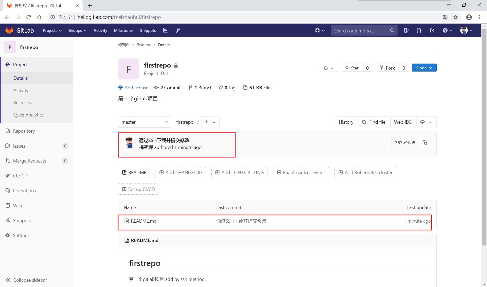

通过http方式下载项目文件::

    D:\Desktop
    $ git clone http://hellogitlab.com/meizhaohui/firstrepo.git http
    Cloning into 'http'...
    remote: Enumerating objects: 6, done.
    remote: Counting objects: 100% (6/6), done.
    remote: Compressing objects: 100% (3/3), done.
    remote: Total 6 (delta 0), reused 0 (delta 0)
    Unpacking objects: 100% (6/6), done.

在克隆下载时，需要输入用户名和密码：

.. image:: ./_static/images/gitlab_domain_git_clone_with_http_method.png

我们再次进行修改并提交::

    D:\Desktop                                                                     
    $ cd http\                                                                     
                                                                                   
    D:\Desktop\http (master -> origin)                                             
    $ git diff                                                                     
    diff --git a/README.md b/README.md                                             
    index a8737ce..80725a0 100644                                                  
    --- a/README.md                                                                
    +++ b/README.md                                                                
    @@ -2,3 +2,4 @@                                                                
                                                                                   
     第一个gitlab项目                                                              
     add by ssh method.                                                            
    +add by http method.                                                           
                                                                                   
    D:\Desktop\http (master -> origin)                                             
    $ git add -A                                                                   
                                                                                   
    D:\Desktop\http (master -> origin)                                             
    $ git commit -m"通过HTTP方式下载并提交修改"                                    
    [master a89dc8c] 通过HTTP方式下载并提交修改                                    
     1 file changed, 1 insertion(+)                                                
                                                                                   
    D:\Desktop\http (master -> origin)                                             
    $ git push origin master:master                                                
    Enumerating objects: 5, done.                                                  
    Counting objects: 100% (5/5), done.                                            
    Delta compression using up to 12 threads                                       
    Compressing objects: 100% (2/2), done.                                         
    Writing objects: 100% (3/3), 360 bytes | 180.00 KiB/s, done.                   
    Total 3 (delta 0), reused 0 (delta 0)                                          
    To http://hellogitlab.com/meizhaohui/firstrepo.git                             
       787a9ba..a89dc8c  master -> master                                          

可以发现通过http方式也可以合入修改！

在WEB界面上查看刚才的提交:

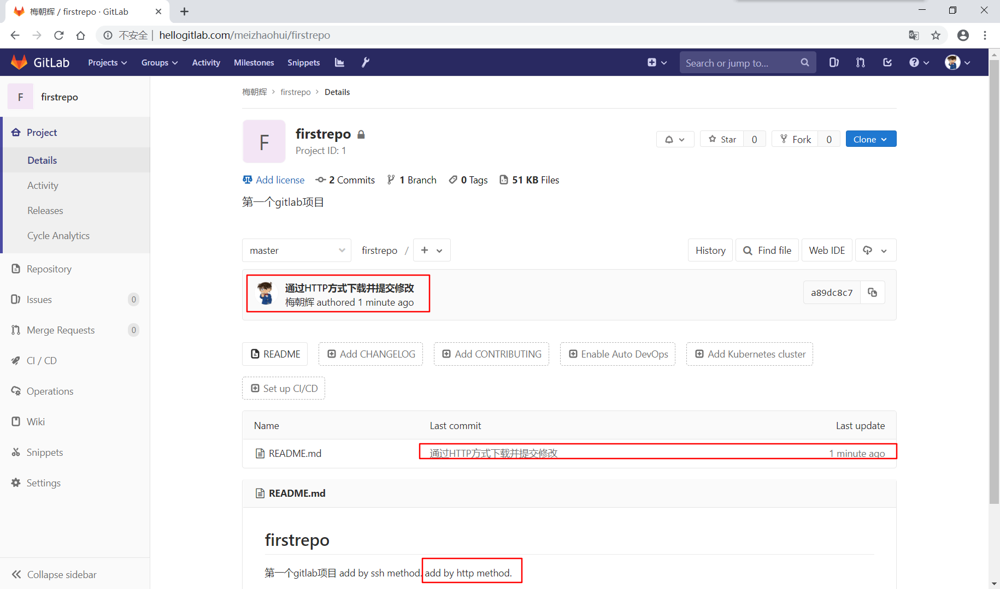

GitLab HTTPS协议配置
-------------------------------------------------

下载配置文件
^^^^^^^^^^^^^^^^^^^^^^^^^^^^^^^^^^^^^^^^^^^^^^^^^

上述使用HTTP域名方式配置的GitLab正常可用，我们在此基础上配置HTTPS协议，使我们的GitLab更安全！

首先，我们下载 ``gitlab-omnibus-ssl-nginx.conf`` 配置文件::

    [root@hellogitlab ~]# wget https://gitlab.com/gitlab-org/gitlab-recipes/raw/master/web-server/nginx/gitlab-omnibus-ssl-nginx.conf
    --2019-08-18 16:23:17--  https://gitlab.com/gitlab-org/gitlab-recipes/raw/master/web-server/nginx/gitlab-omnibus-ssl-nginx.conf
    Resolving gitlab.com (gitlab.com)... 35.231.145.151
    Connecting to gitlab.com (gitlab.com)|35.231.145.151|:443... connected.
    HTTP request sent, awaiting response... 200 OK
    Length: 4695 (4.6K) [text/plain]
    Saving to: ‘gitlab-omnibus-ssl-nginx.conf’
    
    100%[====================================================================================================>] 4,695       --.-K/s   in 0s      
    
    2019-08-18 16:23:20 (91.4 MB/s) - ‘gitlab-omnibus-ssl-nginx.conf’ saved [4695/4695]

你也可以通过点击下面的按钮进行下载。

:download:`gitlab-omnibus-ssl-nginx.conf <./data/gitlab-omnibus-ssl-nginx.conf>`

修改配置
^^^^^^^^^^^^^^^^^^^^^^^^^^^^^^^^^^^^^^^^^^^^^^^^^

将配置文件复制到/etc/nginx/conf.d/目录下::

    [root@hellogitlab ~]# cp gitlab-omnibus-ssl-nginx.conf /etc/nginx/conf.d/
    [root@hellogitlab ~]# ls -lah /etc/nginx/conf.d/
    total 16K
    drwxr-xr-x 2 root root   76 Aug 18 16:35 .
    drwxr-xr-x 4 root root 4.0K Aug 18 11:44 ..
    -rw-r--r-- 1 root root 2.1K Aug 18 16:23 gitlab-omnibus-nginx.conf
    -rw-r--r-- 1 root root 4.6K Aug 18 16:35 gitlab-omnibus-ssl-nginx.conf

查看配置文件，我们关注35、46、52-54行：

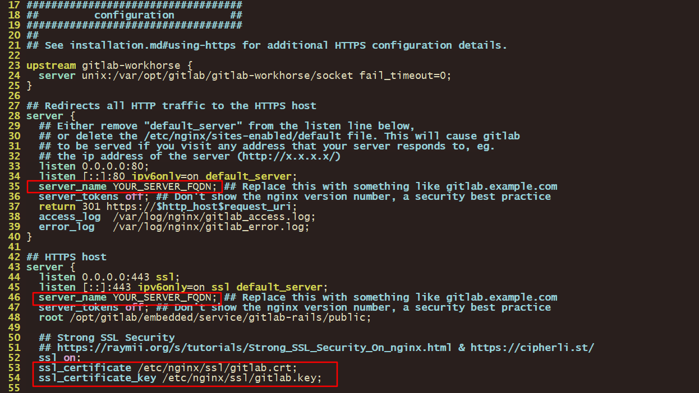

我们将 ``YOUR_SERVER_FQDN`` 替换成域名地址 ``hellogitlab.com`` :

.. code-block:: shell
    :linenos:
    :emphasize-lines: 1,11,22
    
    [root@hellogitlab ~]# sed -i 's/YOUR_SERVER_FQDN/hellogitlab.com/g' /etc/nginx/conf.d/gitlab-omnibus-ssl-nginx.conf
    [root@hellogitlab ~]# cat -n /etc/nginx/conf.d/gitlab-omnibus-ssl-nginx.conf |sed -n '27,55p'
        27  ## Redirects all HTTP traffic to the HTTPS host
        28  server {
        29    ## Either remove "default_server" from the listen line below,
        30    ## or delete the /etc/nginx/sites-enabled/default file. This will cause gitlab
        31    ## to be served if you visit any address that your server responds to, eg.
        32    ## the ip address of the server (http://x.x.x.x/)
        33    listen 0.0.0.0:80;
        34    listen [::]:80 ipv6only=on default_server;
        35    server_name hellogitlab.com; ## Replace this with something like gitlab.example.com
        36    server_tokens off; ## Don't show the nginx version number, a security best practice
        37    return 301 https://$http_host$request_uri;
        38    access_log  /var/log/nginx/gitlab_access.log;
        39    error_log   /var/log/nginx/gitlab_error.log;
        40  }
        41
        42  ## HTTPS host
        43  server {
        44    listen 0.0.0.0:443 ssl;
        45    listen [::]:443 ipv6only=on ssl default_server;
        46    server_name hellogitlab.com; ## Replace this with something like gitlab.example.com
        47    server_tokens off; ## Don't show the nginx version number, a security best practice
        48    root /opt/gitlab/embedded/service/gitlab-rails/public;
        49
        50    ## Strong SSL Security
        51    ## https://raymii.org/s/tutorials/Strong_SSL_Security_On_nginx.html & https://cipherli.st/
        52    ssl on;
        53    ssl_certificate /etc/nginx/ssl/gitlab.crt;
        54    ssl_certificate_key /etc/nginx/ssl/gitlab.key;
        55

创建自签名证书
^^^^^^^^^^^^^^^^^^^^^^^^^^^^^^^^^^^^^^^^^^^^^^^^^

创建自签名证书存放目录，并创建证书::

    [root@hellogitlab ~]# mkdir /etc/nginx/ssl
    [root@hellogitlab ~]# openssl req -x509 -nodes -days 1095 -newkey rsa:2048 -keyout /etc/nginx/ssl/gitlab.key -out /etc/nginx/ssl/gitlab.crt
    Generating a 2048 bit RSA private key
    ...............................................................................+++
    ....................+++
    writing new private key to '/etc/nginx/ssl/gitlab.key'
    -----
    You are about to be asked to enter information that will be incorporated
    into your certificate request.
    What you are about to enter is what is called a Distinguished Name or a DN.
    There are quite a few fields but you can leave some blank
    For some fields there will be a default value,
    If you enter '.', the field will be left blank.
    -----
    Country Name (2 letter code) [XX]:CN
    State or Province Name (full name) []:hubei
    Locality Name (eg, city) [Default City]:wuhan
    Organization Name (eg, company) [Default Company Ltd]:IT
    Organizational Unit Name (eg, section) []:HelloGitlab
    Common Name (eg, your name or your server's hostname) []:hellogitlab.com
    Email Address []:mzh.whut@gmail.com
    [root@hellogitlab ~]# ls -lah /etc/nginx/ssl/
    total 12K
    drwxr-xr-x 2 root root   42 Aug 18 16:52 .
    drwxr-xr-x 5 root root 4.0K Aug 18 16:51 ..
    -rw-r--r-- 1 root root 1.4K Aug 18 16:52 gitlab.crt
    -rw-r--r-- 1 root root 1.7K Aug 18 16:52 gitlab.key

重新配置GitLab
^^^^^^^^^^^^^^^^^^^^^^^^^^^^^^^^^^^^^^^^^^^^^^^^^

先将http方式的配置文件备份::

    [root@hellogitlab ~]# mv /etc/nginx/conf.d/gitlab-omnibus-nginx.conf /etc/nginx/conf.d/gitlab-omnibus-nginx.conf.bak
    [root@hellogitlab ~]# ls -lah /etc/nginx/conf.d/
    total 16K
    drwxr-xr-x 2 root root   80 Aug 18 16:55 .
    drwxr-xr-x 5 root root 4.0K Aug 18 16:51 ..
    -rw-r--r-- 1 root root 2.1K Aug 18 16:23 gitlab-omnibus-nginx.conf.bak
    -rw-r--r-- 1 root root 4.6K Aug 18 16:43 gitlab-omnibus-ssl-nginx.conf

停止GitLab和Nginx::

    [root@hellogitlab ~]# gitlab-ctl stop
    ok: down: alertmanager: 0s, normally up
    ok: down: gitaly: 0s, normally up
    ok: down: gitlab-monitor: 0s, normally up
    ok: down: gitlab-workhorse: 1s, normally up
    ok: down: logrotate: 0s, normally up
    ok: down: node-exporter: 1s, normally up
    ok: down: postgres-exporter: 0s, normally up
    ok: down: postgresql: 1s, normally up
    ok: down: prometheus: 0s, normally up
    ok: down: redis: 0s, normally up
    ok: down: redis-exporter: 1s, normally up
    ok: down: sidekiq: 0s, normally up
    ok: down: unicorn: 0s, normally up
    [root@hellogitlab ~]# systemctl stop gitlab-runsvdir
    [root@hellogitlab ~]# systemctl stop nginx
    [root@hellogitlab ~]# ps -ef|grep gitlab
    root     20570 14345  0 17:08 pts/0    00:00:00 grep --color=auto gitlab
    [root@hellogitlab ~]# ps -ef|grep nginx
    root     20576 14345  0 17:08 pts/0    00:00:00 grep --color=auto nginx

修改Gitlab配置文件 ``/etc/gitlab/gitlab.rb``，将13行的 ``http://hellogitlab.com`` 替换成 ``https://hellogitlab.com`` ::

    [root@hellogitlab ~]# sed -i 's@http://hellogitlab.com@https://hellogitlab.com@g' /etc/gitlab/gitlab.rb
    [root@hellogitlab ~]# cat -n /etc/gitlab/gitlab.rb|sed -n '13p'
        13  external_url "https://hellogitlab.com"

让配置生效::

    [root@hellogitlab ~]# gitlab-ctl reconfigure
    Starting Chef Client, version 13.6.4
    resolving cookbooks for run list: ["gitlab"]
    Synchronizing Cookbooks:
      - package (0.1.0)
      - postgresql (0.1.0)
      - redis (0.1.0)
      - registry (0.1.0)
      - mattermost (0.1.0)
      - consul (0.1.0)
      - gitaly (0.1.0)
      - letsencrypt (0.1.0)
      - nginx (0.1.0)
      - runit (4.3.0)
      - acme (3.1.0)
      - crond (0.1.0)
      - gitlab (0.0.1)
      - compat_resource (12.19.1)
    Installing Cookbook Gems:
    Compiling Cookbooks...
    ...省略
    ...省略
    Running handlers complete
    Chef Client finished, 6/610 resources updated in 17 seconds
    gitlab Reconfigured!

启动GitLab和Nginx服务::

    [root@hellogitlab ~]# systemctl start gitlab-runsvdir
    [root@hellogitlab ~]# gitlab-ctl start
    ok: run: alertmanager: (pid 21555) 12s
    ok: run: gitaly: (pid 21537) 13s
    ok: run: gitlab-monitor: (pid 21549) 12s
    ok: run: gitlab-workhorse: (pid 21541) 12s
    ok: run: logrotate: (pid 21545) 12s
    ok: run: node-exporter: (pid 21547) 12s
    ok: run: postgres-exporter: (pid 21557) 12s
    ok: run: postgresql: (pid 21539) 12s
    ok: run: prometheus: (pid 21553) 12s
    ok: run: redis: (pid 21535) 13s
    ok: run: redis-exporter: (pid 21551) 12s
    ok: run: sidekiq: (pid 21533) 13s
    ok: run: unicorn: (pid 21543) 12s
    [root@hellogitlab ~]# systemctl start nginx

访问GitLab
-------------------------------------------------

在Google浏览器中访问URL: http://hellogitlab.com/ ，可以看到页面自动跳转到 https://hellogitlab.com/ 了：

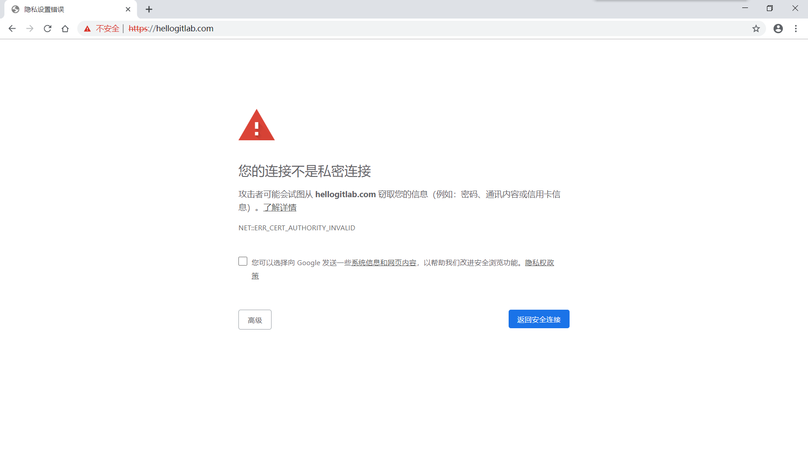

我们点击"高级"--"继续前往hellogitlab.com（不安全）"，可以看到打开了 https://hellogitlab.com/  页面：

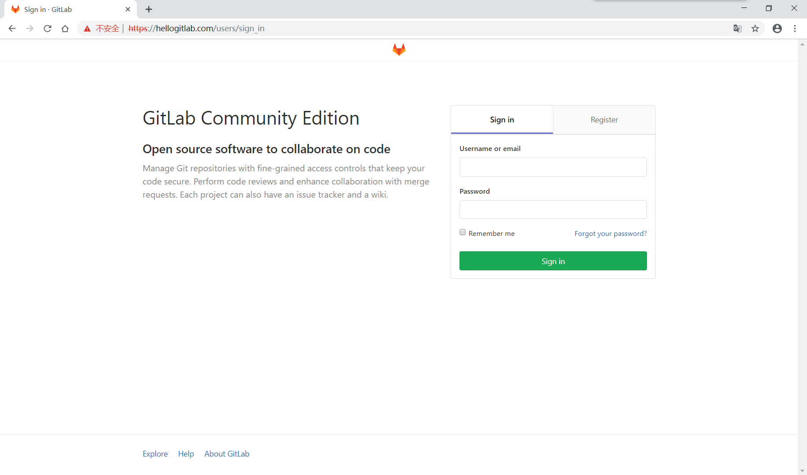

我们使用"meizhaohui"这个账号进行登陆，发现可以登陆上，登陆后的界面如下：

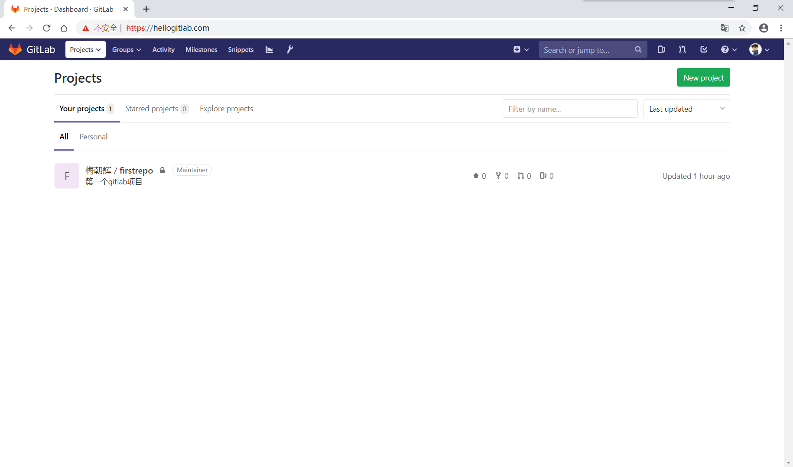

查看项目的详情界面，点击"clone"按钮，查看URL地址是否更新，可以发现URL已经变成https开头了：

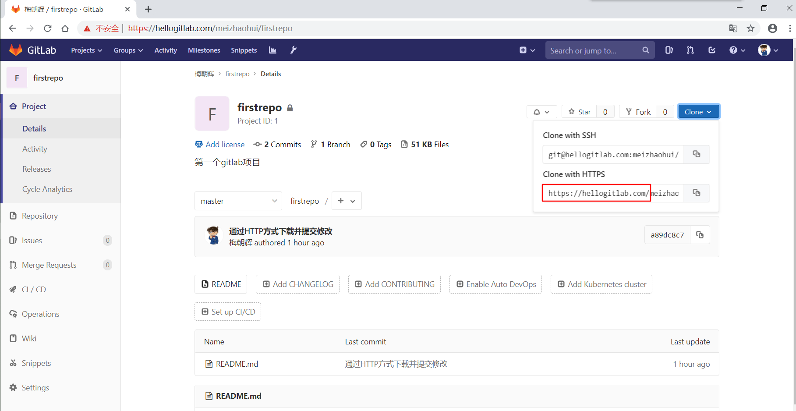

我们在宿主机上面使用https方式克隆下载仓库，也需要输入用户名和密码：

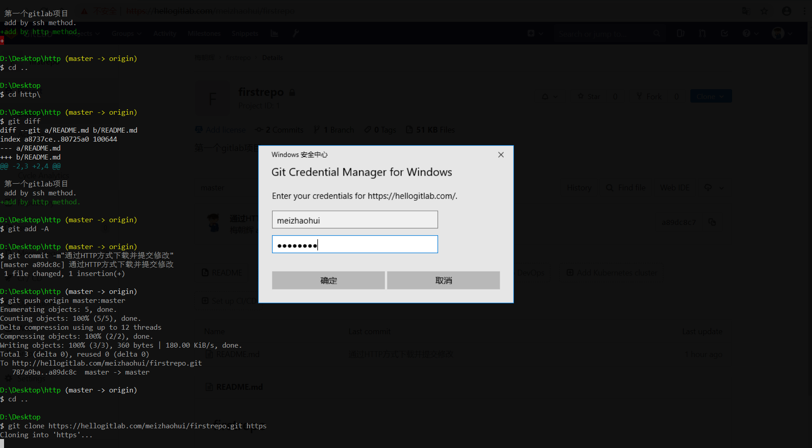

修改文件并提交::

    D:\Desktop
    $ git clone https://hellogitlab.com/meizhaohui/firstrepo.git https
    Cloning into 'https'...
    remote: Enumerating objects: 9, done.
    remote: Counting objects: 100% (9/9), done.
    remote: Compressing objects: 100% (5/5), done.
    remote: Total 9 (delta 1), reused 0 (delta 0)
    Unpacking objects: 100% (9/9), done.
    
    D:\Desktop
    $ cd https
    
    D:\Desktop\https (master -> origin)
    $ git diff
    diff --git a/README.md b/README.md
    index 80725a0..4d4a504 100644
    --- a/README.md
    +++ b/README.md
    @@ -3,3 +3,4 @@
     第一个gitlab项目
     add by ssh method.
     add by http method.
    +add by https method.
    
    D:\Desktop\https (master -> origin)
    $ git add -A
    
    D:\Desktop\https (master -> origin)
    $ git commit -m"通过HTTPS方式下载并提交修改"
    [master 6159214] 通过HTTPS方式下载并提交修改
     1 file changed, 1 insertion(+)
    
    D:\Desktop\https (master -> origin)
    $ git push origin master:master
    Enumerating objects: 5, done.
    Counting objects: 100% (5/5), done.
    Delta compression using up to 12 threads
    Compressing objects: 100% (2/2), done.
    Writing objects: 100% (3/3), 341 bytes | 341.00 KiB/s, done.
    Total 3 (delta 1), reused 0 (delta 0)
    To https://hellogitlab.com/meizhaohui/firstrepo.git
       a89dc8c..6159214  master -> master

在WEB界面上查看刚才的提交：

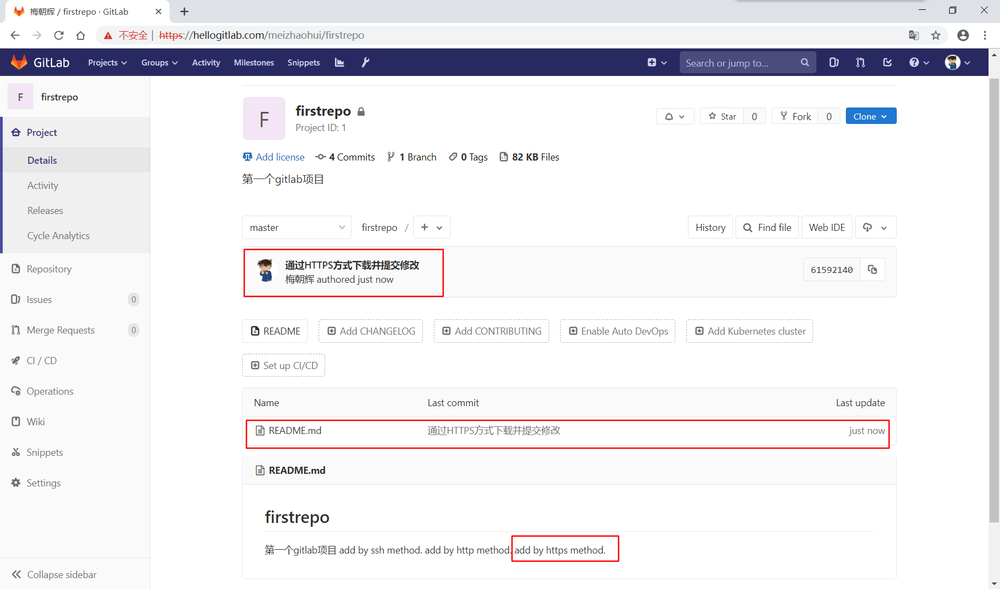

我们再在ssh方式下载的目录更新一下，看能否拉出最新的修改::

    D:\Desktop\https (master -> origin)
    $ cd ..\firstrepo\
    
    D:\Desktop\firstrepo (master -> origin)
    $ git remote -v
    origin  git@hellogitlab.com:meizhaohui/firstrepo.git (fetch)
    origin  git@hellogitlab.com:meizhaohui/firstrepo.git (push)
    
    D:\Desktop\firstrepo (master -> origin)
    $ git pull
    remote: Enumerating objects: 8, done.
    remote: Counting objects: 100% (8/8), done.
    remote: Compressing objects: 100% (4/4), done.
    remote: Total 6 (delta 1), reused 0 (delta 0)
    Unpacking objects: 100% (6/6), done.
    From hellogitlab.com:meizhaohui/firstrepo
       787a9ba..6159214  master     -> origin/master
    Updating 787a9ba..6159214
    Fast-forward
     README.md | 2 ++
     1 file changed, 2 insertions(+)
    
    D:\Desktop\firstrepo (master -> origin)
    $ git log
    commit 61592140da36857dd244b7e136b50fd292995419 (HEAD -> master, origin/master, origin/HEAD)
    Author: Zhaohui Mei <mzh.whut@gmail.com>
    Date:   Sun Aug 18 17:29:37 2019 +0800
    
        通过HTTPS方式下载并提交修改
    
    commit a89dc8c7287ee51e91dee6bb20f56c4b1e19cb36
    Author: Zhaohui Mei <mzh.whut@gmail.com>
    Date:   Sun Aug 18 16:00:38 2019 +0800
    
        通过HTTP方式下载并提交修改
    
    commit 787a9ba5201bdf5f4b51bf9a876820daadb63c54
    Author: Zhaohui Mei <mzh.whut@gmail.com>
    Date:   Sun Aug 18 15:49:11 2019 +0800
    
        通过SSH下载并提交修改
    
    commit 30e1ce16b7e72bcceb5fc071a4f5d8927f2bccba
    Author: 梅朝辉 <mzh.whut@gmail.com>
    Date:   Sun Aug 18 12:30:36 2019 +0800
    
        Initial commit
        
可以看到最新的修改都已经成功下载下来，说明配置没有问题！

我们再通过SSH方式提交一次修改，做最后的检查::

    D:\Desktop\firstrepo (master -> origin)                       
    $ git diff                                                    
    diff --git a/README.md b/README.md                            
    index 4d4a504..ccd2cd5 100644                                 
    --- a/README.md                                               
    +++ b/README.md                                               
    @@ -4,3 +4,4 @@                                               
     add by ssh method.                                           
     add by http method.                                          
     add by https method.                                         
    +add by ssh method again.                                     
                                                                  
    D:\Desktop\firstrepo (master -> origin)                       
    $ git add -A                                                  
                                                                  
    D:\Desktop\firstrepo (master -> origin)                       
    $ git commit -m"配置HTTPS传输后，通过SSH方式提交修改"         
    [master 24c6584] 配置HTTPS传输后，通过SSH方式提交修改         
     1 file changed, 1 insertion(+)                               
                                                                  
    D:\Desktop\firstrepo (master -> origin)                       
    $ git push origin master:master                               
    Enumerating objects: 5, done.                                 
    Counting objects: 100% (5/5), done.                           
    Delta compression using up to 12 threads                      
    Compressing objects: 100% (2/2), done.                        
    Writing objects: 100% (3/3), 363 bytes | 363.00 KiB/s, done.  
    Total 3 (delta 1), reused 0 (delta 0)                         
    To hellogitlab.com:meizhaohui/firstrepo.git                   
       6159214..24c6584  master -> master                         

发现可以正常提交，并且在WEB界面上面可以看到提交的更新：
        
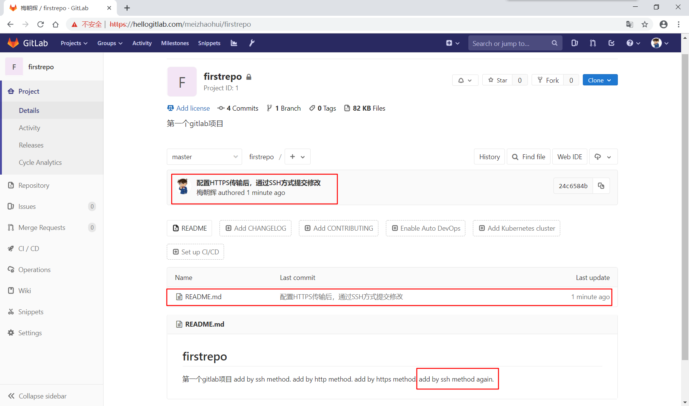

GitLab汉化
-------------------------------------------------

上述的操作可以确定HTTPS协议的GitLab已经配置好了！现在做最后的优化，进行GitLab汉化。

你可以通过下面这个命令下载汉化包::

    git clone https://gitlab.com/xhang/gitlab.git -b 11-10-stable-zh

我使用之前下载的汉化包直接上传到服务器上：

    [root@hellogitlab ~]# ls -lah gitlab-11-10-stable-zh.tar.gz   
    -rw-r--r-- 1 root root 60M Jun 29 18:35 gitlab-11-10-stable-zh.tar.gz
    [root@hellogitlab ~]# tar -zxvf gitlab-11-10-stable-zh.tar.gz
    [root@hellogitlab ~]# ls -ld gitlab-11-10-stable-zh 
    drwxrwxr-x 28 root root 4096 Jun 13 10:13 gitlab-11-10-stable-zh

停止GitLab和Nginx服务::

    [root@hellogitlab ~]# gitlab-ctl stop
    ok: down: alertmanager: 0s, normally up
    ok: down: gitaly: 1s, normally up
    ok: down: gitlab-monitor: 0s, normally up
    ok: down: gitlab-workhorse: 0s, normally up
    ok: down: logrotate: 1s, normally up
    ok: down: node-exporter: 0s, normally up
    ok: down: postgres-exporter: 1s, normally up
    ok: down: postgresql: 0s, normally up
    ok: down: prometheus: 0s, normally up
    ok: down: redis: 0s, normally up
    ok: down: redis-exporter: 0s, normally up
    ok: down: sidekiq: 0s, normally up
    ok: down: unicorn: 0s, normally up
    [root@hellogitlab ~]# systemctl stop gitlab-runsvdir
    [root@hellogitlab ~]# systemctl stop nginx
    [root@hellogitlab ~]# ps -ef|grep gitlab
    root     27234 14345  0 17:51 pts/0    00:00:00 grep --color=auto gitlab
    [root@hellogitlab ~]# ps -ef|grep nginx
    root     27240 14345  0 17:51 pts/0    00:00:00 grep --color=auto nginx

说明GitLab相关服务已经停止。

备份 ``/opt/gitlab/embedded/service/gitlab-rails/`` 文件夹，防止后续操作失败导致GitLab无法运行::

    [root@hellogitlab ~]# cp -rf /opt/gitlab/embedded/service/gitlab-rails/ /opt/gitlab/embedded/service/gitlab-rails.bak
    [root@hellogitlab ~]# ls -lad /opt/gitlab/embedded/service/gitlab-rails*
    drwxr-xr-x 24 root root 4096 Aug 18 11:45 /opt/gitlab/embedded/service/gitlab-rails
    drwxr-xr-x 24 root root 4096 Aug 18 17:52 /opt/gitlab/embedded/service/gitlab-rails.bak
    [root@hellogitlab ~]# du -sh /opt/gitlab/embedded/service/gitlab-rails*
    253M    /opt/gitlab/embedded/service/gitlab-rails
    253M    /opt/gitlab/embedded/service/gitlab-rails.bak

去除cp的别名，复制gitlab汉化包中的文件到 ``/opt/gitlab/embedded/service/gitlab-rails/`` 目录下::

    [root@hellogitlab ~]# alias cp
    alias cp='cp -i'
    [root@hellogitlab ~]# unalias cp
    [root@hellogitlab ~]# ls
    anaconda-ks.cfg       gitlab-11-10-stable-zh         gitlab-omnibus-nginx.conf      readme.txt
    centos7_mini_init.sh  gitlab-11-10-stable-zh.tar.gz  gitlab-omnibus-ssl-nginx.conf
    [root@hellogitlab ~]# cp -rf gitlab-11-10-stable-zh/* /opt/gitlab/embedded/service/gitlab-rails/
    cp: cannot overwrite non-directory ‘/opt/gitlab/embedded/service/gitlab-rails/log’ with directory ‘gitlab-11-10-stable-zh/log’
    cp: cannot overwrite non-directory ‘/opt/gitlab/embedded/service/gitlab-rails/tmp’ with directory ‘gitlab-11-10-stable-zh/tmp’

使配置生效::

    [root@hellogitlab ~]# systemctl start gitlab-runsvdir
    [root@hellogitlab ~]# gitlab-ctl reconfigure
    ...... 执行剧本，忽略
    Running handlers:
    Running handlers complete
    Chef Client finished, 5/609 resources updated in 51 seconds
    gitlab Reconfigured!

启动GitLab和Nginx服务::

    [root@hellogitlab ~]# systemctl start gitlab-runsvdir
    [root@hellogitlab ~]# gitlab-ctl start
    ok: run: alertmanager: (pid 27460) 134s
    ok: run: gitaly: (pid 27472) 134s
    ok: run: gitlab-monitor: (pid 27464) 134s
    ok: run: gitlab-workhorse: (pid 27474) 134s
    ok: run: logrotate: (pid 27476) 134s
    ok: run: node-exporter: (pid 27478) 134s
    ok: run: postgres-exporter: (pid 27462) 134s
    ok: run: postgresql: (pid 27482) 134s
    ok: run: prometheus: (pid 27480) 134s
    ok: run: redis: (pid 27470) 134s
    ok: run: redis-exporter: (pid 27484) 134s
    ok: run: sidekiq: (pid 27468) 134s
    ok: run: unicorn: (pid 27466) 134s
    [root@hellogitlab ~]# systemctl start nginx

重新访问GitLab，可以看到中文页面了:

.. image:: ./_static/images/gitlab_domain_https_with_i18n.png

正常登陆。在"偏好"中设置"语言"是"简体中文"，重新登陆即可。

再次查看项目详情页面：

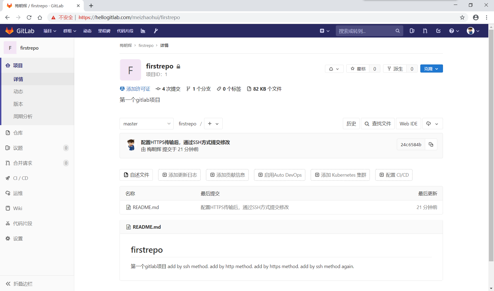

GitLab常用命令
-------------------------------------------------

- 启动服务： ``gitlab-ctl start``
- 查看状态： ``gitlab-ctl status``
- 停掉服务： ``gitlab-ctl stop``
- 重启服务： ``gitlab-ctl restart``
- 让配置生效： ``gitlab-ctl reconfigure``
- 查看GitLab版本： ``cat /opt/gitlab/embedded/service/gitlab-rails/VERSION``

后续补充初始化HTTPS方式GitLab配置文件的脚本。
