.. _configure_gitlab_i18n_and_create_gitlab_ci_with_gitlab_runner:

GitLab的汉化与CI持续集成gitlab-runner的配置
=================================================

.. contents:: 目录

本文讲解在 :ref:`CentOS7安装GitLab(使用外部Nginx配置) <centos7_install_gitlab_with_external_nginx>` 的基础上，对GitLab进行汉化，并配置CI持续集成工具gitlab-runner。

实验环境
-------------------------------------------------

- server服务端: 操作系统为CentOS 7.6，IP:192.168.56.14， git:2.16.5。

查看server服务端信息::

    [root@server ~]# cat /etc/centos-release
    CentOS Linux release 7.6.1810 (Core) 
    [root@server ~]# ip a show|grep 192
    inet 192.168.56.14/24 brd 192.168.56.255 scope global noprefixroute enp0s3
    [root@server ~]# git --version
    git version 2.16.5
    
GitLab用户信息::

    账号            密码
    root            1234567890
    meizhaohui      1234567890
    
- 虚拟机因为重启了，重新检查一下GitLab能否正常运行。

GitLab环境检查
-------------------------------------------------

进行检查::

    [root@server ~]# systemctl status nginx
    ● nginx.service - The nginx HTTP and reverse proxy server
       Loaded: loaded (/usr/lib/systemd/system/nginx.service; disabled; vendor preset: disabled)
       Active: active (running) since Thu 2019-06-27 19:58:19 CST; 57min ago
      Process: 13664 ExecStart=/usr/sbin/nginx (code=exited, status=0/SUCCESS)
      Process: 13660 ExecStartPre=/usr/sbin/nginx -t (code=exited, status=0/SUCCESS)
      Process: 13659 ExecStartPre=/usr/bin/rm -f /run/nginx.pid (code=exited, status=0/SUCCESS)
     Main PID: 13666 (nginx)
        Tasks: 2
       Memory: 10.5M
       CGroup: /system.slice/nginx.service
               ├─13666 nginx: master process /usr/sbin/nginx
               └─13667 nginx: worker process

    Jun 27 19:58:18 server.hopewait systemd[1]: Starting The nginx HTTP and reverse proxy server...
    Jun 27 19:58:19 server.hopewait nginx[13660]: nginx: the configuration file /etc/nginx/nginx.conf syntax is ok
    Jun 27 19:58:19 server.hopewait nginx[13660]: nginx: configuration file /etc/nginx/nginx.conf test is successful
    Jun 27 19:58:19 server.hopewait systemd[1]: Failed to read PID from file /run/nginx.pid: Invalid argument
    Jun 27 19:58:19 server.hopewait systemd[1]: Started The nginx HTTP and reverse proxy server.
    
Nginx服务正常运行，访问GitLab服务 http://192.168.56.14 ，发现可以正常访问：

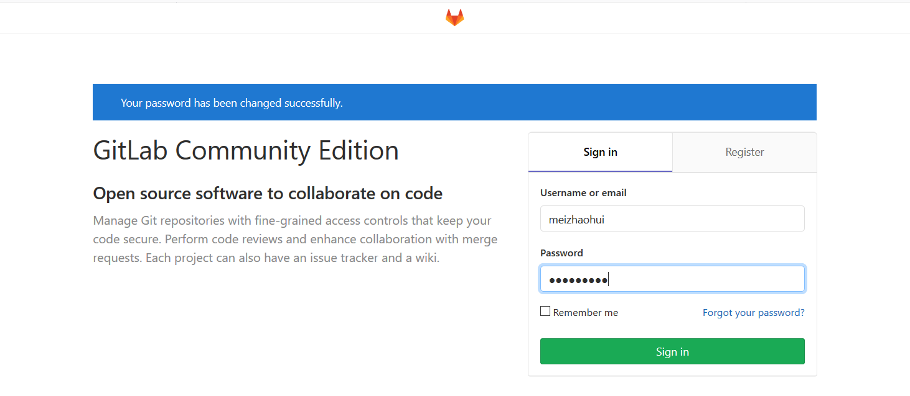

我们使用meizhaohui这个账号来下载hellopython项目::

    D:\Desktop                                            
    $ git clone git@192.168.56.14:higit/hellopython.git   
    Cloning into 'hellopython'...                         
    remote: Enumerating objects: 9, done.                 
    Receiving objects: 100% (9/9), done.    (9/9)         
    remote: Counting objects: 100% (9/9), done.           
    remote: Compressing objects: 100% (3/3), done.        
    remote: Total 9 (delta 0), reused 0 (delta 0)         

说明仍然可以下载，GitLab运行正常。

GitLab汉化
-------------------------------------------------

下面我们开始今天的主题，进行GitLab的汉化和CI的配置。

查看GitLab版本::

    [root@server ~]# cat /opt/gitlab/embedded/service/gitlab-rails/VERSION
    11.10.0

查看GitLab中文社区官方仓库 https://gitlab.com/xhang/gitlab ， 检查对应的汉化包版本信息：

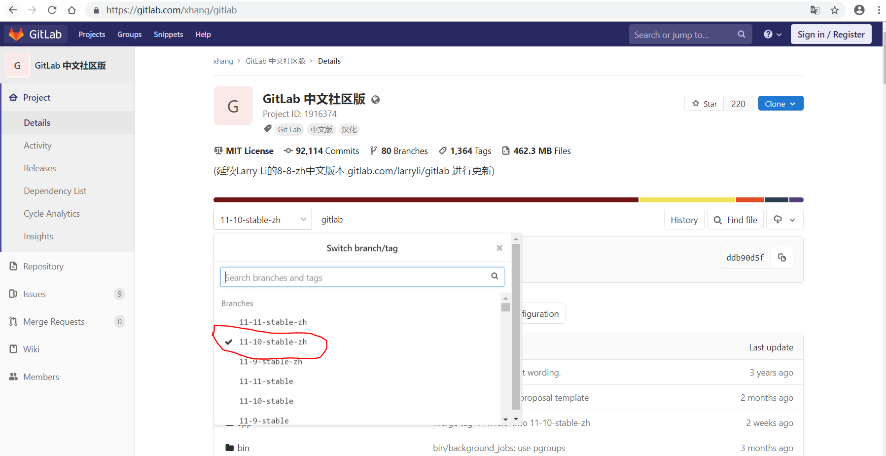

我们下载GitLab版本对应的汉化包，11-10-stable-zh这个版本::

    [root@server ~]#  git clone https://gitlab.com/xhang/gitlab.git -b 11-10-stable-zh
    Cloning into 'gitlab'...
    remote: warning: ignoring extra bitmap file: /var/opt/gitlab/git-data/repositories/@pools/04/ad/04ad22d7630382dd5ece1410d2d8a131c44bdf54b53eb6b22a0276994b836d53.git/objects/pack/pack-573496940d56eadcba5a8d435e5b0f2345c9f918.pack
    remote: Enumerating objects: 979008, done.
    remote: Counting objects: 100% (979008/979008), done.
    remote: Compressing objects: 100% (203291/203291), done.
    remote: Total 979008 (delta 764750), reused 977616 (delta 763404)
    Receiving objects: 100% (979008/979008), 400.57 MiB | 36.88 MiB/s, done.
    Resolving deltas: 100% (764750/764750), done.

下载完后，查看的汉化包信息::

    [root@server ~]# ls -lad gitlab/
    drwxr-xr-x. 29 root root 4096 Jun 27 21:33 gitlab/
    [root@server ~]# cd gitlab/
    [root@server gitlab]# git remote -v
    origin  https://gitlab.com/xhang/gitlab.git (fetch)
    origin  https://gitlab.com/xhang/gitlab.git (push)
    [root@server gitlab]# git branch
    * 11-10-stable-zh

停止GitLab相关服务::

    [root@server ~]# gitlab-ctl stop
    ok: down: alertmanager: 0s, normally up
    ok: down: gitaly: 0s, normally up
    ok: down: gitlab-monitor: 0s, normally up
    ok: down: gitlab-workhorse: 0s, normally up
    ok: down: logrotate: 1s, normally up
    ok: down: node-exporter: 0s, normally up
    ok: down: postgres-exporter: 1s, normally up
    ok: down: postgresql: 0s, normally up
    ok: down: prometheus: 0s, normally up
    ok: down: redis: 0s, normally up
    ok: down: redis-exporter: 0s, normally up
    ok: down: sidekiq: 0s, normally up
    ok: down: unicorn: 0s, normally up
    [root@server ~]# systemctl stop gitlab-runsvdir
    [root@server ~]# systemctl stop nginx
    [root@server ~]# ps -ef|grep gitlab
    root     26384 13568  0 21:46 pts/0    00:00:00 grep --color=auto gitlab
    [root@server ~]# ps -ef|grep nginx
    root     26386 13568  0 21:46 pts/0    00:00:00 grep --color=auto nginx

说明GitLab相关服务已经停止。

备份 ``/opt/gitlab/embedded/service/gitlab-rails/`` 文件夹，防止后续操作失败导致GitLab无法运行::

    [root@server ~]# cp -rf /opt/gitlab/embedded/service/gitlab-rails/ /opt/gitlab/embedded/service/gitlab-rails.bak
    
    # 检查是否备份成功
    [root@server ~]# ls -lad /opt/gitlab/embedded/service/gitlab-rails*
    drwxr-xr-x 24 root root 4096 Jun 23 14:56 /opt/gitlab/embedded/service/gitlab-rails
    drwxr-xr-x 24 root root 4096 Jun 27 21:49 /opt/gitlab/embedded/service/gitlab-rails.bak
    [root@server ~]# du -sh /opt/gitlab/embedded/service/gitlab-rails* 
    253M    /opt/gitlab/embedded/service/gitlab-rails
    253M    /opt/gitlab/embedded/service/gitlab-rails.bak

去除cp的别名，复制gitlab汉化包中的文件到 ``/opt/gitlab/embedded/service/gitlab-rails/`` 目录下::

    [root@server ~]# alias cp
    alias cp='cp -i'
    [root@server ~]# unalias cp
    [root@server ~]# cp -rf gitlab/* /opt/gitlab/embedded/service/gitlab-rails/
    cp: cannot overwrite non-directory ‘/opt/gitlab/embedded/service/gitlab-rails/log’ with directory ‘gitlab/log’
    cp: cannot overwrite non-directory ‘/opt/gitlab/embedded/service/gitlab-rails/tmp’ with directory ‘gitlab/tmp’

使配置生效::

    [root@server ~]# systemctl start gitlab-runsvdir
    [root@server ~]# gitlab-ctl reconfigure
    ...... 执行剧本，忽略
    Running handlers:
    Running handlers complete
    Chef Client finished, 5/609 resources updated in 01 minutes 10 seconds
    gitlab Reconfigured!
    [root@server ~]# 

启动GitLab和Nginx::

    [root@server ~]# gitlab-ctl start
    ok: run: alertmanager: (pid 22346) 697s
    ok: run: gitaly: (pid 22326) 697s
    ok: run: gitlab-monitor: (pid 22340) 697s
    ok: run: gitlab-workhorse: (pid 22334) 697s
    ok: run: logrotate: (pid 22336) 697s
    ok: run: node-exporter: (pid 22338) 697s
    ok: run: postgres-exporter: (pid 22348) 697s
    ok: run: postgresql: (pid 22328) 697s
    ok: run: prometheus: (pid 22344) 697s
    ok: run: redis: (pid 22324) 697s
    ok: run: redis-exporter: (pid 22342) 697s
    ok: run: sidekiq: (pid 22332) 697s
    ok: run: unicorn: (pid 22330) 697s
    [root@server ~]# systemctl start nginx
    [root@server ~]# 

访问GitLab服务 http://192.168.56.14 ，发现可以正常访问，并显示中文的页面：

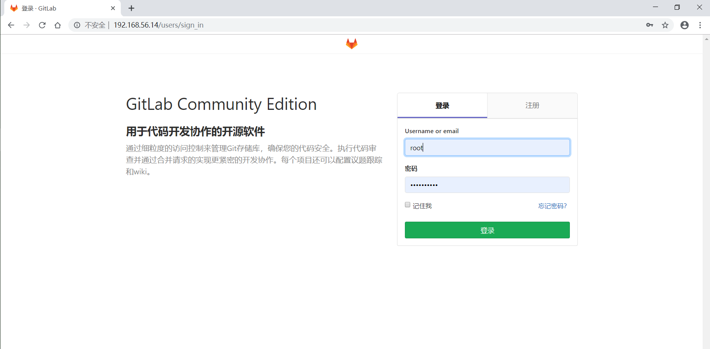

点击右上角的个人图标，在弹出的下拉选项中点击  ``Settings`` 进入到 ``Settings`` 设置界面：

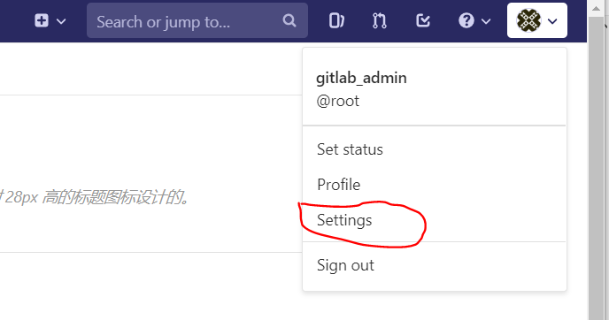

点击左侧的 ``preferences`` 标签页，进入到个人偏好设置界面，下拉到 ``Localization`` 本地化的位置：

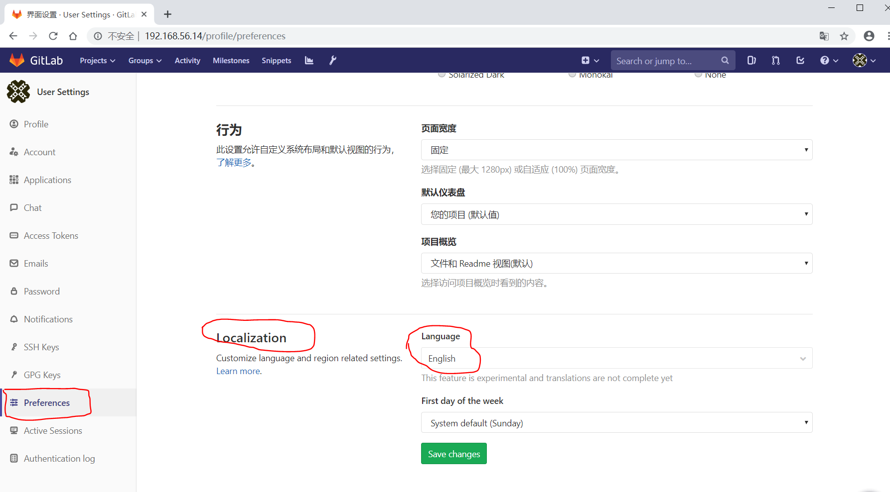

点击 ``Language`` 语言下拉框选择 "简体中文"，并将周一设置为每周的第一天，并点击 ``Save changes`` 保存修改：

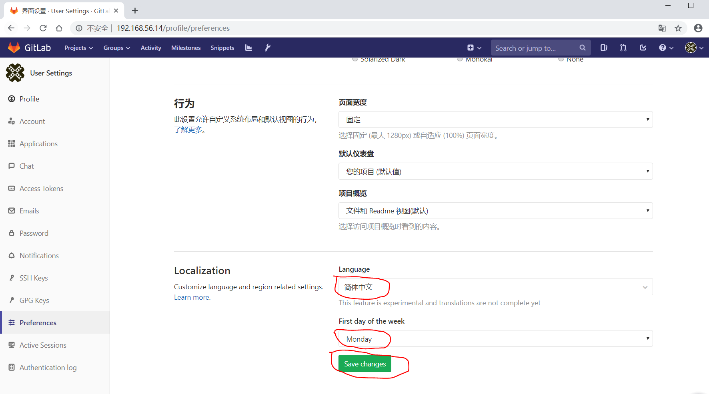

保存后，按F5刷新一下页面，可以看到页面显示已经变成中文了：

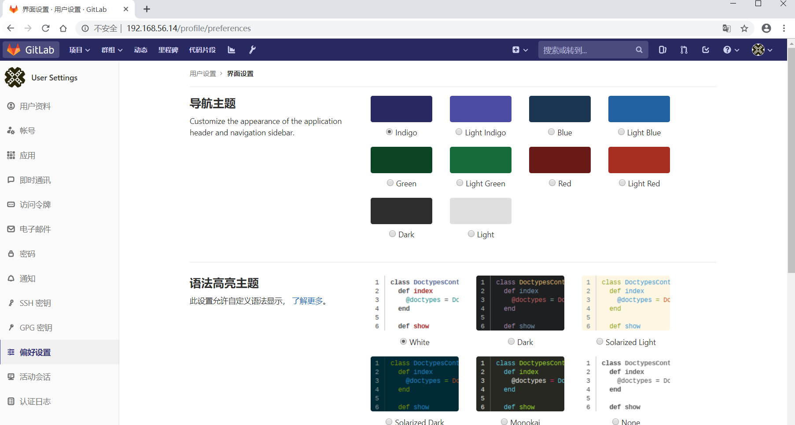

修改图像时，保存时，提示 "Request failed with status code 500" 异常，查看日志信息::

    [root@server ~]# tail -f /var/log/nginx/gitlab_error.log 
    2019/06/29 19:13:07 [crit] 24457#0: *206 open() "/var/lib/nginx/tmp/client_body/0000000001" failed (13: Permission denied), client: 192.168.56.1, server: 192.168.56.14, request: "POST /profile HTTP/1.1", host: "192.168.56.14", referrer: "http://192.168.56.14/profile"
    2019/06/29 19:13:51 [crit] 24457#0: *207 open() "/var/lib/nginx/tmp/client_body/0000000002" failed (13: Permission denied), client: 192.168.56.1, server: 192.168.56.14, request: "POST /profile HTTP/1.1", host: "192.168.56.14", referrer: "http://192.168.56.14/profile"
    2019/06/29 19:15:37 [crit] 24457#0: *212 open() "/var/lib/nginx/tmp/client_body/0000000003" failed (13: Permission denied), client: 192.168.56.1, server: 192.168.56.14, request: "POST /profile HTTP/1.1", host: "192.168.56.14", referrer: "http://192.168.56.14/profile"

发现权限不够，我们查看一下相关目录的权限::

    [root@server ~]# ls -lah /var/lib/nginx/tmp/
    total 0
    drwx------. 7 root  root 78 May 10 16:10 .
    drwx------. 3 root  root 17 May 10 16:10 ..
    drwx------. 2 nginx root  6 Jun 22 23:04 client_body
    drwx------. 2 nginx root  6 Jun 22 23:04 fastcgi
    drwx------. 2 nginx root  6 Jun 22 23:04 proxy
    drwx------. 2 nginx root  6 Jun 22 23:04 scgi
    drwx------. 2 nginx root  6 Jun 22 23:04 uwsgi
    
    [root@server ~]# ls -lad /var/lib/nginx/tmp/
    drwx------. 7 root root 78 May 10 16:10 /var/lib/nginx/tmp/
    [root@server ~]# chmod 755 /var/lib/nginx/tmp/
    [root@server ~]# ls -lad /var/lib/nginx/tmp/  
    drwxr-xr-x. 7 root root 78 May 10 16:10 /var/lib/nginx/tmp/
    
    [root@server ~]# ls -lahd /var/lib/nginx/
    drwx------. 3 root root 17 May 10 16:10 /var/lib/nginx/
    [root@server ~]# chmod 755 /var/lib/nginx
    [root@server ~]# ls -lahd /var/lib/nginx/
    drwxr-xr-x. 3 root root 17 May 10 16:10 /var/lib/nginx/
    [root@server ~]# ls -lad /var/lib/
    drwxr-xr-x. 33 root root 4096 Jun 23 20:18 /var/lib/

将 ``/var/lib/nginx/`` 和 ``/var/lib/nginx/tmp/`` 目录增加rx权限，再上传图像能够正常修改成功！可以看看很酷的头像：

我们将"meizhaohui"这个账号设置为管理员，后期可以直接使用这个账号登陆操作GitLab。

设置后，使用"meizhaohui"登陆，设置头像等属性！

配置CI/CD
-------------------------------------------------

我们新建一个博客项目 ``bluelog`` ，并将博客项目的代码上传入库::

    D:\data\github_tmp\higit
    $ git clone git@192.168.56.14:higit/bluelog.git
    Cloning into 'bluelog'...
    warning: You appear to have cloned an empty repository.
    D:\data\github_tmp\higit
    $ git clone git@192.168.56.14:higit/bluelog.git
    Cloning into 'bluelog'...
    warning: You appear to have cloned an empty repository.
    
    D:\data\github_tmp\higit
    $ ls
    bluelog/
    
    D:\data\github_tmp\higit
    $ ls
    bluelog/
    
    D:\data\github_tmp\higit
    $ cd bluelog\
    
    D:\data\github_tmp\higit\bluelog (master -> origin)
    $ git diff
    
    D:\data\github_tmp\higit\bluelog (master -> origin)
    $ git status
    On branch master
    
    No commits yet
    
    Untracked files:
      (use "git add <file>..." to include in what will be committed)
    
            .flaskenv
            .gitignore
            LICENSE
            Pipfile
            Pipfile.lock
            README.md
            README_origin.md
            bluelog/
            logs/
    
    nothing added to commit but untracked files present (use "git add" to track)
    
    D:\data\github_tmp\higit\bluelog (master -> origin)
    $ git add -A
    
    D:\data\github_tmp\higit\bluelog (master -> origin)
    $ git commit -m"upload bluelog code"
    
    D:\data\github_tmp\higit\bluelog (master -> origin)
    $ git push origin master:master
    Enumerating objects: 1115, done.
    Counting objects: 100% (1115/1115), done.
    Delta compression using up to 12 threads
    Compressing objects: 100% (1040/1040), done.
    Writing objects: 100% (1115/1115), 3.99 MiB | 5.91 MiB/s, done.
    Total 1115 (delta 261), reused 0 (delta 0)
    remote: Resolving deltas: 100% (261/261), done.
    To 192.168.56.14:higit/bluelog.git
     * [new branch]      master -> master
     
上传完成后，查看 ``bluelog`` 项目：

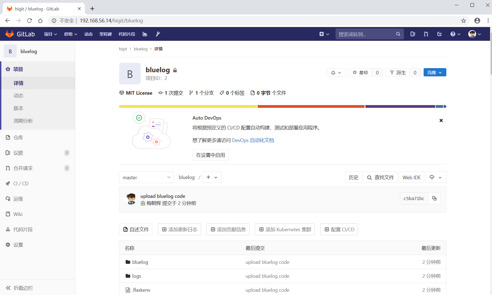

我们点击"配置CD/CD"按钮：

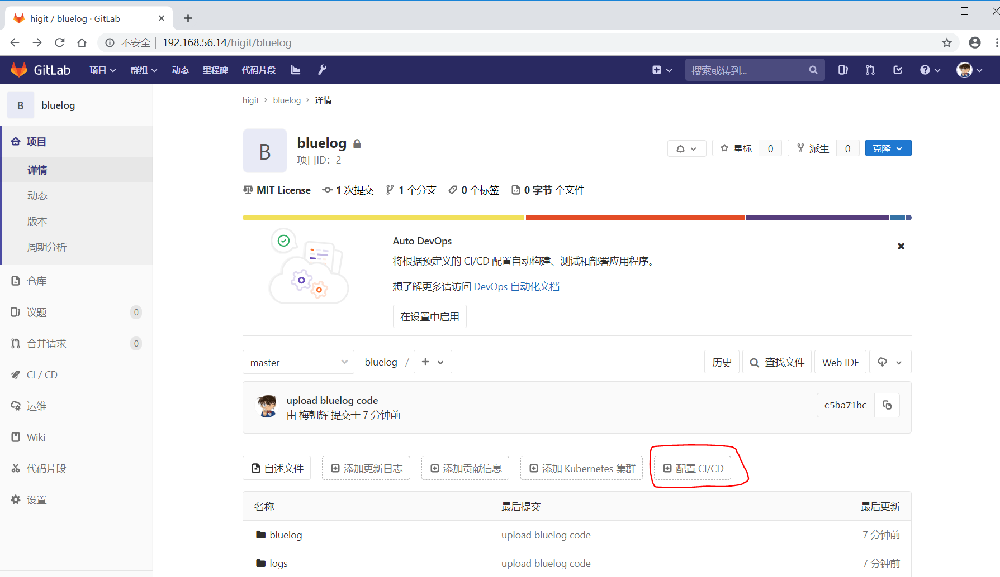

我们点击"选择一个GitLab CI Yaml模板"：

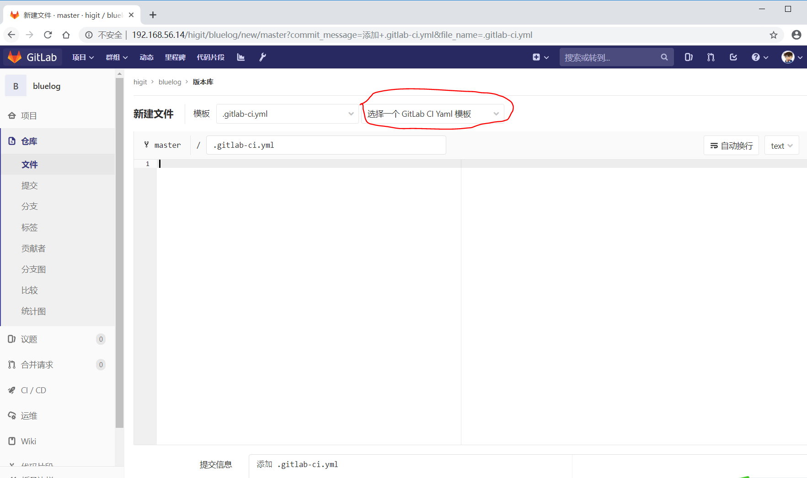

选择 ``Bash`` 模板：

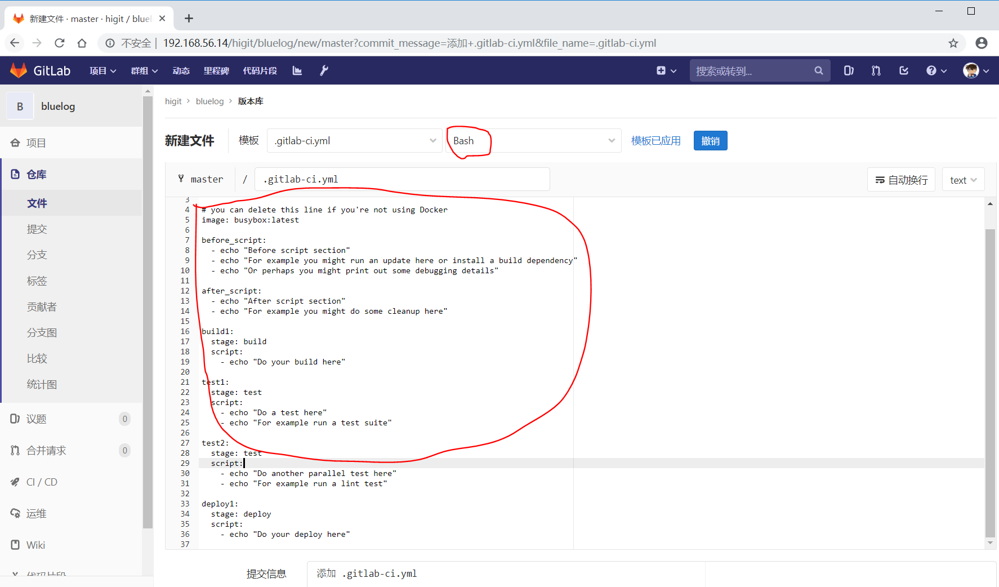

会自动加入Bash模板的内容，我们点击"提交修改"按钮进行提交，并检查CI/CD中的流水线工程：

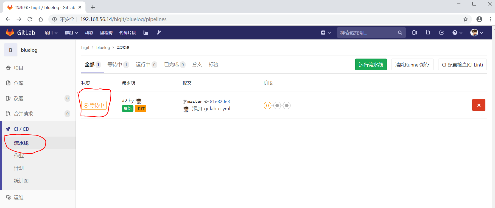

发现流水线任务的状态是 ``"卡住(stuck)"`` ``"等待中"``，说明我们的流水线配置还不正确，没能正确的运行。

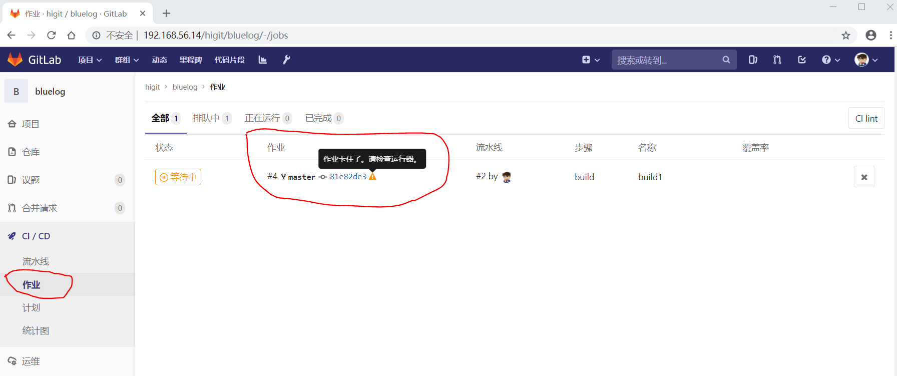

提示 ``作业卡住了，请检查运行器`` ，我们查看具体哪个JOB卡住了：

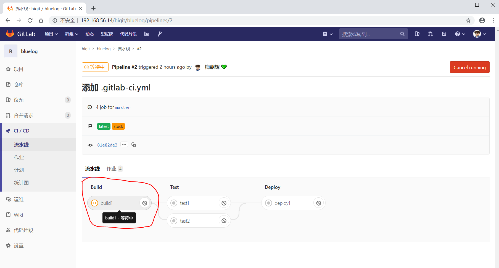

我们查看build这个作业的详情页面：

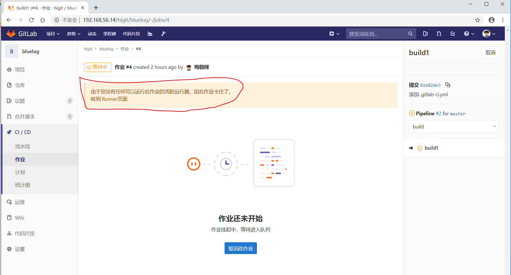

可以看到提示 ``由于您没有任何可以运行此作业的活跃运行器，因此作业卡住了。转到 Runner页面`` ，说明我们没有配置运行器，我们点击"Runner页面"跳转到运行器配置页面：

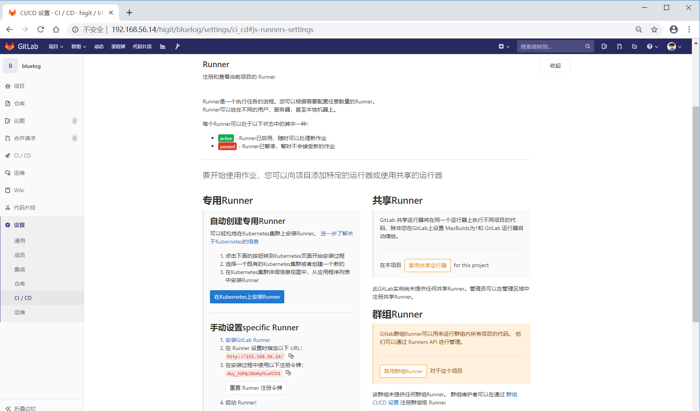

终于到了GitLab Runner界面了，这个就是我们接下来要重点讲的 ``GitLab Runner`` ，也就是 ``运行器`` ！

什么是GitLab Runner
-------------------------------------------------

- Runner是一个执行任务的进程。您可以根据需要配置任意数量的Runner。 
- Runner可以放在不同的用户、服务器，甚至本地机器上。

- 每个Runner可以处于以下状态中的其中一种：

    - ``active`` Runner已启用，随时可以处理新作业
    - ``paused`` Runner已暂停，暂时不会接受新的作业

- 要开始使用作业，您可以向项目添加特定的运行器或使用共享的运行器。

- 可以设置 ``专用Runner`` 、 ``共享Runner`` 、 ``群组Runner`` 。

- 手动设置专用Runner的步骤：

    - 安装 GitLab Runner
    - 在Runner设置时指定URL
    - 在Runner设置时使用注册令牌
    - 启动Runner
    
- GiTLab Runner就是运行器，类似于Jenkins，可以为我们执行一些CI持续集成、构建的脚本任务，运行器具有执行脚本、调度、协调的工作能力。

接下来我们为blog项目 ``bluelog`` 设置一个专用运行器 ``blog`` 。

安装GitLab Runner运行器
-------------------------------------------------

`Install GitLab Runner <https://docs.gitlab.com/runner/install/>`_ 官方文档指出：

    GitLab Runner can be installed and used on GNU/Linux, macOS, FreeBSD, and Windows. There are three ways to install it. Use Docker, download a binary manually, or use a repository for rpm/deb packages. Below you can find information on the different installation methods.

即GitLab Runner可以通过二进制文件安装、Docker镜像安装、包仓库安装。

我们使用通过第三种方式包仓库安装，即添加Yum源来进行安装。

**我们就在GitLab服务器上面安装GitLab Runner。**

添加官方YUM源::

    [root@server ~]# curl -L https://packages.gitlab.com/install/repositories/runner/gitlab-runner/script.rpm.sh | sudo bash
      % Total    % Received % Xferd  Average Speed   Time    Time     Time  Current
                                     Dload  Upload   Total   Spent    Left  Speed
    100  6753    0  6753    0     0   3420      0 --:--:--  0:00:01 --:--:--  3419
    Detected operating system as centos/7.
    Checking for curl...
    Detected curl...
    Downloading repository file: https://packages.gitlab.com/install/repositories/runner/gitlab-runner/config_file.repo?os=centos&dist=7&source=script
    done.
    Installing pygpgme to verify GPG signatures...
    Loaded plugins: fastestmirror
    Loading mirror speeds from cached hostfile
     * base: mirrors.cn99.com
     * centos-sclo-rh: ap.stykers.moe
     * extras: ap.stykers.moe
     * updates: ap.stykers.moe
    base                                                                                                                          | 3.6 kB  00:00:00     
    centos-sclo-rh                                                                                                                | 3.0 kB  00:00:00     
    docker-ce-stable                                                                                                              | 3.5 kB  00:00:00     
    epel                                                                                                                          | 5.3 kB  00:00:00 
    
    extras                                                                                                                        | 3.4 kB  00:00:00     
    gitlab-ce                                                                                                                     | 2.9 kB  00:00:00     
    ius                                                                                                                           | 1.3 kB  00:00:00     
    mariadb                                                                                                                       | 2.9 kB  00:00:00     
    runner_gitlab-runner-source/signature                                                                                         |  836 B  00:00:00     
    Retrieving key from https://packages.gitlab.com/runner/gitlab-runner/gpgkey
    Importing GPG key 0xE15E78F4:
     Userid     : "GitLab B.V. (package repository signing key) <packages@gitlab.com>"
     Fingerprint: 1a4c 919d b987 d435 9396 38b9 1421 9a96 e15e 78f4
     From       : https://packages.gitlab.com/runner/gitlab-runner/gpgkey
    Retrieving key from https://packages.gitlab.com/runner/gitlab-runner/gpgkey/runner-gitlab-runner-366915F31B487241.pub.gpg
    runner_gitlab-runner-source/signature                                                                                         |  951 B  00:00:00 !!! 
    updates                                                                                                                       | 3.4 kB  00:00:00    
    (1/6): epel/x86_64/updateinfo                                                                                                 | 977 kB  00:00:01    
    (2/6): docker-ce-stable/x86_64/primary_db                                                                                     |  29 kB  00:00:02    
    (3/6): ius/x86_64/primary                                                                                                     | 123 kB  00:00:03    
    (4/6): gitlab-ce/7/primary_db                                                                                                 | 2.9 MB  00:00:06    
    (5/6): updates/7/x86_64/primary_db                                                                                            | 6.4 MB  00:00:07    
    (6/6): epel/x86_64/primary_db                               73% [====================================-             ] 1.0 MB/s |  13 MB  00:00:04 ETA
    Installing yum-utils...
    Loaded plugins: fastestmirror
    Loading mirror speeds from cached hostfile
     * base: mirrors.cn99.com
     * centos-sclo-rh: ap.stykers.moe
     * extras: ap.stykers.moe
     * updates: ap.stykers.moe
    Package yum-utils-1.1.31-50.el7.noarch already installed and latest version
    Nothing to do
    Generating yum cache for runner_gitlab-runner...
    Importing GPG key 0xE15E78F4:
     Userid     : "GitLab B.V. (package repository signing key) <packages@gitlab.com>"
     Fingerprint: 1a4c 919d b987 d435 9396 38b9 1421 9a96 e15e 78f4
     From       : https://packages.gitlab.com/runner/gitlab-runner/gpgkey
    Generating yum cache for runner_gitlab-runner-source...
    
    The repository is setup! You can now install packages.

查看Yum源中有哪些版本::

    [root@server ~]# yum search --showduplicates gitlab-runner
    Loaded plugins: fastestmirror
    Loading mirror speeds from cached hostfile
     * base: mirrors.cn99.com
     * centos-sclo-rh: ap.stykers.moe
     * extras: ap.stykers.moe
     * updates: ap.stykers.moe
    ============================================================ N/S matched: gitlab-runner =============================================================
    gitlab-runner-10.0.0-1.x86_64 : GitLab Runner
    gitlab-runner-10.0.1-1.x86_64 : GitLab Runner
    gitlab-runner-10.0.2-1.x86_64 : GitLab Runner
    gitlab-runner-10.1.0-1.x86_64 : GitLab Runner
    gitlab-runner-10.1.1-1.x86_64 : GitLab Runner
    gitlab-runner-10.2.0-1.x86_64 : GitLab Runner
    gitlab-runner-10.2.1-1.x86_64 : GitLab Runner
    gitlab-runner-10.3.0-1.x86_64 : GitLab Runner
    gitlab-runner-10.3.1-1.x86_64 : GitLab Runner
    gitlab-runner-10.4.0-1.x86_64 : GitLab Runner
    gitlab-runner-10.5.0-1.x86_64 : GitLab Runner
    gitlab-runner-10.6.0-1.x86_64 : GitLab Runner
    gitlab-runner-10.6.1-1.x86_64 : GitLab Runner
    gitlab-runner-10.7.0-1.x86_64 : GitLab Runner
    gitlab-runner-10.7.1-1.x86_64 : GitLab Runner
    gitlab-runner-10.7.2-1.x86_64 : GitLab Runner
    gitlab-runner-10.7.4-1.x86_64 : GitLab Runner
    gitlab-runner-10.8.0-1.x86_64 : GitLab Runner
    gitlab-runner-10.8.2-1.x86_64 : GitLab Runner
    gitlab-runner-11.0.0-1.x86_64 : GitLab Runner
    gitlab-runner-11.0.2-1.x86_64 : GitLab Runner
    gitlab-runner-11.1.0-1.x86_64 : GitLab Runner
    gitlab-runner-11.1.1-1.x86_64 : GitLab Runner
    gitlab-runner-11.2.0-1.x86_64 : GitLab Runner
    gitlab-runner-11.2.1-1.x86_64 : GitLab Runner
    gitlab-runner-11.2.2-1.x86_64 : GitLab Runner
    gitlab-runner-11.3.0-1.x86_64 : GitLab Runner
    gitlab-runner-11.3.1-1.x86_64 : GitLab Runner
    gitlab-runner-11.3.2-1.x86_64 : GitLab Runner
    gitlab-runner-11.4.0-1.x86_64 : GitLab Runner
    gitlab-runner-11.4.1-1.x86_64 : GitLab Runner
    gitlab-runner-11.4.2-1.x86_64 : GitLab Runner
    gitlab-runner-11.5.0-1.x86_64 : GitLab Runner
    gitlab-runner-11.5.1-1.x86_64 : GitLab Runner
    gitlab-runner-11.6.0-1.x86_64 : GitLab Runner
    gitlab-runner-11.6.1-1.x86_64 : GitLab Runner
    gitlab-runner-11.7.0-1.x86_64 : GitLab Runner
    gitlab-runner-11.8.0-1.x86_64 : GitLab Runner
    gitlab-runner-11.9.0-1.x86_64 : GitLab Runner
    gitlab-runner-11.9.1-1.x86_64 : GitLab Runner
    gitlab-runner-11.9.2-1.x86_64 : GitLab Runner
    gitlab-runner-11.10.0-1.x86_64 : GitLab Runner
    gitlab-runner-11.10.1-1.x86_64 : GitLab Runner
    gitlab-runner-11.11.0-1.x86_64 : GitLab Runner
    gitlab-runner-11.11.1-1.x86_64 : GitLab Runner
    gitlab-runner-11.11.2-1.x86_64 : GitLab Runner
    gitlab-runner-11.11.3-1.x86_64 : GitLab Runner
    gitlab-runner-12.0.0-1.x86_64 : GitLab Runner
    gitlab-runner-12.0.1-1.x86_64 : GitLab Runner
    
      Name and summary matches only, use "search all" for everything.

我们安装与GitLab大版本相同的GitLab Runner::

    [root@server ~]# cat /opt/gitlab/embedded/service/gitlab-rails/VERSION
    11.10.6
    [root@server ~]# yum search --showduplicates gitlab-runner|grep 11.10
    gitlab-runner-11.10.0-1.x86_64 : GitLab Runner
    gitlab-runner-11.10.1-1.x86_64 : GitLab Runner
    
    [root@server ~]# yum install gitlab-runner-11.10.0 -y
    Loaded plugins: fastestmirror
    Loading mirror speeds from cached hostfile
     * base: mirrors.cn99.com
     * centos-sclo-rh: ap.stykers.moe
     * extras: ap.stykers.moe
     * updates: ap.stykers.moe
    Resolving Dependencies
    --> Running transaction check
    ---> Package gitlab-runner.x86_64 0:11.10.0-1 will be installed
    --> Finished Dependency Resolution
    
    Dependencies Resolved
    
    =====================================================================================================================================================
     Package                             Arch                         Version                           Repository                                  Size
    =====================================================================================================================================================
    Installing:
     gitlab-runner                       x86_64                       11.10.0-1                         runner_gitlab-runner                        31 M
    
    Transaction Summary
    =====================================================================================================================================================
    Install  1 Package
    
    Total download size: 31 M
    Installed size: 52 M
    Downloading packages:
    gitlab-runner-11.10.0-1.x86_64.rpm                           0% [                                                  ]  64 kB/s | 169 kB  00:08:08 ETA 
    gitlab-runner-11.10.0-1.x86_64.rpm                          14% [=======                                           ]  54 kB/s | 4.6 MB  00:08:14 ETA 
    gitlab-runner-11.10.0-1.x86_64.rpm                          19% [=========-     gitlab-runner-11.10.0-1.x86_64.rpm                          19% [=========-     gitlab-runner-11.10.0-1.x8 28% [====-           ]  60 kB/s | 8.7 MB   06:13 ETA 
    gitlab-runner-11.10.0-1.x8 36% [=====-          ]  36 kB/s |  11 MB   09:12 ETA 
    gitlab-runner-11.10.0-1.x86_64.rpm                          45% [======================-                           ]  65 kB/s |  14 MB  00:04:18 ETA 
    gitlab-runner-11.10.0-1.x86_64.rpm                          63% [===============================-                  ]  89 kB/s |  19 MB  00:02:09 ETA 
    gitlab-runner-11.10.0-1.x86_64.rpm                          83% [=========================================-        ] 136 kB/s |  26 MB  00:00:36 ETA 
    warning: /var/cache/yum/x86_64/7/runner_gitlab-runner/packages/gitlab-runner-11.10.0-1.x86_64.rpm: Header V4 RSA/SHA512 Signature, key ID 880721d4: NOKEY
    Public key for gitlab-runner-11.10.0-1.x86_64.rpm is not installed
    gitlab-runner-11.10.0-1.x86_64.rpm                                                                                            |  31 MB  00:06:50     
    Retrieving key from https://packages.gitlab.com/runner/gitlab-runner/gpgkey
    Importing GPG key 0xE15E78F4:
     Userid     : "GitLab B.V. (package repository signing key) <packages@gitlab.com>"
     Fingerprint: 1a4c 919d b987 d435 9396 38b9 1421 9a96 e15e 78f4
     From       : https://packages.gitlab.com/runner/gitlab-runner/gpgkey
    Retrieving key from https://packages.gitlab.com/runner/gitlab-runner/gpgkey/runner-gitlab-runner-366915F31B487241.pub.gpg
    Importing GPG key 0x880721D4:
     Userid     : "GitLab, Inc. <support@gitlab.com>"
     Fingerprint: 3018 3ac2 c4e2 3a40 9efb e705 9ce4 5abc 8807 21d4
     From       : https://packages.gitlab.com/runner/gitlab-runner/gpgkey/runner-gitlab-runner-366915F31B487241.pub.gpg
    Running transaction check
    Running transaction test
    Transaction test succeeded
    Running transaction
      Installing : gitlab-runner-11.10.0-1.x86_64                                                                                                    1/1 
    GitLab Runner: creating gitlab-runner...
    Runtime platform                                    arch=amd64 os=linux pid=19979 revision=3001a600 version=11.10.0
    gitlab-runner: Service is not running.
    Runtime platform                                    arch=amd64 os=linux pid=19985 revision=3001a600 version=11.10.0
    gitlab-ci-multi-runner: Service is not running.
    Runtime platform                                    arch=amd64 os=linux pid=20004 revision=3001a600 version=11.10.0
    Runtime platform                                    arch=amd64 os=linux pid=20039 revision=3001a600 version=11.10.0
    Clearing docker cache...
      Verifying  : gitlab-runner-11.10.0-1.x86_64                                                                                                    1/1 
    
    Installed:
      gitlab-runner.x86_64 0:11.10.0-1                                                                                                                   
    
    Complete!

查看gitlab-runner版本信息及帮助信息::

    [root@server ~]# gitlab-runner --version
    Version:      11.10.0
    Git revision: 3001a600
    Git branch:   11-10-stable
    GO version:   go1.8.7
    Built:        2019-04-19T09:48:55+0000
    OS/Arch:      linux/amd64
    [root@server ~]# gitlab-runner --help
    NAME:
       gitlab-runner - a GitLab Runner
    
    USAGE:
       gitlab-runner [global options] command [command options] [arguments...]
    
    VERSION:
       11.10.0 (3001a600)
    
    AUTHOR:
       GitLab Inc. <support@gitlab.com>
    
    COMMANDS:
         exec                  execute a build locally
         list                  List all configured runners
         run                   run multi runner service
         register              register a new runner
         install               install service
         uninstall             uninstall service
         start                 start service
         stop                  stop service
         restart               restart service
         status                get status of a service
         run-single            start single runner
         unregister            unregister specific runner
         verify                verify all registered runners
         artifacts-downloader  download and extract build artifacts (internal)
         artifacts-uploader    create and upload build artifacts (internal)
         cache-archiver        create and upload cache artifacts (internal)
         cache-extractor       download and extract cache artifacts (internal)
         cache-init            changed permissions for cache paths (internal)
         health-check          check health for a specific address
         help, h               Shows a list of commands or help for one command
    
    GLOBAL OPTIONS:
       --cpuprofile value           write cpu profile to file [$CPU_PROFILE]
       --debug                      debug mode [$DEBUG]
       --log-format value           Choose log format (options: runner, text, json) [$LOG_FORMAT]
       --log-level value, -l value  Log level (options: debug, info, warn, error, fatal, panic) [$LOG_LEVEL]
       --help, -h                   show help
       --version, -v                print the version

注册GitLab Runner
-------------------------------------------------

查看GitLab Runner注册的帮助信息::

    [root@server ~]# gitlab-runner register --help
    Runtime platform                                    arch=amd64 os=linux pid=24088 revision=3001a600 version=11.10.0
    NAME:
       gitlab-runner register - register a new runner
    
    USAGE:
       gitlab-runner register [command options] [arguments...]
    
    OPTIONS:
       -c value, --config value                              Config file (default: "/etc/gitlab-runner/config.toml") [$CONFIG_FILE]
       --tag-list value                                      Tag list [$RUNNER_TAG_LIST]
       -n, --non-interactive                                 Run registration unattended [$REGISTER_NON_INTERACTIVE]
       --leave-runner                                        Don't remove runner if registration fails [$REGISTER_LEAVE_RUNNER]
       -r value, --registration-token value                  Runner's registration token [$REGISTRATION_TOKEN]
       --run-untagged                                        Register to run untagged builds; defaults to 'true' when 'tag-list' is empty [$REGISTER_RUN_UNTAGGED]
       --locked                                              Lock Runner for current project, defaults to 'true' [$REGISTER_LOCKED]
       --maximum-timeout value                               What is the maximum timeout (in seconds) that will be set for job when using this Runner (default: "0") [$REGISTER_MAXIMUM_TIMEOUT]
       --paused                                              Set Runner to be paused, defaults to 'false' [$REGISTER_PAUSED]
       --name value, --description value                     Runner name (default: "server.hopewait") [$RUNNER_NAME]
       --limit value                                         Maximum number of builds processed by this runner (default: "0") [$RUNNER_LIMIT]
       --output-limit value                                  Maximum build trace size in kilobytes (default: "0") [$RUNNER_OUTPUT_LIMIT]
       --request-concurrency value                           Maximum concurrency for job requests (default: "0") [$RUNNER_REQUEST_CONCURRENCY]
       -u value, --url value                                 Runner URL [$CI_SERVER_URL]
       -t value, --token value                               Runner token [$CI_SERVER_TOKEN]
       --tls-ca-file value                                   File containing the certificates to verify the peer when using HTTPS [$CI_SERVER_TLS_CA_FILE]
       --tls-cert-file value                                 File containing certificate for TLS client auth when using HTTPS [$CI_SERVER_TLS_CERT_FILE]
       --tls-key-file value                                  File containing private key for TLS client auth when using HTTPS [$CI_SERVER_TLS_KEY_FILE]
       --executor value                                      Select executor, eg. shell, docker, etc. [$RUNNER_EXECUTOR]
       --builds-dir value                                    Directory where builds are stored [$RUNNER_BUILDS_DIR]
       --cache-dir value                                     Directory where build cache is stored [$RUNNER_CACHE_DIR]
       --clone-url value                                     Overwrite the default URL used to clone or fetch the git ref [$CLONE_URL]
       --env value                                           Custom environment variables injected to build environment [$RUNNER_ENV]
       --pre-clone-script value                              Runner-specific command script executed before code is pulled [$RUNNER_PRE_CLONE_SCRIPT]
       --pre-build-script value                              Runner-specific command script executed after code is pulled, just before build executes [$RUNNER_PRE_BUILD_SCRIPT]
       --post-build-script value                             Runner-specific command script executed after code is pulled and just after build executes [$RUNNER_POST_BUILD_SCRIPT]
       --debug-trace-disabled                                When set to true Runner will disable the possibility of using the CI_DEBUG_TRACE feature [$RUNNER_DEBUG_TRACE_DISABLED]
       --shell value                                         Select bash, cmd or powershell [$RUNNER_SHELL]
       --custom_build_dir-enabled                            Enable job specific build directories [$CUSTOM_BUILD_DIR_ENABLED]
       --ssh-user value                                      User name [$SSH_USER]
       --ssh-password value                                  User password [$SSH_PASSWORD]
       --ssh-host value                                      Remote host [$SSH_HOST]
       --ssh-port value                                      Remote host port [$SSH_PORT]
       --ssh-identity-file value                             Identity file to be used [$SSH_IDENTITY_FILE]
       --docker-host value                                   Docker daemon address [$DOCKER_HOST]
       --docker-cert-path value                              Certificate path [$DOCKER_CERT_PATH]
       --docker-tlsverify                                    Use TLS and verify the remote [$DOCKER_TLS_VERIFY]
       --docker-hostname value                               Custom container hostname [$DOCKER_HOSTNAME]
       --docker-image value                                  Docker image to be used [$DOCKER_IMAGE]
       --docker-runtime value                                Docker runtime to be used [$DOCKER_RUNTIME]
       --docker-memory value                                 Memory limit (format: <number>[<unit>]). Unit can be one of b, k, m, or g. Minimum is 4M. [$DOCKER_MEMORY]
       --docker-memory-swap value                            Total memory limit (memory + swap, format: <number>[<unit>]). Unit can be one of b, k, m, or g. [$DOCKER_MEMORY_SWAP]
       --docker-memory-reservation value                     Memory soft limit (format: <number>[<unit>]). Unit can be one of b, k, m, or g. [$DOCKER_MEMORY_RESERVATION]
       --docker-cpuset-cpus value                            String value containing the cgroups CpusetCpus to use [$DOCKER_CPUSET_CPUS]
       --docker-cpus value                                   Number of CPUs [$DOCKER_CPUS]
       --docker-dns value                                    A list of DNS servers for the container to use [$DOCKER_DNS]
       --docker-dns-search value                             A list of DNS search domains [$DOCKER_DNS_SEARCH]
       --docker-privileged                                   Give extended privileges to container [$DOCKER_PRIVILEGED]
       --docker-disable-entrypoint-overwrite                 Disable the possibility for a container to overwrite the default image entrypoint [$DOCKER_DISABLE_ENTRYPOINT_OVERWRITE]
       --docker-userns value                                 User namespace to use [$DOCKER_USERNS_MODE]
       --docker-cap-add value                                Add Linux capabilities [$DOCKER_CAP_ADD]
       --docker-cap-drop value                               Drop Linux capabilities [$DOCKER_CAP_DROP]
       --docker-oom-kill-disable                             Do not kill processes in a container if an out-of-memory (OOM) error occurs [$DOCKER_OOM_KILL_DISABLE]
       --docker-security-opt value                           Security Options [$DOCKER_SECURITY_OPT]
       --docker-devices value                                Add a host device to the container [$DOCKER_DEVICES]
       --docker-disable-cache                                Disable all container caching [$DOCKER_DISABLE_CACHE]
       --docker-volumes value                                Bind-mount a volume and create it if it doesn't exist prior to mounting. Can be specified multiple times once per mountpoint, e.g. --docker-volumes 'test0:/test0' --docker-volumes 'test1:/test1' [$DOCKER_VOLUMES]
       --docker-volume-driver value                          Volume driver to be used [$DOCKER_VOLUME_DRIVER]
       --docker-cache-dir value                              Directory where to store caches [$DOCKER_CACHE_DIR]
       --docker-extra-hosts value                            Add a custom host-to-IP mapping [$DOCKER_EXTRA_HOSTS]
       --docker-volumes-from value                           A list of volumes to inherit from another container [$DOCKER_VOLUMES_FROM]
       --docker-network-mode value                           Add container to a custom network [$DOCKER_NETWORK_MODE]
       --docker-links value                                  Add link to another container [$DOCKER_LINKS]
       --docker-services value                               Add service that is started with container [$DOCKER_SERVICES]
       --docker-wait-for-services-timeout value              How long to wait for service startup (default: "0") [$DOCKER_WAIT_FOR_SERVICES_TIMEOUT]
       --docker-allowed-images value                         Whitelist allowed images [$DOCKER_ALLOWED_IMAGES]
       --docker-allowed-services value                       Whitelist allowed services [$DOCKER_ALLOWED_SERVICES]
       --docker-pull-policy value                            Image pull policy: never, if-not-present, always [$DOCKER_PULL_POLICY]
       --docker-shm-size value                               Shared memory size for docker images (in bytes) (default: "0") [$DOCKER_SHM_SIZE]
       --docker-tmpfs value                                  A toml table/json object with the format key=values. When set this will mount the specified path in the key as a tmpfs volume in the main container, using the options specified as key. For the supported options, see the documentation for the unix 'mount' command (default: "{}") [$DOCKER_TMPFS]
       --docker-services-tmpfs value                         A toml table/json object with the format key=values. When set this will mount the specified path in the key as a tmpfs volume in all the service containers, using the options specified as key. For the supported options, see the documentation for the unix 'mount' command (default: "{}") [$DOCKER_SERVICES_TMPFS]
       --docker-sysctls value                                Sysctl options, a toml table/json object of key=value. Value is expected to be a string. (default: "{}") [$DOCKER_SYSCTLS]
       --docker-helper-image value                           [ADVANCED] Override the default helper image used to clone repos and upload artifacts [$DOCKER_HELPER_IMAGE]
       --parallels-base-name value                           VM name to be used [$PARALLELS_BASE_NAME]
       --parallels-template-name value                       VM template to be created [$PARALLELS_TEMPLATE_NAME]
       --parallels-disable-snapshots                         Disable snapshoting to speedup VM creation [$PARALLELS_DISABLE_SNAPSHOTS]
       --parallels-time-server value                         Timeserver to sync the guests time from. Defaults to time.apple.com [$PARALLELS_TIME_SERVER]
       --virtualbox-base-name value                          VM name to be used [$VIRTUALBOX_BASE_NAME]
       --virtualbox-base-snapshot value                      Name or UUID of a specific VM snapshot to clone [$VIRTUALBOX_BASE_SNAPSHOT]
       --virtualbox-disable-snapshots                        Disable snapshoting to speedup VM creation [$VIRTUALBOX_DISABLE_SNAPSHOTS]
       --cache-type value                                    Select caching method [$CACHE_TYPE]
       --cache-path value                                    Name of the path to prepend to the cache URL [$CACHE_PATH]
       --cache-shared                                        Enable cache sharing between runners. [$CACHE_SHARED]
       --cache-s3-server-address value                       A host:port to the used S3-compatible server [$CACHE_S3_SERVER_ADDRESS]
       --cache-s3-access-key value                           S3 Access Key [$CACHE_S3_ACCESS_KEY]
       --cache-s3-secret-key value                           S3 Secret Key [$CACHE_S3_SECRET_KEY]
       --cache-s3-bucket-name value                          Name of the bucket where cache will be stored [$CACHE_S3_BUCKET_NAME]
       --cache-s3-bucket-location value                      Name of S3 region [$CACHE_S3_BUCKET_LOCATION]
       --cache-s3-insecure                                   Use insecure mode (without https) [$CACHE_S3_INSECURE]
       --cache-gcs-access-id value                           ID of GCP Service Account used to access the storage [$CACHE_GCS_ACCESS_ID]
       --cache-gcs-private-key value                         Private key used to sign GCS requests [$CACHE_GCS_PRIVATE_KEY]
       --cache-gcs-credentials-file value                    File with GCP credentials, containing AccessID and PrivateKey [$GOOGLE_APPLICATION_CREDENTIALS]
       --cache-gcs-bucket-name value                         Name of the bucket where cache will be stored [$CACHE_GCS_BUCKET_NAME]
       --cache-s3-cache-path value                           Name of the path to prepend to the cache URL. DEPRECATED [$S3_CACHE_PATH]
       --cache-cache-shared                                  Enable cache sharing between runners. DEPRECATED
       --machine-idle-nodes value                            Maximum idle machines (default: "0") [$MACHINE_IDLE_COUNT]
       --machine-idle-time value                             Minimum time after node can be destroyed (default: "0") [$MACHINE_IDLE_TIME]
       --machine-max-builds value                            Maximum number of builds processed by machine (default: "0") [$MACHINE_MAX_BUILDS]
       --machine-machine-driver value                        The driver to use when creating machine [$MACHINE_DRIVER]
       --machine-machine-name value                          The template for machine name (needs to include %s) [$MACHINE_NAME]
       --machine-machine-options value                       Additional machine creation options [$MACHINE_OPTIONS]
       --machine-off-peak-periods value                      Time periods when the scheduler is in the OffPeak mode [$MACHINE_OFF_PEAK_PERIODS]
       --machine-off-peak-timezone value                     Timezone for the OffPeak periods (defaults to Local) [$MACHINE_OFF_PEAK_TIMEZONE]
       --machine-off-peak-idle-count value                   Maximum idle machines when the scheduler is in the OffPeak mode (default: "0") [$MACHINE_OFF_PEAK_IDLE_COUNT]
       --machine-off-peak-idle-time value                    Minimum time after machine can be destroyed when the scheduler is in the OffPeak mode (default: "0") [$MACHINE_OFF_PEAK_IDLE_TIME]
       --kubernetes-host value                               Optional Kubernetes master host URL (auto-discovery attempted if not specified) [$KUBERNETES_HOST]
       --kubernetes-cert-file value                          Optional Kubernetes master auth certificate [$KUBERNETES_CERT_FILE]
       --kubernetes-key-file value                           Optional Kubernetes master auth private key [$KUBERNETES_KEY_FILE]
       --kubernetes-ca-file value                            Optional Kubernetes master auth ca certificate [$KUBERNETES_CA_FILE]
       --kubernetes-bearer_token_overwrite_allowed           Bool to authorize builds to specify their own bearer token for creation. [$KUBERNETES_BEARER_TOKEN_OVERWRITE_ALLOWED]
       --kubernetes-bearer_token value                       Optional Kubernetes service account token used to start build pods. [$KUBERNETES_BEARER_TOKEN]
       --kubernetes-image value                              Default docker image to use for builds when none is specified [$KUBERNETES_IMAGE]
       --kubernetes-namespace value                          Namespace to run Kubernetes jobs in [$KUBERNETES_NAMESPACE]
       --kubernetes-namespace_overwrite_allowed value        Regex to validate 'KUBERNETES_NAMESPACE_OVERWRITE' value [$KUBERNETES_NAMESPACE_OVERWRITE_ALLOWED]
       --kubernetes-privileged                               Run all containers with the privileged flag enabled [$KUBERNETES_PRIVILEGED]
       --kubernetes-cpu-limit value                          The CPU allocation given to build containers [$KUBERNETES_CPU_LIMIT]
       --kubernetes-memory-limit value                       The amount of memory allocated to build containers [$KUBERNETES_MEMORY_LIMIT]
       --kubernetes-service-cpu-limit value                  The CPU allocation given to build service containers [$KUBERNETES_SERVICE_CPU_LIMIT]
       --kubernetes-service-memory-limit value               The amount of memory allocated to build service containers [$KUBERNETES_SERVICE_MEMORY_LIMIT]
       --kubernetes-helper-cpu-limit value                   The CPU allocation given to build helper containers [$KUBERNETES_HELPER_CPU_LIMIT]
       --kubernetes-helper-memory-limit value                The amount of memory allocated to build helper containers [$KUBERNETES_HELPER_MEMORY_LIMIT]
       --kubernetes-cpu-request value                        The CPU allocation requested for build containers [$KUBERNETES_CPU_REQUEST]
       --kubernetes-memory-request value                     The amount of memory requested from build containers [$KUBERNETES_MEMORY_REQUEST]
       --kubernetes-service-cpu-request value                The CPU allocation requested for build service containers [$KUBERNETES_SERVICE_CPU_REQUEST]
       --kubernetes-service-memory-request value             The amount of memory requested for build service containers [$KUBERNETES_SERVICE_MEMORY_REQUEST]
       --kubernetes-helper-cpu-request value                 The CPU allocation requested for build helper containers [$KUBERNETES_HELPER_CPU_REQUEST]
       --kubernetes-helper-memory-request value              The amount of memory requested for build helper containers [$KUBERNETES_HELPER_MEMORY_REQUEST]
       --kubernetes-pull-policy value                        Policy for if/when to pull a container image (never, if-not-present, always). The cluster default will be used if not set [$KUBERNETES_PULL_POLICY]
       --kubernetes-node-selector value                      A toml table/json object of key=value. Value is expected to be a string. When set this will create pods on k8s nodes that match all the key=value pairs. (default: "{}") [$KUBERNETES_NODE_SELECTOR]
       --kubernetes-node-tolerations value                   A toml table/json object of key=value:effect. Value and effect are expected to be strings. When set, pods will tolerate the given taints. Only one toleration is supported through environment variable configuration. (default: "{}") [$KUBERNETES_NODE_TOLERATIONS]
       --kubernetes-image-pull-secrets value                 A list of image pull secrets that are used for pulling docker image [$KUBERNETES_IMAGE_PULL_SECRETS]
       --kubernetes-helper-image value                       [ADVANCED] Override the default helper image used to clone repos and upload artifacts [$KUBERNETES_HELPER_IMAGE]
       --kubernetes-terminationGracePeriodSeconds value      Duration after the processes running in the pod are sent a termination signal and the time when the processes are forcibly halted with a kill signal. (default: "0") [$KUBERNETES_TERMINATIONGRACEPERIODSECONDS]
       --kubernetes-poll-interval value                      How frequently, in seconds, the runner will poll the Kubernetes pod it has just created to check its status (default: "0") [$KUBERNETES_POLL_INTERVAL]
       --kubernetes-poll-timeout value                       The total amount of time, in seconds, that needs to pass before the runner will timeout attempting to connect to the pod it has just created (useful for queueing more builds that the cluster can handle at a time) (default: "0") [$KUBERNETES_POLL_TIMEOUT]
       --kubernetes-pod-labels value                         A toml table/json object of key-value. Value is expected to be a string. When set, this will create pods with the given pod labels. Environment variables will be substituted for values here. (default: "{}")
       --kubernetes-service-account value                    Executor pods will use this Service Account to talk to kubernetes API [$KUBERNETES_SERVICE_ACCOUNT]
       --kubernetes-service_account_overwrite_allowed value  Regex to validate 'KUBERNETES_SERVICE_ACCOUNT' value [$KUBERNETES_SERVICE_ACCOUNT_OVERWRITE_ALLOWED]
       --kubernetes-pod-annotations value                    A toml table/json object of key-value. Value is expected to be a string. When set, this will create pods with the given annotations. Can be overwritten in build with KUBERNETES_POD_ANNOTATIONS_* varialbes (default: "{}")
       --kubernetes-pod_annotations_overwrite_allowed value  Regex to validate 'KUBERNETES_POD_ANNOTATIONS_*' values [$KUBERNETES_POD_ANNOTATIONS_OVERWRITE_ALLOWED]

交互式注册GitLab Runner::

    [root@server ~]# gitlab-runner register
    Runtime platform                                    arch=amd64 os=linux pid=25074 revision=3001a600 version=11.10.0
    Running in system-mode.                            
                                                       
    Please enter the gitlab-ci coordinator URL (e.g. https://gitlab.com/):
    http://192.168.56.14/
    Please enter the gitlab-ci token for this runner:
    dwy_hDMpZ8W4yMLwMJV1
    Please enter the gitlab-ci description for this runner:
    [server.hopewait]: bulelog runner
    Please enter the gitlab-ci tags for this runner (comma separated):
    bluelog
    Registering runner... succeeded                     runner=dwy_hDMp
    Please enter the executor: docker, docker-ssh+machine, kubernetes, docker-ssh, parallels, shell, ssh, virtualbox, docker+machine:
    shell
    Runner registered successfully. Feel free to start it, but if it's running already the config should be automatically reloaded! 
    [root@server ~]# 

.. Attention:: 交互式注册、非交互式注册选择一种执行即可，不用重复执行！！！

交互式注册时，需要手动输入相关的信息，我们可以使用非交互式注册，直接在命令行中以参数的形式指定相关信息。

非交互式注册GitLab Runner::
    
    # 需要执行的命令
    gitlab-runner register \
      --non-interactive \
      --url "http://192.168.56.14/" \
      --registration-token "dwy_hDMpZ8W4yMLwMJV1" \
      --executor "shell" \
      --description "bluelog runner" \
      --tag-list "bluelog"
    
    # 实际执行时的显示效果
    [root@server ~]# gitlab-runner register \
    >   --non-interactive \
    >   --url "http://192.168.56.14/" \
    >   --registration-token "dwy_hDMpZ8W4yMLwMJV1" \
    >   --executor "shell" \
    >   --description "bluelog runner" \
    >   --tag-list "bluelog"
    Runtime platform                                    arch=amd64 os=linux pid=25873 revision=3001a600 version=11.10.0
    Running in system-mode.                            
                                                       
    Registering runner... succeeded                     runner=dwy_hDMp
    Runner registered successfully. Feel free to start it, but if it's running already the config should be automatically reloaded! 

.. Attention:: 交互式注册、非交互式注册选择一种执行即可，不用重复执行！！！

注册成功后，查看WEB界面中已经激活的运行器：

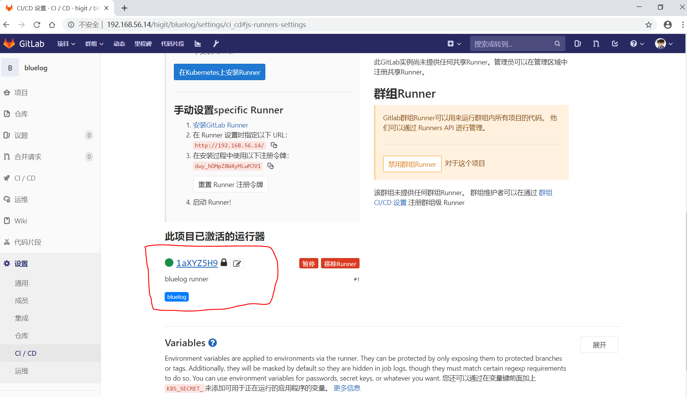

点击"1aXYZ5H9"，查看运行器的详情：

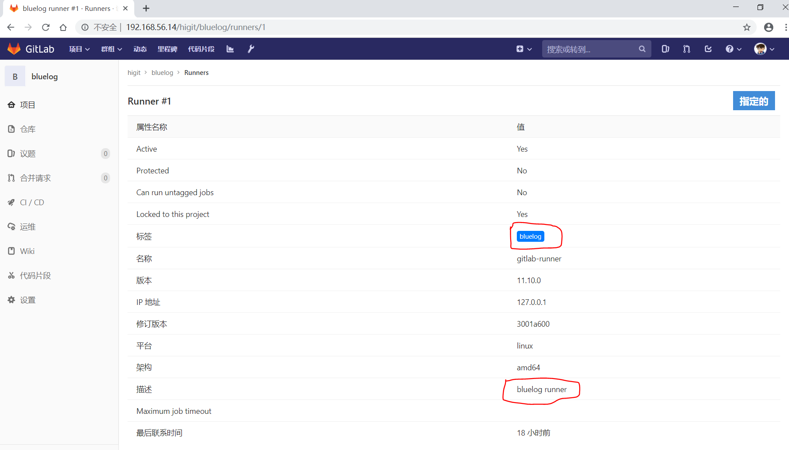

说明是我们刚才创建的运行器！

由于多次注册，Runner ID不是从1开始处理方法
-------------------------------------------------

清空配置文件数据::

    [root@server ~]# echo "" > /etc/gitlab-runner/config.toml 
    [root@server ~]# cat /etc/gitlab-runner/config.toml       
    
    [root@server ~]# 

访问GitLab的PostgreSQL数据库，查看数据库配置信息::

    [root@server ~]# cat /var/opt/gitlab/gitlab-rails/etc/database.yml 
    # This file is managed by gitlab-ctl. Manual changes will be
    # erased! To change the contents below, edit /etc/gitlab/gitlab.rb
    # and run `sudo gitlab-ctl reconfigure`.

    production:
      adapter: postgresql
      encoding: unicode
      collation: 
      database: gitlabhq_production    # 说明：数据库名
      pool: 10
      username: "gitlab"   # 说明：用户名
      password: 
      host: "/var/opt/gitlab/postgresql"    # 说明：主机
      port: 5432
      socket: 
      sslmode: 
      sslcompression: 0
      sslrootcert: 
      sslca: 
      load_balancing: {"hosts":[]}
      prepared_statements: false
      statements_limit: 1000
      fdw: 

查看/etc/passwd文件里边gitlab对应的系统用户::

    [root@server ~]# cat /etc/passwd|grep gitlab
    nginx:x:1002:1002::/var/opt/gitlab/nginx:/bin/false
    gitlab-redis:x:993:990::/var/opt/gitlab/redis:/bin/false
    gitlab-psql:x:992:989::/var/opt/gitlab/postgresql:/bin/sh      # 说明：gitlab的postgresql用户
    gitlab-prometheus:x:991:988::/var/opt/gitlab/prometheus:/bin/sh
    gitlab_admin:x:1004:1004::/home/gitlab_admin:/bin/bash
    gitlab-runner:x:990:987:GitLab Runner:/home/gitlab-runner:/bin/bash

根据上面的配置信息登陆PostgreSQL数据库::

    [root@server ~]# su - gitlab-psql  # 说明：登陆用户
    -sh-4.2$ psql  # 说明：检查psql命令是否有
    psql: could not connect to server: No such file or directory
            Is the server running locally and accepting
            connections on Unix domain socket "/tmp/.s.PGSQL.5432"?
    -sh-4.2$ psql -h /var/opt/gitlab/postgresql -d gitlabhq_production  # 说明：连接到gitlabhq_production库
    psql (9.6.11)
    Type "help" for help.

    gitlabhq_production=# \h  # 说明： 查看帮助命令
    Available help:
      ABORT                            COMMENT                          DECLARE                          EXECUTE
      ALTER AGGREGATE                  COMMIT                           DELETE                           EXPLAIN
      ALTER COLLATION                  COMMIT PREPARED                  DISCARD                          FETCH
      ALTER CONVERSION                 COPY                             DO                               GRANT
      ALTER DATABASE                   CREATE ACCESS METHOD             DROP ACCESS METHOD               IMPORT FOREIGN SCHEMA
      ALTER DEFAULT PRIVILEGES         CREATE AGGREGATE                 DROP AGGREGATE                   INSERT
      ALTER DOMAIN                     CREATE CAST                      DROP CAST                        LISTEN
      ALTER EVENT TRIGGER              CREATE COLLATION                 DROP COLLATION                   LOAD
      ALTER EXTENSION                  CREATE CONVERSION                DROP CONVERSION                  LOCK
      ALTER FOREIGN DATA WRAPPER       CREATE DATABASE                  DROP DATABASE                    MOVE
      ALTER FOREIGN TABLE              CREATE DOMAIN                    DROP DOMAIN                      NOTIFY
      ALTER FUNCTION                   CREATE EVENT TRIGGER             DROP EVENT TRIGGER               PREPARE
      ALTER GROUP                      CREATE EXTENSION                 DROP EXTENSION                   PREPARE TRANSACTION
      ALTER INDEX                      CREATE FOREIGN DATA WRAPPER      DROP FOREIGN DATA WRAPPER        REASSIGN OWNED
      ALTER LANGUAGE                   CREATE FOREIGN TABLE             DROP FOREIGN TABLE               REFRESH MATERIALIZED VIEW
      ALTER LARGE OBJECT               CREATE FUNCTION                  DROP FUNCTION                    REINDEX
      ALTER MATERIALIZED VIEW          CREATE GROUP                     DROP GROUP                       RELEASE SAVEPOINT
      ALTER OPERATOR                   CREATE INDEX                     DROP INDEX                       RESET
      ALTER OPERATOR CLASS             CREATE LANGUAGE                  DROP LANGUAGE                    REVOKE
      ALTER OPERATOR FAMILY            CREATE MATERIALIZED VIEW         DROP MATERIALIZED VIEW           ROLLBACK
      ALTER POLICY                     CREATE OPERATOR                  DROP OPERATOR                    ROLLBACK PREPARED
      ALTER ROLE                       CREATE OPERATOR CLASS            DROP OPERATOR CLASS              ROLLBACK TO SAVEPOINT
      ALTER RULE                       CREATE OPERATOR FAMILY           DROP OPERATOR FAMILY             SAVEPOINT
      ALTER SCHEMA                     CREATE POLICY                    DROP OWNED                       SECURITY LABEL
      ALTER SEQUENCE                   CREATE ROLE                      DROP POLICY                      SELECT
      ALTER SERVER                     CREATE RULE                      DROP ROLE                        SELECT INTO
      ALTER SYSTEM                     CREATE SCHEMA                    DROP RULE                        SET
      ALTER TABLE                      CREATE SEQUENCE                  DROP SCHEMA                      SET CONSTRAINTS
      ALTER TABLESPACE                 CREATE SERVER                    DROP SEQUENCE                    SET ROLE
      ALTER TEXT SEARCH CONFIGURATION  CREATE TABLE                     DROP SERVER                      SET SESSION AUTHORIZATION
      ALTER TEXT SEARCH DICTIONARY     CREATE TABLE AS                  DROP TABLE                       SET TRANSACTION
      ALTER TEXT SEARCH PARSER         CREATE TABLESPACE                DROP TABLESPACE                  SHOW
      ALTER TEXT SEARCH TEMPLATE       CREATE TEXT SEARCH CONFIGURATION DROP TEXT SEARCH CONFIGURATION   START TRANSACTION
      ALTER TRIGGER                    CREATE TEXT SEARCH DICTIONARY    DROP TEXT SEARCH DICTIONARY      TABLE
      ALTER TYPE                       CREATE TEXT SEARCH PARSER        DROP TEXT SEARCH PARSER          TRUNCATE
      ALTER USER                       CREATE TEXT SEARCH TEMPLATE      DROP TEXT SEARCH TEMPLATE        UNLISTEN
      ALTER USER MAPPING               CREATE TRANSFORM                 DROP TRANSFORM                   UPDATE
      ALTER VIEW                       CREATE TRIGGER                   DROP TRIGGER                     VACUUM
      ANALYZE                          CREATE TYPE                      DROP TYPE                        VALUES
      BEGIN                            CREATE USER                      DROP USER                        WITH
      CHECKPOINT                       CREATE USER MAPPING              DROP USER MAPPING                
      CLOSE                            CREATE VIEW                      DROP VIEW                        
      CLUSTER                          DEALLOCATE                       END     
  
查看数据库列表 ``\l`` (小写的L) ::

    gitlabhq_production=# \l
                                                List of databases
            Name         |    Owner    | Encoding |  Collate   |   Ctype    |        Access privileges        
    ---------------------+-------------+----------+------------+------------+---------------------------------
     gitlabhq_production | gitlab      | UTF8     | en_US.utf8 | en_US.utf8 | 
     postgres            | gitlab-psql | UTF8     | en_US.utf8 | en_US.utf8 | 
     template0           | gitlab-psql | UTF8     | en_US.utf8 | en_US.utf8 | =c/"gitlab-psql"               +
                         |             |          |            |            | "gitlab-psql"=CTc/"gitlab-psql"
     template1           | gitlab-psql | UTF8     | en_US.utf8 | en_US.utf8 | =c/"gitlab-psql"               +
                         |             |          |            |            | "gitlab-psql"=CTc/"gitlab-psql"
    (4 rows)

查询所有的表列表::

    gitlabhq_production=# \dt
                             List of relations
     Schema |                   Name                   | Type  | Owner  
    --------+------------------------------------------+-------+--------
     public | abuse_reports                            | table | gitlab
     public | appearances                              | table | gitlab
     public | application_setting_terms                | table | gitlab
     public | application_settings                     | table | gitlab
     public | ar_internal_metadata                     | table | gitlab
     public | audit_events                             | table | gitlab
     public | award_emoji                              | table | gitlab
     public | badges                                   | table | gitlab
     public | board_group_recent_visits                | table | gitlab
     public | board_project_recent_visits              | table | gitlab
     public | boards                                   | table | gitlab
     public | broadcast_messages                       | table | gitlab
     public | chat_names                               | table | gitlab
     public | chat_teams                               | table | gitlab
     public | ci_build_trace_chunks                    | table | gitlab
     public | ci_build_trace_section_names             | table | gitlab
     public | ci_build_trace_sections                  | table | gitlab
     public | ci_builds                                | table | gitlab
     public | ci_builds_metadata                       | table | gitlab
     public | ci_builds_runner_session                 | table | gitlab
     public | ci_group_variables                       | table | gitlab
     public | ci_job_artifacts                         | table | gitlab
     public | ci_pipeline_chat_data                    | table | gitlab
     public | ci_pipeline_schedule_variables           | table | gitlab
     public | ci_pipeline_schedules                    | table | gitlab
     public | ci_pipeline_variables                    | table | gitlab
     public | ci_pipelines                             | table | gitlab
     public | ci_runner_namespaces                     | table | gitlab
     public | ci_runner_projects                       | table | gitlab
     public | ci_runners                               | table | gitlab
     public | ci_stages                                | table | gitlab
     public | ci_trigger_requests                      | table | gitlab
     public | ci_triggers                              | table | gitlab
     public | ci_variables                             | table | gitlab
     public | cluster_groups                           | table | gitlab
     public | cluster_platforms_kubernetes             | table | gitlab
     public | cluster_projects                         | table | gitlab
     public | cluster_providers_gcp                    | table | gitlab
     public | clusters                                 | table | gitlab
     public | clusters_applications_cert_managers      | table | gitlab
     public | clusters_applications_helm               | table | gitlab
     public | clusters_applications_ingress            | table | gitlab
     public | clusters_applications_jupyter            | table | gitlab
     public | clusters_applications_knative            | table | gitlab
     public | clusters_applications_prometheus         | table | gitlab
     public | clusters_applications_runners            | table | gitlab
     public | clusters_kubernetes_namespaces           | table | gitlab
     public | container_repositories                   | table | gitlab
     public | conversational_development_index_metrics | table | gitlab
     public | deploy_keys_projects                     | table | gitlab
     public | deploy_tokens                            | table | gitlab
     public | deployments                              | table | gitlab
     public | emails                                   | table | gitlab
     public | environments                             | table | gitlab
     public | events                                   | table | gitlab
     public | feature_gates                            | table | gitlab
     public | features                                 | table | gitlab
     public | fork_network_members                     | table | gitlab
     public | fork_networks                            | table | gitlab
     public | forked_project_links                     | table | gitlab
     public | gpg_key_subkeys                          | table | gitlab
     public | gpg_keys                                 | table | gitlab
     public | gpg_signatures                           | table | gitlab
     public | group_custom_attributes                  | table | gitlab
     public | identities                               | table | gitlab
     public | import_export_uploads                    | table | gitlab
     public | internal_ids                             | table | gitlab
     public | issue_assignees                          | table | gitlab
     public | issue_metrics                            | table | gitlab
     public | issues                                   | table | gitlab
     public | keys                                     | table | gitlab
     public | label_links                              | table | gitlab
     public | label_priorities                         | table | gitlab
     public | labels                                   | table | gitlab
     public | lfs_file_locks                           | table | gitlab
     public | lfs_objects                              | table | gitlab
     public | lfs_objects_projects                     | table | gitlab
     public | lists                                    | table | gitlab
     public | members                                  | table | gitlab
     public | merge_request_assignees                  | table | gitlab
     public | merge_request_diff_commits               | table | gitlab
     public | merge_request_diff_files                 | table | gitlab
     public | merge_request_diffs                      | table | gitlab
     public | merge_request_metrics                    | table | gitlab
     public | merge_requests                           | table | gitlab
     public | merge_requests_closing_issues            | table | gitlab
     public | milestones                               | table | gitlab
     public | namespaces                               | table | gitlab
     public | note_diff_files                          | table | gitlab
     public | notes                                    | table | gitlab
     public | notification_settings                    | table | gitlab
     public | oauth_access_grants                      | table | gitlab
     public | oauth_access_tokens                      | table | gitlab
     public | oauth_applications                       | table | gitlab
     public | oauth_openid_requests                    | table | gitlab
     public | pages_domains                            | table | gitlab
     public | personal_access_tokens                   | table | gitlab
     public | pool_repositories                        | table | gitlab
     public | programming_languages                    | table | gitlab
     public | project_authorizations                   | table | gitlab
     public | project_auto_devops                      | table | gitlab
     public | project_ci_cd_settings                   | table | gitlab
     public | project_custom_attributes                | table | gitlab
     public | project_daily_statistics                 | table | gitlab
     public | project_deploy_tokens                    | table | gitlab
     public | project_error_tracking_settings          | table | gitlab
     public | project_features                         | table | gitlab
     public | project_group_links                      | table | gitlab
     public | project_import_data                      | table | gitlab
     public | project_mirror_data                      | table | gitlab
     public | project_repositories                     | table | gitlab
     public | project_statistics                       | table | gitlab
     public | projects                                 | table | gitlab
     public | prometheus_metrics                       | table | gitlab
     public | protected_branch_merge_access_levels     | table | gitlab
     public | protected_branch_push_access_levels      | table | gitlab
     public | protected_branches                       | table | gitlab
     public | protected_tag_create_access_levels       | table | gitlab
     public | protected_tags                           | table | gitlab
     public | push_event_payloads                      | table | gitlab
     public | redirect_routes                          | table | gitlab
     public | release_links                            | table | gitlab
     public | releases                                 | table | gitlab
     public | remote_mirrors                           | table | gitlab
     public | repository_languages                     | table | gitlab
     public | resource_label_events                    | table | gitlab
     public | routes                                   | table | gitlab
     public | schema_migrations                        | table | gitlab
     public | sent_notifications                       | table | gitlab
     public | services                                 | table | gitlab
     public | shards                                   | table | gitlab
     public | snippets                                 | table | gitlab
     public | spam_logs                                | table | gitlab
     public | subscriptions                            | table | gitlab
     public | suggestions                              | table | gitlab
     public | system_note_metadata                     | table | gitlab
     public | taggings                                 | table | gitlab
     public | tags                                     | table | gitlab
     public | term_agreements                          | table | gitlab
     public | timelogs                                 | table | gitlab
     public | todos                                    | table | gitlab
     public | trending_projects                        | table | gitlab
     public | u2f_registrations                        | table | gitlab
     public | uploads                                  | table | gitlab
     public | user_agent_details                       | table | gitlab
     public | user_callouts                            | table | gitlab
     public | user_custom_attributes                   | table | gitlab
     public | user_interacted_projects                 | table | gitlab
     public | user_preferences                         | table | gitlab
     public | user_statuses                            | table | gitlab
     public | user_synced_attributes_metadata          | table | gitlab
     public | users                                    | table | gitlab
     public | users_star_projects                      | table | gitlab
     public | web_hook_logs                            | table | gitlab
     public | web_hooks                                | table | gitlab
    (155 rows)

查看单个Table表::

    gitlabhq_production=# \d ci_runners
                                            Table "public.ci_runners"
         Column      |            Type             |                        Modifiers                        
    -----------------+-----------------------------+---------------------------------------------------------
     id              | integer                     | not null default nextval('ci_runners_id_seq'::regclass)
     token           | character varying           | 
     created_at      | timestamp without time zone | 
     updated_at      | timestamp without time zone | 
     description     | character varying           | 
     contacted_at    | timestamp without time zone | 
     active          | boolean                     | not null default true
     is_shared       | boolean                     | default false
     name            | character varying           | 
     version         | character varying           | 
     revision        | character varying           | 
     platform        | character varying           | 
     architecture    | character varying           | 
     run_untagged    | boolean                     | not null default true
     locked          | boolean                     | not null default false
     access_level    | integer                     | not null default 0
     ip_address      | character varying           | 
     maximum_timeout | integer                     | 
     runner_type     | smallint                    | not null
     token_encrypted | character varying           | 
    Indexes:
        "ci_runners_pkey" PRIMARY KEY, btree (id)
        "index_ci_runners_on_contacted_at" btree (contacted_at)
        "index_ci_runners_on_is_shared" btree (is_shared)
        "index_ci_runners_on_locked" btree (locked)
        "index_ci_runners_on_runner_type" btree (runner_type)
        "index_ci_runners_on_token" btree (token)
        "index_ci_runners_on_token_encrypted" btree (token_encrypted)
    Referenced by:
        TABLE "clusters_applications_runners" CONSTRAINT "fk_02de2ded36" FOREIGN KEY (runner_id) REFERENCES ci_runners(id) ON DELETE SET NULL
        TABLE "ci_runner_namespaces" CONSTRAINT "fk_rails_8767676b7a" FOREIGN KEY (runner_id) REFERENCES ci_runners(id) ON DELETE CASCADE

    gitlabhq_production=# \d ci_runner_projects;
                                         Table "public.ci_runner_projects"
       Column   |            Type             |                            Modifiers                            
    ------------+-----------------------------+-----------------------------------------------------------------
     id         | integer                     | not null default nextval('ci_runner_projects_id_seq'::regclass)
     runner_id  | integer                     | not null
     created_at | timestamp without time zone | 
     updated_at | timestamp without time zone | 
     project_id | integer                     | 
    Indexes:
        "ci_runner_projects_pkey" PRIMARY KEY, btree (id)
        "index_ci_runner_projects_on_project_id" btree (project_id)
        "index_ci_runner_projects_on_runner_id" btree (runner_id)
    Foreign-key constraints:
        "fk_4478a6f1e4" FOREIGN KEY (project_id) REFERENCES projects(id) ON DELETE CASCADE

查询数据::

    gitlabhq_production=# SELECT * FROM ci_runners; 
     id | token |         created_at         |         updated_at         |  description   | contacted_at | active | is_shared |     name      | version 
    | revision | platform | architecture | run_untagged | locked | access_level | ip_address | maximum_timeout | runner_type |                 token_encr
    ypted                  
    ----+-------+----------------------------+----------------------------+----------------+--------------+--------+-----------+---------------+---------
    +----------+----------+--------------+--------------+--------+--------------+------------+-----------------+-------------+---------------------------
    -----------------------
      5 |       | 2019-06-29 15:56:13.454501 | 2019-06-29 15:56:13.454501 | bluelog runner |              | t      | f         | gitlab-runner | 11.10.0 
    | 3001a600 | linux    | amd64        | f            | t      |            0 | 127.0.0.1  |                 |           3 | bB6dQb34MKlVEHt9xpYRns4MUF
    q17NMNFfeCk6Fpl2Wl6GHr
    (1 row)

查询下一个ID值::

    gitlabhq_production=# SELECT nextval('ci_runners_id_seq');
     nextval 
    ---------
           6
    (1 row)

清空表中所有数据::

    gitlabhq_production=# SELECT * FROM  ci_runner_projects;   # 说明：查询ci_runner_projects表的数据
     id | runner_id |         created_at         |         updated_at         | project_id 
    ----+-----------+----------------------------+----------------------------+------------
      5 |         5 | 2019-06-29 15:56:13.456883 | 2019-06-29 15:56:13.456883 |          2
    (1 row)
    gitlabhq_production=# TRUNCATE TABLE ci_runner_projects;   # 说明：清空ci_runner_projects表的数据
    TRUNCATE TABLE
    gitlabhq_production=# SELECT * FROM  ci_runner_projects;
     id | runner_id | created_at | updated_at | project_id 
    ----+-----------+------------+------------+------------
    (0 rows)
    
    gitlabhq_production=# SELECT * FROM  ci_runner_namespaces;
     id | runner_id | namespace_id 
    ----+-----------+--------------
    (0 rows)
    gitlabhq_production=# TRUNCATE TABLE ci_runner_namespaces;   # 说明：清空ci_runner_namespaces表的数据
    TRUNCATE TABLE

    gitlabhq_production=# TRUNCATE TABLE ci_runners;   # 说明：清空ci_runners表的数据，由于有外键关联，不能清空
    ERROR:  cannot truncate a table referenced in a foreign key constraint
    DETAIL:  Table "ci_runner_namespaces" references "ci_runners".
    HINT:  Truncate table "ci_runner_namespaces" at the same time, or use TRUNCATE ... CASCADE.

设置下一次ID值从0开始::

    gitlabhq_production=# SELECT setval('ci_runners_id_seq',1,false);
     setval 
    --------
          1
    (1 row)
    
    gitlabhq_production=# SELECT setval('ci_runner_projects_id_seq',1,false);
     setval 
    --------
          1
    (1 row)

.. Attention:: 最重要的是要将 ``ci_runners_id_seq`` 和 ``ci_runner_projects_id_seq`` 设置为从1开始，然后删除原来无用的数据！

我们重新使用gitlab-runner register注册一个运行器，再查看ci_runners表中的数据，发现新增数据的id为1，说明设置生效了::

    gitlabhq_production=# SELECT * FROM  ci_runners;
     id | token |         created_at         |         updated_at         |  description   | contacted_at | active | is_shared |     name      | version 
    | revision | platform | architecture | run_untagged | locked | access_level | ip_address | maximum_timeout | runner_type |                 token_encr
    ypted                  
    ----+-------+----------------------------+----------------------------+----------------+--------------+--------+-----------+---------------+---------
    +----------+----------+--------------+--------------+--------+--------------+------------+-----------------+-------------+---------------------------
    -----------------------
      5 |       | 2019-06-29 15:56:13.454501 | 2019-06-29 15:56:13.454501 | bluelog runner |              | t      | f         | gitlab-runner | 11.10.0 
    | 3001a600 | linux    | amd64        | f            | t      |            0 | 127.0.0.1  |                 |           3 | bB6dQb34MKlVEHt9xpYRns4MUF
    q17NMNFfeCk6Fpl2Wl6GHr
      1 |       | 2019-06-29 16:21:00.103794 | 2019-06-29 16:21:00.103794 | bluelog runner |              | t      | f         | gitlab-runner | 11.10.0 
    | 3001a600 | linux    | amd64        | f            | t      |            0 | 127.0.0.1  |                 |           3 | YEa5X+WhOKhdKHwPxLAxrpwgel
    2Sh2QX5BMN6KNMDO+O+UL6
    (2 rows)

把id为5的垃圾数据删除掉::

    gitlabhq_production=# DELETE FROM ci_runners WHERE id=5;
    DELETE 1
    gitlabhq_production=# SELECT * FROM  ci_runners;
     id | token |         created_at         |         updated_at         |  description   | contacted_at | active | is_shared |     name      | version 
    | revision | platform | architecture | run_untagged | locked | access_level | ip_address | maximum_timeout | runner_type |                 token_encr
    ypted                  
    ----+-------+----------------------------+----------------------------+----------------+--------------+--------+-----------+---------------+---------
    +----------+----------+--------------+--------------+--------+--------------+------------+-----------------+-------------+---------------------------
    -----------------------
      1 |       | 2019-06-29 16:21:00.103794 | 2019-06-29 16:21:00.103794 | bluelog runner |              | t      | f         | gitlab-runner | 11.10.0 
    | 3001a600 | linux    | amd64        | f            | t      |            0 | 127.0.0.1  |                 |           3 | YEa5X+WhOKhdKHwPxLAxrpwgel
    2Sh2QX5BMN6KNMDO+O+UL6
    (1 row)

把数据删除后，重新注册后，再查询数据::

    gitlabhq_production=# SELECT * FROM ci_runner_namespaces;
     id | runner_id | namespace_id 
    ----+-----------+--------------
    (0 rows)
    
    gitlabhq_production=# SELECT * FROM ci_runner_projects;
     id | runner_id |         created_at         |         updated_at         | project_id 
    ----+-----------+----------------------------+----------------------------+------------
      1 |         1 | 2019-06-29 19:58:45.636335 | 2019-06-29 19:58:45.636335 |          2
    (1 row)
    
    gitlabhq_production=# SELECT * FROM ci_runners;
     id | token |         created_at         |         updated_at         |  description   | contacted_at | active | is_shared |     name      | version 
    | revision | platform | architecture | run_untagged | locked | access_level | ip_address | maximum_timeout | runner_type |                 token_encr
    ypted                  
    ----+-------+----------------------------+----------------------------+----------------+--------------+--------+-----------+---------------+---------
    +----------+----------+--------------+--------------+--------+--------------+------------+-----------------+-------------+---------------------------
    -----------------------
      1 |       | 2019-06-29 19:58:45.634203 | 2019-06-29 19:58:45.634203 | bluelog runner |              | t      | f         | gitlab-runner | 11.10.0 
    | 3001a600 | linux    | amd64        | f            | t      |            0 | 127.0.0.1  |                 |           3 | NEiIdoymCtYKW2sP04I3qpM7JX
    syMBGCzzJXGJFl75C5XDtl
    (1 row)

查询GitLab Runner，列出所有的运行器::

    [root@server ~]# gitlab-runner list
    Runtime platform                                    arch=amd64 os=linux pid=22962 revision=3001a600 version=11.10.0
    Listing configured runners                          ConfigFile=/etc/gitlab-runner/config.toml
    bluelog runner                                      Executor=shell Token=1aXYZ5H9n2y8oauWkz7D URL=http://192.168.56.14/

检查运行器是否能连接上运行器，不检查运行器是否运行::

    [root@server ~]# gitlab-runner verify
    Runtime platform                                    arch=amd64 os=linux pid=23017 revision=3001a600 version=11.10.0
    Running in system-mode.                            
                                                       
    Verifying runner... is alive                        runner=1aXYZ5H9

启动运行器
-------------------------------------------------

查看 ``gitlab-runner run`` 帮助信息::

    [root@server ~]# gitlab-runner run --help
    Runtime platform                                    arch=amd64 os=linux pid=23694 revision=3001a600 version=11.10.0
    NAME:
       gitlab-runner run - run multi runner service

    USAGE:
       gitlab-runner run [command options] [arguments...]

    OPTIONS:
       -c value, --config value             Config file (default: "/etc/gitlab-runner/config.toml") [$CONFIG_FILE]
       --listen-address value               Metrics / pprof server listening address [$LISTEN_ADDRESS]
       --metrics-server value               (DEPRECATED) Metrics / pprof server listening address [$METRICS_SERVER]
       -n value, --service value            Use different names for different services (default: "gitlab-runner")
       -d value, --working-directory value  Specify custom working directory  指定工作目录
       -u value, --user value               Use specific user to execute shell scripts 指定执行用户名
       --syslog                             Log to system service logger [$LOG_SYSLOG]
   
如果不使用GitLab Runner执行一些软件安装、环境依赖等的操作，不建议使用root用户使用GitLab Runner运行器的执行用户名，我们测试就使用root使用执行用户。

我们直接使用默认的用户名、工作目录，但将日志写入到 ``/root/gitlab-runner/runner.log`` 文件中，不直接显示在标准输出里。

启动运行器，并放置在后台运行::

    [root@server ~]# mkdir gitlab-runner
    [root@server ~]# gitlab-runner run --config /etc/gitlab-runner/config.toml --working-directory /root/gitlab-runner --user root > /root/gitlab-runner/runner.log 2>&1 &
    [1] 26467
    [root@server ~]# ps -ef|grep gitlab-runner
    root     26467 21598  0 04:46 pts/2    00:00:00 gitlab-runner run --config /etc/gitlab-runner/config.toml --working-directory /root/gitlab-runner --user root
    root     26501 21598  0 04:46 pts/2    00:00:00 grep --color=auto gitlab-runner
    [root@server ~]# tail -f gitlab-runner/runner.log 
    Runtime platform                                    arch=amd64 os=linux pid=26467 revision=3001a600 version=11.10.0
    Starting multi-runner from /etc/gitlab-runner/config.toml ...  builds=0
    Running in system-mode.                            
                                                       
    Configuration loaded                                builds=0
    listen_address not defined, metrics & debug endpoints disabled  builds=0
    [session_server].listen_address not defined, session endpoints disabled  builds=0
    ^C
    [root@server ~]# ls -lah gitlab-runner/runner.log 
    -rw-r--r-- 1 root root 588 Jun 30 04:46 gitlab-runner/runner.log

.. Attention:: 此处的gitlab-runner目录需要手动创建，gitlab-runner不会自动创建该目录!!

触发GitLab Runner执行流水线任务
-------------------------------------------------

我们更新一下本地bluelog项目的文件，从仓库里面拉取最新的数据::

    D:\data\github_tmp\higit\bluelog (master -> origin)
    $ git pull
    remote: Enumerating objects: 4, done.
    remote: Counting objects: 100% (4/4), done.
    remote: Compressing objects: 100% (3/3), done.
    remote: Total 3 (delta 1), reused 0 (delta 0)
    Unpacking objects: 100% (3/3), done.
    From 192.168.56.14:higit/bluelog
       c5ba71b..81e82de  master     -> origin/master
    Updating c5ba71b..81e82de
    Fast-forward
     .gitlab-ci.yml | 36 ++++++++++++++++++++++++++++++++++++
     1 file changed, 36 insertions(+)
     create mode 100644 .gitlab-ci.yml

更新一下文件 ``.gitlab-ci.yml`` ，在每个阶段添加Runner的标签::

    # This file is a template, and might need editing before it works on your project.
    # see https://docs.gitlab.com/ce/ci/yaml/README.html for all available options
    
    
    before_script:
      - echo "Before script section"
      - echo "For example you might run an update here or install a build dependency"
      - echo "Or perhaps you might print out some debugging details"
    
    after_script:
      - echo "After script section"
      - echo "For example you might do some cleanup here"
    
    build1:
      stage: build
      script:
        - echo "Do your build here"
      tags:   # 此行是新增的
        - bluelog   # 此行是新增的
    
    test1:
      stage: test
      script:
        - echo "Do a test here"
        - echo "For example run a test suite"
      tags:   # 此行是新增的
        - bluelog   # 此行是新增的
    
    test2:
      stage: test
      script:
        - echo "Do another parallel test here"
        - echo "For example run a lint test"
      tags:   # 此行是新增的
        - bluelog   # 此行是新增的
        
    deploy1:
      stage: deploy
      script:
        - echo "Do your deploy here"
      tags:   # 此行是新增的
        - bluelog   # 此行是新增的

提交入库::

  D:\data\github_tmp\higit\bluelog (master -> origin)
  $ git add -A

  D:\data\github_tmp\higit\bluelog (master -> origin)
  $ git commit -m"add runner tags"
  [master 9a13e9c] add runner tags
   1 file changed, 2 insertions(+)

  D:\data\github_tmp\higit\bluelog (master -> origin)
  $ git push origin master:master
  Enumerating objects: 5, done.
  Counting objects: 100% (5/5), done.
  Delta compression using up to 12 threads
  Compressing objects: 100% (3/3), done.
  Writing objects: 100% (3/3), 299 bytes | 299.00 KiB/s, done.
  Total 3 (delta 2), reused 0 (delta 0)
  To 192.168.56.14:higit/bluelog.git
     3afd4fe..9a13e9c  master -> master

提交后，查看 ``bluelog`` 项目的流水线，发现状态是"已通过"：

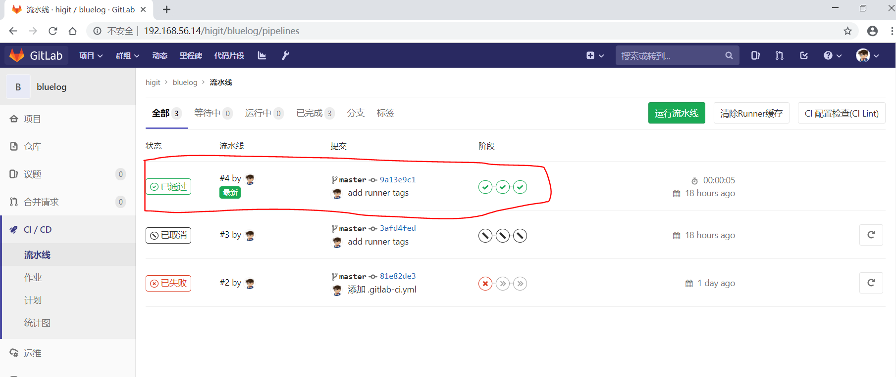

查看4#流水线的详情：

.. image:: ./_static/images/gitlab_cicd-pipeline_detail.png

可以发现其 ``build`` 、``Test`` 、``Deploy`` 三个阶段的任务都执行成功！

查看作业详情，可以看到控制台输出的内容，就是我们在 ``.gitlab-ci.yml`` 中定义的一些过程的输出:

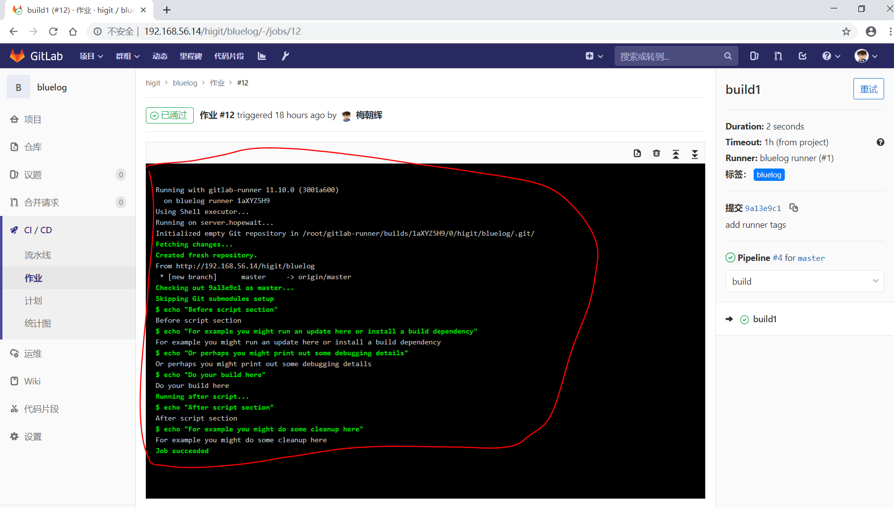

后台控制台输出以及工作目录中的内容如下：

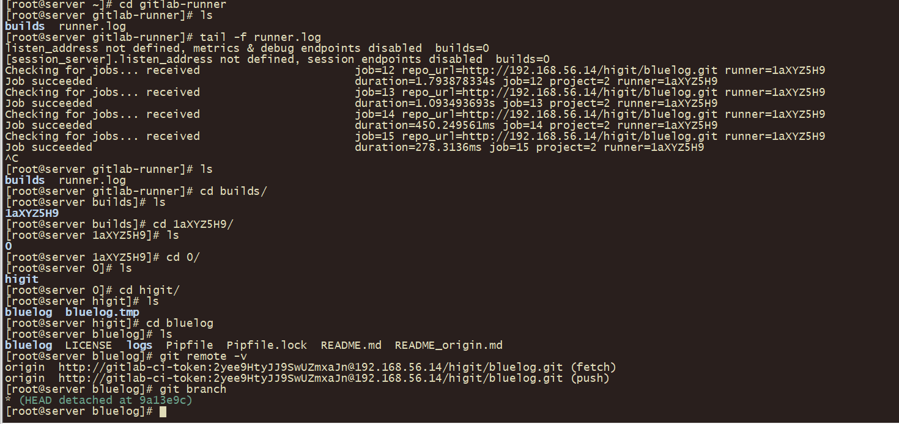

今天就讲这些，下一节讲解 详解 ``.gitlab-ci.yml`` ！

参考：

- `访问GitLab的PostgreSQL数据库 <https://www.cnblogs.com/sfnz/p/7131287.html?utm_source=itdadao&utm_medium=referral>`_
- `Install GitLab Runner using the official GitLab repositories <https://docs.gitlab.com/runner/install/linux-repository.html>`_
- `Registering Runners <https://docs.gitlab.com/runner/register/index.html>`_
- `GitLab Runner commands <https://docs.gitlab.com/runner/commands/README.html#gitlab-runner-run>`_
- `GitLab Runner Executors <https://docs.gitlab.com/runner/executors/README.html>`_
- `GitLab Runner Advanced configuration <https://docs.gitlab.com/runner/configuration/advanced-configuration.html#the-shells>`_
- `GitLab Runner Executors Shell <https://docs.gitlab.com/runner/executors/shell.html>`_
